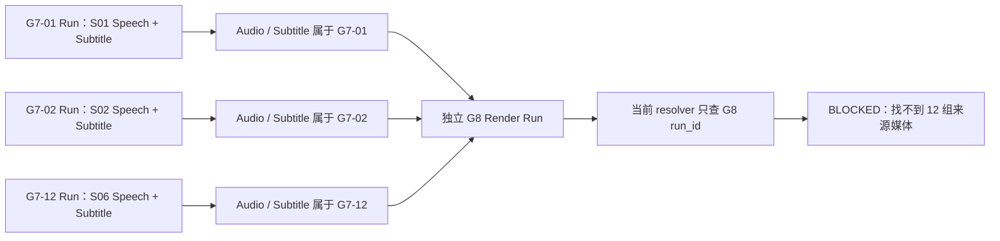
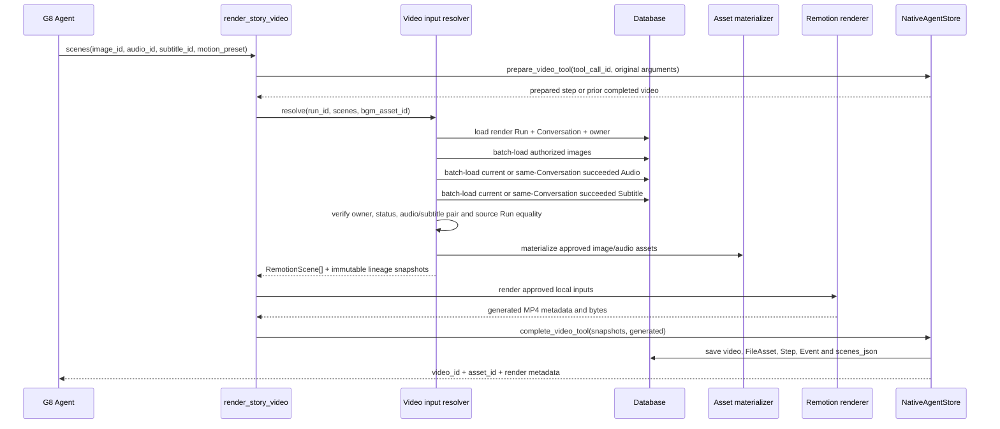

# Native Agent 同会话跨 Run 媒体 Lineage 蓝图

更新时间：2026-08-12

状态：Design ready / not implemented / no media authorization

对应合同：[Sprint 187 / G7-0](../contracts/sprint-187-native-agent-cross-run-media-lineage.md)

## 1. 要解决的唯一问题

Paynes Creek G7 计划把 12 镜语音分别放进 12 个 Run，每镜完成 Speech、Subtitle 和人工试听后才开放下一镜。
G8 再用一个独立 Run 合成成片。当前图片已经能跨同一 Conversation 使用，但音频和字幕只能从渲染 Run
自己读取，所以这条人工 Gate 链无法闭合。



G7-0 只改变 `render_story_video` 的输入解析范围。它不改变媒体生成、人工 Gate、渲染器或发布流程。

## 2. 设计原则

1. **Conversation 是共享边界**：同一用户的另一个 Conversation 也不能引用。
2. **owner 仍显式检查**：Admin 的资产读取权限不能变成渲染授权。
3. **当前 Run 行为不变**：运行中的 Run 可以继续使用自己刚生成的 Audio / Subtitle。
4. **历史 Run 必须成功**：只有 `succeeded` 才代表该来源已结束并可被后续 Gate 消费。
5. **来源由数据库推导**：模型只提交媒体 ID，不提交或声明来源 Run ID。
6. **不复制资产**：新视频保存引用和快照，不移动、重挂或重新登记源媒体。
7. **失败不可猜测**：无权、未知或未成功候选使用相同安全错误，不做 fallback。

## 3. 目标调用链



任一资格或配对校验失败都发生在 `materialize` / Remotion 之前；失败后沿现有 Tool 失败路径记录 Step，不保存
视频或新 FileAsset。

## 4. 资格判定

设当前渲染 Run 为 `render_run`，候选媒体的 Run 为 `source_run`：

```text
owner_allowed = source_conversation.owner_user_id == render_conversation.owner_user_id

run_allowed =
  source_run.id == render_run.id
  OR (
    source_run.conversation_id == render_run.conversation_id
    AND source_run.status == succeeded
  )

media_allowed = owner_allowed AND run_allowed
```

查询实现应把这组条件放进 SQL `WHERE`，并按最多 30 个 Scene 的 Audio / Subtitle ID 集合批量读取。不要先
读取跨用户或跨 Conversation 记录，再在 Python 中决定是否返回。

### 资格矩阵

| source_run | 相同 Conversation | 相同 owner | `succeeded` | 允许 |
| --- | ---: | ---: | ---: | ---: |
| 当前渲染 Run | 是 | 是 | 不要求 | 是 |
| 历史 Run | 是 | 是 | 是 | 是 |
| 历史 Run | 是 | 是 | 否 | 否 |
| 历史 Run | 否 | 是 | 任意 | 否 |
| 历史 Run | 任意 | 否 | 任意 | 否 |

## 5. Audio / Subtitle 不变量

当 Scene 使用持久化 Subtitle 时，以下条件必须同时成立：

```text
audio is authorized
subtitle is authorized
subtitle.audio_id == audio.id
subtitle.run_id == audio.run_id
audio.asset exists
subtitle.asset exists
audio.duration_ms > 0
```

`subtitle.audio_id` 外键只证明字幕指向一条 Audio，不证明两条记录的 `run_id` 一致，所以最后一个来源关系
必须由应用层单独锁定。内联字幕不创建记录，也没有 Subtitle 来源 Run。

## 6. Tool Schema 与持久化边界

### 模型看到的输入保持不变

```json
{
  "image_id": "...",
  "audio_id": "...",
  "subtitle_id": "...",
  "motion_preset": "static"
}
```

来源 Run ID 不进入 Tool Schema；否则模型可能提交错误或越权的来源声明，也会把授权逻辑变成模型契约。

### 新 Scene 快照示例

```json
{
  "scene_order": 1,
  "image_id": "image-s01",
  "image_source": "conversation_native_run",
  "image_source_run_id": "g5-or-g6-source-run",
  "image_asset_id": "image-asset-s01",
  "audio_id": "audio-s01",
  "audio_source": "conversation_native_run",
  "audio_source_run_id": "g7-01-source-run",
  "audio_asset_id": "audio-asset-s01",
  "subtitle": null,
  "subtitle_id": "subtitle-s01",
  "subtitle_source": "conversation_native_run",
  "subtitle_source_run_id": "g7-01-source-run",
  "subtitle_asset_id": "subtitle-asset-s01",
  "duration_ms": 8000,
  "motion_preset": "static"
}
```

内联字幕使用：

```json
{
  "subtitle": "内联字幕",
  "subtitle_id": null,
  "subtitle_source": "inline_scene_text",
  "subtitle_source_run_id": null,
  "subtitle_asset_id": null
}
```

Generation Task 图片没有 Native Run，因此 `image_source=generation_task` 且 `image_source_run_id=null`。

`NativeAgentVideo.scenes_json` 已经是 JSON Text，`NativeAgentVideoRead.scenes` 也会原样反序列化。新字段属于
新视频的不可变审计快照，不需要新列、迁移或 API endpoint；历史视频不回填。

## 7. 错误策略

| 条件 | 对外错误类别 | 是否调用 renderer | 是否保存视频 |
| --- | --- | ---: | ---: |
| Audio 未知 / 越权 / 跨会话 / 历史 Run 未成功 | 不属于当前 Run 或同会话已成功来源 Run | 否 | 否 |
| Subtitle 未知 / 越权 / 跨会话 / 历史 Run 未成功 | 不属于当前 Run 或同会话已成功来源 Run | 否 | 否 |
| Subtitle 指向另一条 Audio | 字幕不属于对应 Audio | 否 | 否 |
| Subtitle 与 Audio 的来源 Run 不同 | 字幕与音频不属于同一来源 Run | 否 | 否 |
| Audio 无真实时长或资产缺失 | 媒体资产不完整 | 否 | 否 |
| 合法输入后的 Remotion 失败 | 保持现有渲染失败行为 | 是 | 否 |

安全错误不包含传入 ID 的真实 owner、Conversation、Run 状态或邮箱，防止形成存在性探针。

## 8. 不改变的路径

- `generate_speech` 和 `generate_subtitles` 仍在当前 Run 生成并配对。
- 图片权限、Generation Task current 图片、`inspect_image` 和 BGM 规则不变。
- `prepare_video_tool` 仍使用模型提交的原始 Scene 参数做 Tool 幂等；lineage 只在解析成功后进入最终
  `scenes_json`。
- 同一成功 `tool_call_id` 重放返回原 Video，不重新解析来源或运行 Remotion。
- 取消、恢复、Tool 计数、SSE、视频资产访问和 API 投影不变。
- G8 专用 Skill 是否只暴露 `render_story_video` 由后续 Gate 人工核验，本设计不创建 Skill。

## 9. 测试矩阵

| 编号 | 场景 | 预期 |
| --- | --- | --- |
| T1 | 当前 Run Audio + 内联字幕 | 成功；当前来源和 inline 快照正确 |
| T2 | 同 Conversation 已成功来源 Run Audio + Subtitle | 成功；三个来源 Run ID 持久化 |
| T3 | 历史来源 Run 为每一种非 `succeeded` 状态 | 全部拒绝 |
| T4 | 同 owner、不同 Conversation | 拒绝且不泄露存在性 |
| T5 | 不同 owner | 拒绝且不泄露身份 |
| T6 | Subtitle 指向另一条 Audio | 拒绝 |
| T7 | Subtitle.audio_id 匹配但 Subtitle.run_id 不同 | 拒绝 |
| T8 | Generation Task 图片 + 历史 Audio + 内联字幕 | 成功；图片 Run ID 与字幕 Run ID 为 null |
| T9 | 成功 Tool Call 重放 | 只存在一个 Video / FileAsset；lineage 不变 |
| T10 | 任一资格失败 | renderer 0 次，新增 Video / FileAsset 0 |

## 10. 数据库与性能判断

- 每次最多 30 个 Scene，Audio / Subtitle 以主键集合查询，数据规模有硬上界。
- `native_agent_audios.run_id`、`native_agent_subtitles.run_id`、`native_agent_runs.conversation_id` 已有索引；
  本切片没有新的列表或恢复查询，不新增索引。
- Scene lineage 是渲染时不可变事实，适合保存在现有 `scenes_json`；为它新增通用 lineage 表会扩大事务、
  迁移和 API 复杂度，当前没有必要。

## 11. 实施顺序与开放条件

```mermaid
flowchart LR
  G2A["Sprint 181 / G2-A"] --> G2B["G2-B Chat 适配"]
  G2B --> G3["G3 零媒体 Gate"]
  G3 --> G46["G4–G6 图片 Gate"]
  G46 --> G70["Sprint 187 / G7-0 离线实现"]
  G70 --> P7["pass_for_g7_scene_runs"]
  P7 --> G701["G7-01 单镜真实语音授权"]
  G701 --> G7ALL["12 镜逐镜审核"]
  G7ALL --> G8A["Sprint 188 / G8-A 固定 1080p Profile"]
  G8A --> G8B["Sprint 189 / G8-B 冻结 Manifest Run"]
  G8B --> G8C["Sprint 190 / G8-C 固定帧证据包能力"]
  G8C --> G8["G8 独立成片 Run + Evidence Pack"]
```



Sprint 187 的测试通过只开放 G7-01 的评审，不授权 TTS、Whisper、Remotion 或发布。Paynes Creek 首片仍以
生产控制室的 G0–G9 Gate 为权威顺序。

## 控制器决策

- `input_used`：G7 协议、当前 Native Audio / Subtitle / Video 实体、渲染 resolver、持久化与测试。
- `artifact`：本蓝图与 Sprint 187 合同。
- `decision`：允许评审同会话已成功来源 Run 的只读引用；禁止跨 Conversation、来源声明入参、资产复制和
  任何真实媒体调用。
- `next_step`：当前仍先等待 Sprint 181 / G2-A 的明确批准；G7-0 只保留为后续可审核实现切片。

本轮完成：把 G7-0 从方向性描述收敛为可验证的权限、配对、快照和测试契约。

下一步建议：先实施并验收 Sprint 181 / G2-A，再按顺序评审 Sprint 187 与 Sprint 188。
