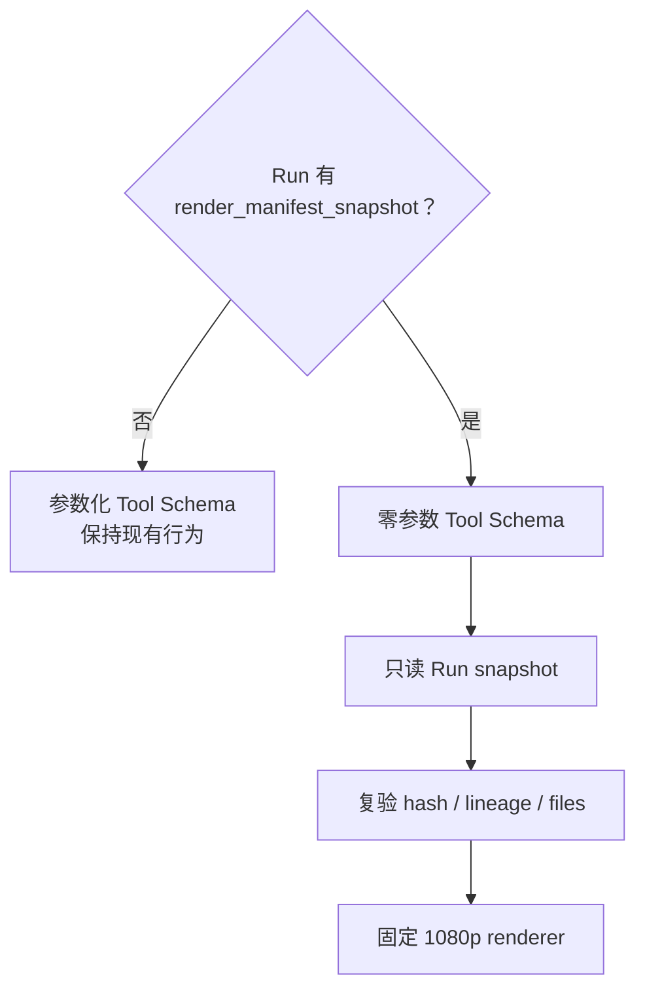
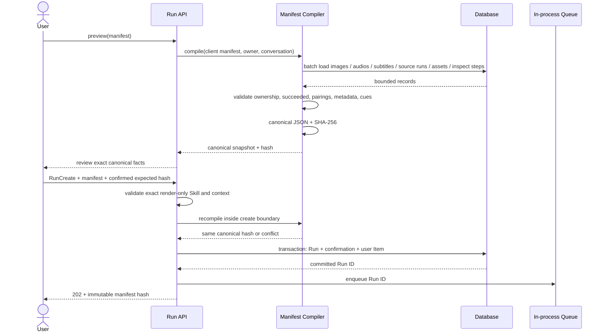
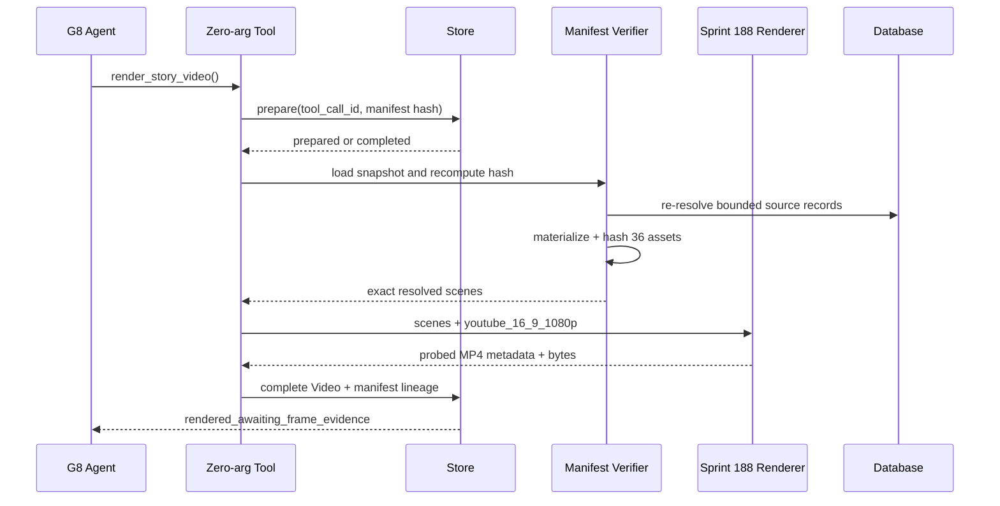
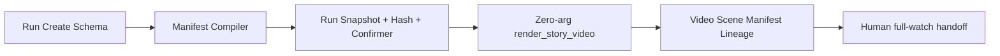

# Native Agent 冻结 Render Manifest Run 蓝图

更新时间：2026-08-12
状态：设计完成，代码 / 迁移 / Skill seed / 真实媒体均未实施
对应合同：[Sprint 189 / G8-B](../contracts/sprint-189-native-agent-frozen-render-manifest-run.md)

## 1. 问题不是缺一份 JSON，而是缺少批准边界

当前 `render_story_video` 的 `scenes` 已经很接近 Render Manifest，但它由模型在 Tool Call 时提交：


这里能审计模型最终传了什么，却不能回答三个问题：

1. 人工批准的资产集合究竟是哪一版；
2. 模型有没有在转抄时改变顺序、Motion、字幕或 preset；
3. 重试 / 恢复是否仍消费同一份批准输入。

把 JSON 写进 Skill 或 Prompt 仍然把准确性寄托在模型复述上。G8 需要的是“人在 Run 创建前确认，服务端
冻结，模型只能触发执行”的边界。

## 2. 选择 Run Snapshot，不新建重型工作流

Paynes Creek 是一条有界本地样片：12 个 Scene、一次渲染、一次完整观看。现有 Run、Step、Event、
Video 和进程内 Worker 已能承担执行与恢复，因此不需要 Redis、消息队列或通用审批引擎。

Manifest 是这次 Run 的不可变输入，最自然的归属就是 `native_agent_runs`：

```text
Run
├─ model / provider / api shape snapshot      # Sprint 181 / G2
├─ skill version snapshot                     # 已有
├─ render manifest canonical JSON + SHA-256   # Sprint 189
├─ authenticated confirmer + server time      # Sprint 189
├─ Tool Step / Event                          # 已有
└─ Video + Scene lineage                      # Sprint 187 / 188 / 189
```

四个 nullable 字段配合全空 / 全非空约束即可区分普通 Run 和 Manifest-bound Run。Manifest 只按 Run 主键
读取，不需要新表或索引。

## 3. 两种同名 Tool，能力由 Run 决定

普通工作流仍需要模型自由组合 Scene，因此保持参数化 Tool：

```text
render_story_video(
  scenes,
  bgm_asset_id=null,
  output_preset="source"
)
```

Manifest-bound Run 使用同一业务 Tool 名，但 Function Schema 变为：

```text
render_story_video()
```



这不是 fallback。两条路径由持久化 Run 事实严格选择；Manifest Run 不能退回参数化路径，普通 Run 也不会
偷偷使用某份 Manifest。

## 4. 创建时编译：客户端只选业务对象，服务端补事实

客户端只提交它有权决定的字段：

- 业务 Scene key 与顺序；
- Native 图片、音频、字幕 ID；
- Motion；
- 审核记录引用；
- 固定输出 preset 与 BGM 选择；
- 明确确认。

客户端不能提交下列事实：

- Asset ID / hash / byte size；
- 图片尺寸；
- 音频 / 字幕时长；
- cue 数量或字幕文本 hash；
- source Run ID、owner 或 Conversation；
- 模板、fps、codec、裁切或文件路径。

创建时序：



Preview 不写任何记录、不 enqueue；它只是让用户看到服务端将要冻结的精确事实。Run Create 必须重新
编译并与 `expected_manifest_sha256` 完全一致。任何校验或 hash 漂移都发生在 Run 写库与 enqueue 之前。
查询只返回当前 owner / Conversation 的合法候选，错误不区分“无记录”和“有记录但无权”。

## 5. Canonical Snapshot

服务端快照可采用下面的结构；字段名是设计合同，不代表当前已实现：

```json
{
  "schema_version": 1,
  "manifest_key": "yt-pc-local-pilot-01-g8-v01",
  "purpose": "local_production_validation",
  "output_preset": "youtube_16_9_1080p",
  "bgm_asset_id": null,
  "scenes": [
    {
      "scene_order": 1,
      "scene_key": "S01",
      "image_id": "...",
      "image_asset_id": "...",
      "image_source_run_id": "...",
      "image_sha256": "...",
      "image_width_px": 1792,
      "image_height_px": 1024,
      "audio_id": "...",
      "audio_asset_id": "...",
      "audio_source_run_id": "...",
      "audio_sha256": "...",
      "audio_duration_ms": 8120,
      "subtitle_id": "...",
      "subtitle_asset_id": "...",
      "subtitle_source_run_id": "...",
      "subtitle_sha256": "...",
      "subtitle_text_sha256": "...",
      "subtitle_cue_count": 2,
      "subtitle_duration_ms": 8120,
      "motion_preset": "zoom_in",
      "image_review_ref": "...",
      "image_review_sha256": "...",
      "audio_subtitle_review_ref": "...",
      "audio_subtitle_review_sha256": "..."
    }
  ]
}
```

Canonical 化规则固定为：JSON key 排序、数组顺序保留、UTF-8、`ensure_ascii=false` 等价语义、紧凑分隔符，
再对 bytes 计算 SHA-256。Scene 数组顺序是业务事实，不能排序；对象 key 顺序不是业务事实。

## 6. 创建检查与运行检查分工

| 检查 | Run 创建时 | Tool 运行时 | 原因 |
| --- | --- | --- | --- |
| owner / Conversation / source Run succeeded | 是 | 是 | 防止授权或数据库事实漂移 |
| 图片 `inspect_image=accept` | 是 | 是 | G8 不重新暴露 inspect Tool |
| Audio / Subtitle 配对与 cues | 是 | 是 | 防止错配 |
| FileAsset 元数据 hash 存在 | 是 | 是 | 快照需要来源 |
| materialized bytes 的真实 SHA-256 | 否 | 是 | 创建请求不做远端 / 本地大文件 I/O |
| 16:9 / crop / template / ffprobe | 否 | Sprint 188 renderer | 这是渲染 Profile 的职责 |
| 审核记录 ref / hash 是否由人核对 | preview 后确认 | 人工验收 | 后端保存但不伪造其语义 |

创建时避免 materialize 大文件，保持 API 有界；运行时反正必须读取媒体，因此在 Node 前对实际 bytes 复验
不会引入第二套基础设施。

## 7. 真实执行与幂等



- Prepare Step 只摘要记录 Manifest key / hash / Scene 数 / preset，完整快照以 Run 为唯一来源。
- 同一成功 Tool Call 直接返回已有 Video；不会再次 hash、render 或保存。
- Manifest-bound Run 在第一次 Render Step 被 prepared 后即封闭第二次调用；不同 `tool_call_id` 也不能创建
  第二个 Step 或 Video。失败后的再次执行由人创建新 Run，不由模型在同一 Run 内试探。
- Run 崩溃恢复仍使用同一 snapshot。Snapshot 或文件不一致时明确失败，不重新编译或寻找“最新资产”。
- Follow-up 被禁用，避免同一 Skill 在缺少 Manifest 时变回自由参数渲染。

## 8. Paynes Creek：生产顺序不等于成片顺序

图片与语音生产为了先验证高风险 Scene，使用了不同的 Gate 顺序。最终 Manifest 必须恢复叙事顺序：

```text
S01 → S02 → S03 → S04 → S05 → S06 → S07 → S08 → S09 → S10 → S11 → S12
```

它不能沿用：

- G6 的九镜生产顺序；
- G7 的语言风险验证顺序；
- 数据库 created_at；
- 文件名自然排序以外的隐式猜测；
- “每个 Scene 最新一条”自动发现。

`scene_key` 与 Manifest 数组顺序共同锁定这个事实。

## 9. 自动通过与人工通过必须分开

自动层能证明：

- 12 组来源和 hash 未漂移；
- 顺序、Motion、preset 与已确认 Manifest 一致；
- 最终文件是一个 H.264 / yuv420p 1920×1080 30fps 视频流和一个 AAC 音频流；
- 文件时长、Run / Step / Tool / Asset lineage 可回查。

自动层不能证明：

- 字幕没有遮住关键证据对象；
- Motion 没有在某一时刻裁掉器物或地图锚点；
- 专名发音自然；
- 四处“重建 / 可能 / 未知”在完整观看中都被保留；
- 整体节奏和观看体验合格。

因此 Tool 成功终态只能是 `rendered_awaiting_frame_evidence`。Sprint 190 / G8-C 必须对同一个 Video
SHA-256 生成逐镜帧证据包，成功后才进入 `ready_for_full_watch_review`。人工完整观看后，才可在本地
acceptance packet 写 `pass_local_pilot`；它仍不授权 G9 发布。

## 10. 失败与修订

| 失败阶段 | 保留什么 | 下一步 |
| --- | --- | --- |
| Run 创建前校验失败 | 无 Run、无队列消息 | 修正 Manifest 请求后重新确认 |
| 运行前 hash / lineage 失败 | 失败 Step 与安全错误 | 查明资产漂移；创建新 Manifest，不改旧快照 |
| Remotion / ffprobe 失败 | 失败 Step；无 Video / FileAsset | 按明确原因评审新 Run，不自动重试 |
| Tool 成功、人工观看失败 | 原 Manifest、Video、探针、review | 新 manifest key / 新 Run；旧记录保持失败事实 |
| 人工观看通过 | 完整 acceptance packet | 记录 `pass_local_pilot`；G9 仍关闭 |

同一 Manifest hash 可以用于恢复同一 Run，但不能被另一个“修订版”复用。任何 Scene、Motion、ref 或 preset
变化都会自然产生新 hash。

## 11. 实施切面

Sprint 189 只新增一个小型 Run 快照能力：



不新建通用审批产品、素材库、视频项目表或外部队列。若未来多种 Agent 流程都需要“产物冻结 → 人工审批 →
执行”，再以多条真实用例评审是否抽象通用 Artifact Approval；不能由这一条样片提前泛化。

## 12. 控制器决策

- `input_used`：当前参数化 Render Tool、Run / Step / Video 持久化、Sprint 187 lineage、Sprint 188 1080p
  Profile、Paynes Creek G5–G7 审核协议与总验收模板。
- `artifact`：本蓝图、Sprint 189 合同、G8 操作协议与空白 Manifest / attempt 模板。
- `decision`：G8 必须使用认证用户确认、服务端编译和 Run 级不可变 hash；禁止 Prompt 转抄充当批准机制。
- `next_step`：按 Sprint 190 设计实施逐镜帧证据包；实际开发顺序仍先等待 Sprint 181 批准。

本轮完成：把 12 组已审核媒体到一次确定性渲染之间的批准、快照和恢复边界固定下来。

下一步建议：按 Sprint 190 蓝图继续审计 G8 完整观看到 G9 发布准备之间的批准事实，不调用真实媒体。
