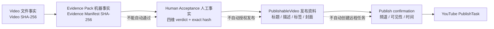
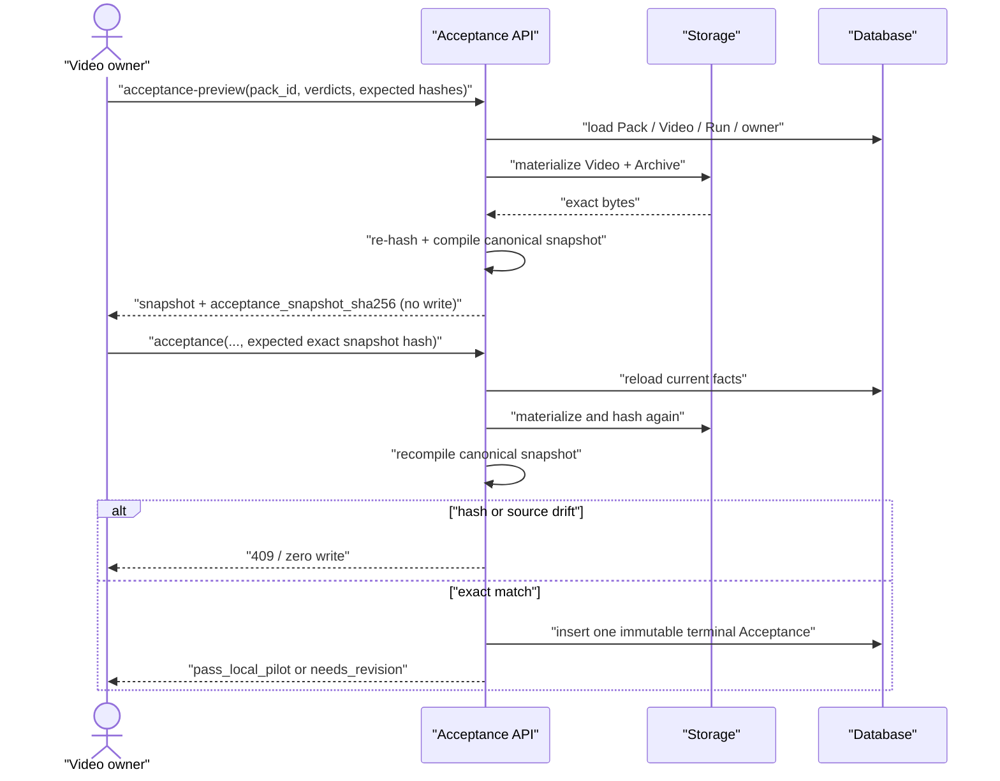
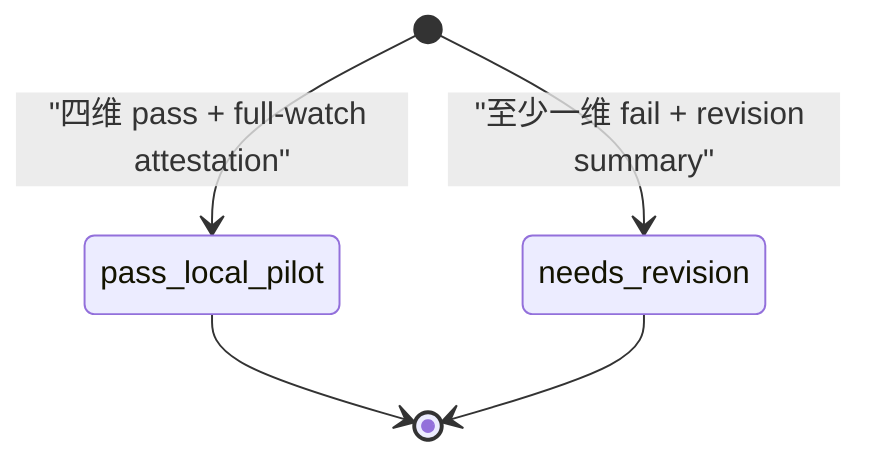
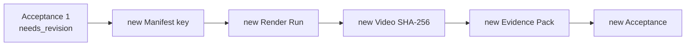
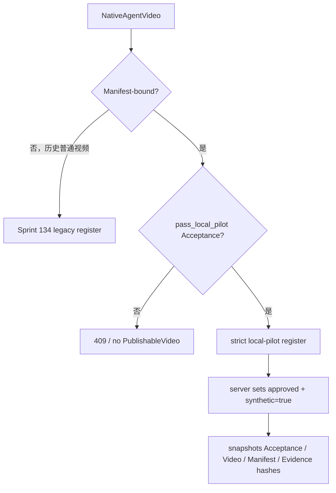
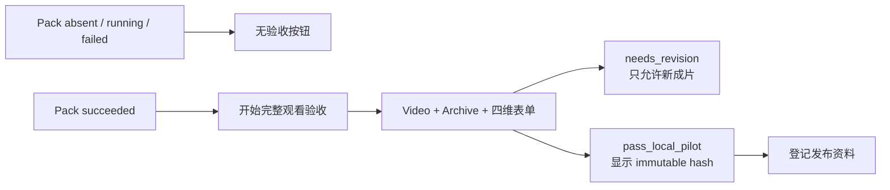

# Native Agent 本地样片不可变验收与发布登记交接蓝图

更新时间：2026-08-13<br>
状态：设计完成，代码 / 迁移 / API / 前端 / 真实审核均未实施<br>
对应合同：[Sprint 191](../contracts/sprint-191-native-agent-immutable-local-pilot-acceptance.md)

## 1. 当前的“approved”不是 G8 证据

当前视频登记 Dialog 把标题、描述、标签和可选封面填完后，直接向后端发送：

```json
{
  "source_native_agent_video_id": "...",
  "review_status": "approved"
}
```

后端只证明这个 Video 属于当前 Admin、未重复登记且有公网 URL，然后原样保存 `approved`。发布服务再用这个
布尔式状态作为远程调用门槛。这里缺失：

```text
哪一个 Video bytes 被观看
哪一个 Render Manifest 被执行
哪一个 Evidence Pack 被查看
四个验收维度分别是什么结果
谁在什么时候对这些 exact hash 作了决定
```

所以不能在现有 `review_status` 上继续加更多 UI 文案；必须先建立独立的验收事实。

## 2. 三层事实不能合并



- Evidence Pack 的 `succeeded` 只证明证据完整。
- Acceptance 的 `pass_local_pilot` 只证明特定母版本地验收通过。
- PublishableVideo 只锁定发布资料与已通过母版。
- Publish confirmation 才是向具体频道创建外部任务的最后授权。

## 3. 为什么不复用现有 Approval

| 候选 | 为什么不复用 |
| --- | --- |
| `AgentApprovalRequest` | 绑定旧 `AgentConversation / AgentRun / comic_plan`，会驱动漫画 Workflow |
| `NativeAgentArticleApproval` | 一对一绑定 `NativeAgentArtifact`，批准后会把文案 Run 改为 article_approved |
| `PublishableVideo.review_status` | 客户端可在创建时直接选择 approved，没有内容 hash 和 verdict |
| G8 attempt JSON | 是操作证据模板，不是 owner-scoped 数据库事实，发布服务无法安全引用 |

新表不是“再造通用审批系统”，而是一个只服务 Video + Evidence Pack 的终态业务事实。

## 4. 单 owner、四维度

当前产品只有 user / admin 两级，没有团队成员、Reviewer 邀请或跨 owner 共享。v1 的真实能力是：

```text
一个认证 Conversation owner
对四个固定维度分别给出 pass / fail
并统一 attestation 已完整观看同一个 Video SHA-256
```

四维度不是四个独立账号：

| dimension | 人工判断 |
| --- | --- |
| `visual_evidence_continuity` | 证据对象、画面连续性、Motion、安全区、未知项视觉表达 |
| `script_evidence_and_pacing` | 事实映射、四处限定词、Scene 顺序、120–150 秒节奏 |
| `chinese_speech_and_subtitles` | 专名、数字、限定词、同步、可读性、声音完整性 |
| `render_delivery_and_traceability` | 完整播放、拉伸 / 黑边 / 空白 / 跳帧、文件与 lineage |

未来若需要四个不同人签字，必须增加协作权限和逐角色 identity；不能让 owner 在 JSON 里代填四个名字。

## 5. 两阶段 exact-hash 决定



Preview 不是草稿保存。它没有 ID、没有状态、没有副作用；唯一用途是让人看到系统将签署的 canonical 事实。

## 6. Canonical Acceptance snapshot

固定结构示意：

```json
{
  "schema_version": 1,
  "video": {
    "id": "...",
    "sha256": "...",
    "render_manifest_sha256": "..."
  },
  "evidence": {
    "pack_id": "...",
    "manifest_sha256": "...",
    "archive_sha256": "...",
    "profile_id": "narrated_panel_review_v1"
  },
  "decision": "pass_local_pilot",
  "full_watch_attested": true,
  "dimensions": {
    "visual_evidence_continuity": {"verdict": "pass", "issues": [], "notes": null},
    "script_evidence_and_pacing": {"verdict": "pass", "issues": [], "notes": null},
    "chinese_speech_and_subtitles": {"verdict": "pass", "issues": [], "notes": null},
    "render_delivery_and_traceability": {"verdict": "pass", "issues": [], "notes": null}
  },
  "revision_summary": null,
  "decided_by_user_id": "...",
  "publication_authorized": false
}
```

`decided_at` 不放入 snapshot，避免 preview 与最终提交因为服务器时间必然产生不同 hash。它作为数据库终态
时间单独保存。

## 7. 终态状态机

Acceptance 没有可变状态机，只有一次创建：



禁止：

```text
pending -> approved
needs_revision -> pass_local_pilot
update notes
replace evidence_pack_id
delete and recreate same video
```

若内容需要修订，正确 lineage 是：



## 8. 数据关系

```mermaid
erDiagram
  NATIVE_AGENT_RUN ||--o{ NATIVE_AGENT_VIDEO : renders
  NATIVE_AGENT_VIDEO ||--o{ VIDEO_EVIDENCE_PACK : derives
  NATIVE_AGENT_VIDEO ||--o| VIDEO_ACCEPTANCE : receives
  VIDEO_EVIDENCE_PACK ||--o| VIDEO_ACCEPTANCE : supports
  VIDEO_ACCEPTANCE ||--o| PUBLISHABLE_VIDEO : qualifies
  PUBLISHABLE_VIDEO ||--o{ YOUTUBE_PUBLISH_TASK : snapshots

  VIDEO_ACCEPTANCE {
    string id PK
    string video_id UK
    string evidence_pack_id UK
    string status
    string review_snapshot_sha256 UK
    string decided_by_user_id
    datetime decided_at
  }

  PUBLISHABLE_VIDEO {
    string source_native_agent_video_id UK
    string source_video_acceptance_id UK_NULLABLE
    string source_video_acceptance_sha256_snapshot NULLABLE
    string source_video_sha256_snapshot NULLABLE
    string source_render_manifest_sha256_snapshot NULLABLE
    string source_evidence_manifest_sha256_snapshot NULLABLE
  }
```

Acceptance 通过 `video_id` 唯一约束固定一支成片只有一个最终人工决定。PublishableVideo 的五字段对历史记录
全空，对严格路径记录全非空。

## 9. 发布登记的双轨边界



这不是失败后回退到 legacy。Manifest-bound 是确定分流条件；严格路径失败时停止，绝不切到旧入口。

## 10. 发布前复验

现有发布服务已经在外部调用前检查频道状态、owner、`review_status`、确认和公网 URL。严格路径再增加：

```text
Publishable snapshot == current Acceptance snapshot
Acceptance.status == pass_local_pilot
Acceptance.video_id == Publishable.source video
current Video bytes SHA-256 == accepted Video SHA-256
current Manifest / Evidence hashes == accepted hashes
```

任一失败时 Fake / real publisher 调用数必须为 0。合法后，PublishTask 除现有标题 / 描述 / 标签 / URL 快照
外，再复制五项 Acceptance lineage，保证远程提交发生后仍能回答“发布的是哪个已验收母版”。

## 11. UI 状态



浏览器 `ended`、`played` 或 seek 事件不是可信签名。UI 可以帮助用户从头播放，但服务端只把
`full_watch_attested` 解释为认证 owner 的明确陈述，不声称防作弊。

## 12. 失败矩阵

| 失败点 | 数据写入 | 下一动作 |
| --- | --- | --- |
| Pack 未成功 / 帧不全 | 无 Acceptance | 修复 Evidence 能力或新 Pack，不签字 |
| expected hash 错 | 无 Acceptance | 刷新真实事实后重新 preview |
| preview 后 source 漂移 | 无 Acceptance | 当前 preview 作废 |
| 人工任一维失败 | 写 immutable `needs_revision` | 新 Manifest / Run / Video |
| pass Acceptance 后登记 metadata 失败 | Acceptance 保留 | 修正登记输入，不重验母版 |
| 发布前 source bytes 漂移 | PublishTask 不创建 / 不远程调用 | 运维调查，不替换文件 |
| 外部发布结果不明确 | 沿用 Sprint 135 outcome_unknown | 不重新创建任务 |

## 13. 对现有设计的修正

- Sprint 134 的 `review_status="approved"` 对历史普通视频仍成立；对新的 Manifest 成片不再足够。
- Sprint 135 的“视频必须审核通过”对 Manifest 成片收紧为：`review_status=approved` 且存在 exact Acceptance
  lineage，并在发布前重新复验。
- Sprint 190 中“人工完整观看记录必须确认同一个 Video / Evidence Manifest hash”落实为数据库终态，而不是
  只留在本地 JSON。
- `pass_local_pilot` 仍不授权 G9；Acceptance snapshot 明确保存 `publication_authorized=false`。

## 14. 当前不解决的 G9 问题

本蓝图只保证发布资料不能绑定未通过母版。以下仍需 G9-A 单独设计：

- 目标频道和目标受众；
- 发布前 `prediction.json` 与只改变一个主要变量；
- 标题候选如何定稿；
- 封面必须使用哪个 FileAsset、其 SHA-256 和权利审核；
- 描述、标签、AI 合成披露、可见性、计划时间；
- 发布责任人、撤回责任和 24 / 72 小时数据回流；
- 元数据修改是否需要 revision / supersede，而不是原地覆盖。

## 15. 控制器决策

- `input_used`：Sprint 189 / 190、当前 Video / FileAsset / Approval 实体、Sprint 134 / 135、PublishableVideo
  创建 API、发布服务、Agent 发布确认和当前前端登记 Dialog。
- `artifact`：本蓝图、Sprint 191 合同、Paynes Creek G8 人工验收协议与空白请求。
- `decision`：允许新增一个 owner-signed、四维、不可变终态；禁止继续把客户端
  `review_status="approved"` 当 Manifest 成片的审核事实，也禁止 Acceptance 自动创建发布任务。
- `next_step`：设计完成后仍回到 Sprint 181 开发入口；后续研究进入 G9-A 不可变发布包。

本轮完成：把 Evidence Pack 到 PublishableVideo 之间缺失的人工身份、exact hash、终态和发布复验边界固定。

下一步建议：设计 G9-A 发布包，把频道、预测、单一变量、封面 Asset / 权利和元数据版本锁成可确认快照。
