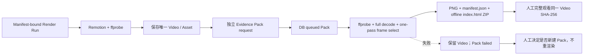
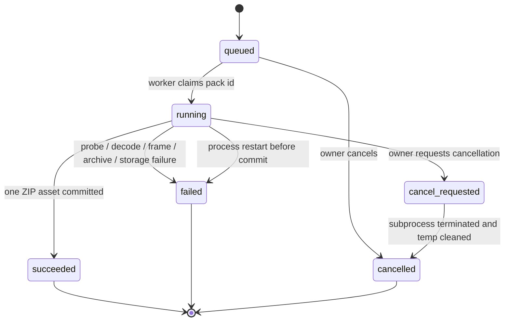

# Native Agent 成片逐镜帧证据包蓝图

更新时间：2026-08-12
状态：设计完成，代码 / 迁移 / 队列 / 真实视频均未实施
对应合同：[Sprint 190 / G8-C](../contracts/sprint-190-native-agent-video-frame-evidence-pack.md)

## 1. 要解决的不是“能不能截图”

Sprint 188 的 ffprobe 证明文件结构，Sprint 189 的 Manifest 证明渲染输入，但两者都不能证明输出画面真的按
顺序出现、字幕落在安全区、Motion 没裁掉证据对象，或转场之外没有空白。与此同时，当前模板主动把每镜首尾
淡成黑色；简单的“发现黑帧即失败”也会得到错误结论。

因此 G8-C 的目标是建立三层互不冒充的事实：

```text
文件事实：同一个 MP4 hash、可完整解码、结构仍匹配 1080p Profile
帧事实：固定帧号确实解码为这些 PNG，具备 hash、尺寸和像素观察
人工事实：真实审核人完整观看后，对视觉、字幕、声音和事实边界作判断
```

Evidence Pack 只负责前两层，并把第三层需要看的东西整理好。

## 2. 为什么不塞进 Render Tool



如果抽帧属于 Render Tool，ffmpeg 后处理失败会造成两种坏状态：丢弃已经有效的 MP4，或让失败 Tool 留下
未被承认的视频副作用。独立 Pack 把两类事实分开：Video 一经保存保持不变，证据失败只影响是否开放观看。

## 3. 资格边界

G8-C v1 不是通用截图接口。它只接受同时满足下列条件的视频：

| 条件 | 权威来源 |
| --- | --- |
| 当前用户拥有 Conversation | Video → Run → Conversation |
| 冻结输入 | Run 的 Render Manifest snapshot / hash |
| 逐镜业务 key | Video `scenes_json.manifest_scene_key` |
| 固定输出 | template ID、Video / FileAsset width / height、fps |
| 文件未漂移 | Asset SHA-256 + materialized bytes SHA-256 |
| 字幕可定位 | Video Scene 的 Subtitle ID / source Run + Subtitle cues |
| 连续帧区间 | Scene duration 与固定 30fps 模板公式 |

Admin 的读取能力不代表能替另一个 owner 创建证据。未知 ID、越权 ID 和不合格视频对写入口使用同一 404 /
安全错误，不返回候选 owner、Conversation、路径或 Asset 存在状态。

创建请求必须同时携带 `expected_video_sha256` 与 `expected_render_manifest_sha256`。前者需同时匹配 Asset
记录和重新计算的文件 bytes，后者需匹配 Video 所属 Run 的冻结 Manifest；任一漂移都在 Pack 写库前拒绝。

## 4. Pack 是独立小型工作流



- 队列只放 Pack ID，数据库保存请求、计划、状态和输出。
- 默认单 worker；不添加外部基础设施。
- 最大 attempt 为 1，不自动重试。
- 旧 Pack 永远不覆盖。人工重试创建新 Pack，并用 `previous_pack_id` 建链。
- Run 和 Video 的终态不因 Pack 状态回写；G8 操作记录另行投影“是否可以完整观看”。

## 5. 固定帧数学

### 5.1 Scene 区间

Remotion 当前以 `Math.ceil(durationMs / 1000 * 30)` 分配每镜帧数。Evidence profile v1 固定同一公式：

```text
N_i = ceil(duration_ms_i × 30 / 1000)
start_i = Σ N_previous
end_i_exclusive = start_i + N_i
```

所有 Scene 区间必须连续、无重叠、无缺口，最终 `end_exclusive` 必须等于 Video `duration_in_frames`。这比
把 8 秒、11 秒等计划时长换算成时间戳更准确，也避免不同 Scene 的向上取整误差累积。

### 5.2 每镜五角色

模板的 `FADE_FRAMES=8` 是 Profile 事实：

| role | local frame | 预期 |
| --- | ---: | --- |
| expected_dark_start | 0 | 预期接近黑，不是故障 |
| safe_start | 8 | opacity 已为 1，可看 Motion 起点 |
| midpoint | floor((N-1)/2) | 主证据帧 |
| safe_end | N-9 | opacity 仍为 1，可看 Motion 终点 |
| expected_dark_end | N-1 | 预期接近黑，不是故障 |

Scene 少于 19 帧时不换一个“差不多”的采样点，而是拒绝该 Evidence profile。Paynes Creek 每镜计划 8–14
秒，不触及这个边界，但产品实现仍必须显式验证。

### 5.3 Qualifier cue

调用方只给 Scene 与必须逐字出现的限定词，不给时间。服务端在持久化 cue 文本中唯一定位片段，找出所有
相交 cue，再将每个 cue 映射到保证字幕可见的离散帧：

```text
first = ceil(start_ms × 30 / 1000)
last = ceil(end_ms × 30 / 1000) - 1
target = floor((first + last) / 2)
```

同一个物理帧可同时承担 midpoint、qualifier 和多个 fragment role；只输出一个 PNG，但 Manifest 保留全部
用途，防止用“去重”丢掉审计语义。

## 6. Paynes Creek 的有界规模

12 镜固定产生 60 个逻辑角色：

```text
12 × (dark start + safe start + midpoint + safe end + dark end) = 60
```

四组限定词将解析为 4–20 个 cue 目标：

- S03：依据遗迹与类比的重建、可能；
- S07：可能、不等于通用货币；
- S09：没有单船货单、不知道装载量；
- S10：路线、城市、买家未知。

因此首片最多 80 个逻辑目标；物理帧去重后只会更少。通用 30 Scene 上限为 170，不会出现无限抽帧。

## 7. 为什么 `blackdetect` 只是辅助

本机合成校准使用 30 帧测试视频和与模板相同的 8 帧淡入淡出：

- 一次 `select` 正确生成 5 张指定帧 PNG；
- 帧 0 与帧 29 是预期黑场，文件远小于可见内容帧；
- `blackdetect` 报告片头 1 帧黑场，却没有在 EOF 输出片尾黑场区间。

因此 Pack 同时保存：

1. 每镜首尾 endpoint PNG；
2. 每帧平均亮度、亮度标准差、黑像素比例；
3. 固定参数 `blackdetect` 的结构化区间；
4. safe start / midpoint / safe end 的可见内容帧。

这些值只形成 `observation`：预期黑帧不自动失败，深色画面的 safe frame 也不自动失败。离线 HTML 用角色和
指标把情况摆在审核人面前，由人看原尺寸 PNG 和整片。

## 8. 单进程媒体步骤

```mermaid
sequenceDiagram
  participant A as Owner API
  participant D as Database
  participant W as Evidence worker
  participant P as ffprobe
  participant F as ffmpeg
  participant S as Storage

  A->>D: validate video/hash/manifest/cues; insert queued Pack
  A-->>A: 202 + pack id
  W->>D: claim Pack id; reload immutable facts
  W->>W: materialize video and recompute SHA-256
  W->>P: probe streams, fps, frames, duration
  W->>F: full audio/video decode with -xerror
  W->>F: one select process for sorted frame numbers
  W->>F: fixed blackdetect observation
  W->>W: validate PNGs; compute metrics; build manifest + HTML + ZIP
  W->>S: save one generated_video_evidence archive
  W->>D: atomically bind asset and mark succeeded
```

所有子进程使用参数数组、`-nostdin`、固定超时和显式可执行路径。客户端无法传 filter 或 shell 字符串。

## 9. Canonical plan 与 Evidence manifest

创建时已经可以固定 `sampling_plan_json`：

- source video / asset / Manifest hash；
- profile / template / fps / fade frames；
- Scene 顺序、duration、frame interval；
- 每个逻辑 target 的绝对 frame、role 和 qualifier / cue 依据。

执行后才形成 `evidence_manifest_json`：

- 重新探测的文件结构和完整 decode 结果；
- ffmpeg / ffprobe 版本；
- 每个物理 PNG 的路径、SHA-256、尺寸、byte size 和像素指标；
- logical roles 到物理 PNG 的映射；
- blackdetect 区间与是否落在预期 fade window 的结构化观察。

两个 JSON 都用 UTF-8、排序 key、紧凑分隔符计算 SHA-256；数组顺序是事实，不排序。Manifest 不写 Archive
hash，Archive Asset 在外层记录自己的 hash，避免自引用。

## 10. 一个 ZIP 比几十个 Asset 更合适

```text
evidence-pack.zip
├─ manifest.json
├─ index.html
└─ frames/
   ├─ 0001-S01-expected-dark-start-f000000.png
   ├─ 0002-S01-safe-start-f000008.png
   ├─ 0003-S01-midpoint-f000120.png
   └─ ...
```

逐帧 FileAsset 会放大数据库行数、权限查询和部分失败处理。一个 ZIP 让成功成为单个输出引用，离线 HTML
仍能按 Scene、Motion 端点、限定词和黑场观察浏览原图。HTML 不请求网络、不嵌入视频、不带签名 URL 或
绝对路径，数据全部做 HTML escaping。

ZIP 以排序 entry、固定 timestamp 和固定压缩参数生成；它是审计交付件，不是图片库。

## 11. API 投影

列表只返回：

```text
pack id / previous pack id / status / profile
source video hash / manifest hash / plan hash
frame count / archive asset id / evidence manifest hash
started / finished / safe error
```

详情才返回 request、plan、evidence manifest。Archive 继续走现有 owner-protected Asset content API。Run
projection 不嵌套几十帧，也不在终态 Run 上追加大事件 payload。

## 12. 状态含义

| 状态 | 含义 | 是否可完整观看验收 |
| --- | --- | --- |
| `queued / running` | 证据尚未完成 | 否 |
| `cancelled` | 人工取消，无成功 Archive | 否 |
| `failed` | 视频保留，证据不完整 | 否；人工决定是否新建 Pack |
| `succeeded` | 文件、帧、manifest、HTML 与 archive 齐全 | 是，但不等于通过 |

Render Tool 成功状态由原设计中的 `ready_for_full_watch_review` 收紧为
`rendered_awaiting_frame_evidence`。只有 Pack 成功且 G8 attempt 核对同一个 Video SHA-256、Manifest
SHA-256 与所有必需 qualifier group 后，才写 `ready_for_full_watch_review`。

## 13. 失败矩阵

| 失败 | 保留什么 | 禁止什么 |
| --- | --- | --- |
| 创建资格 / hash / qualifier 失败 | 无 Pack、原 Video | 不入队、不猜 cue |
| ffprobe / full decode 失败 | failed Pack、原 Video | 不保存 Archive、不重渲染 |
| select 少帧 / 多帧 / PNG 坏 | failed Pack、原 Video | 不返回部分 evidence |
| cancel | cancelled Pack、原 Video | 不把临时 ZIP 登记为 Asset |
| startup 中断 | failed Pack、原 Video | 不自动覆盖存储、不静默重跑 |
| storage / DB commit 失败 | failed Pack 或明确事务失败、原 Video | 不伪造 succeeded |
| 人工发现问题 | Pack 与 Video 都保留 | 不原地改 Manifest 或视频 hash |

## 14. 对既有设计的修正

本蓝图使 Sprint 189 的两个表述更精确：

- Manifest Run 的不同 `tool_call_id` 也只能准备一次 Render；不能靠换 Tool Call ID 生成第二个视频。
- Render Tool 技术成功不直接开放人工验收，而是进入 `rendered_awaiting_frame_evidence`；G8-C Pack 成功后
  才进入 `ready_for_full_watch_review`。

这不是增加重试或替代路线，而是把两个不同副作用拆成可审计的先后步骤。

## 15. 实施切片

Sprint 190 只增加：

1. 一个 Evidence Pack 表和一个 FileAsset purpose；
2. 一个固定请求、列表、详情和取消 API；
3. 一个单 worker 本地队列；
4. 一个固定 30fps / 8 fade frame 的采样 Profile；
5. 一个 PNG + JSON + 离线 HTML ZIP；
6. 合成视频测试和 owner 权限回归。

不增加前端审核台、VL 质检、通用视频编辑器、外部队列或发布门禁。

## 16. 控制器决策

- `input_used`：当前 Remotion 30fps / 8 帧淡入淡出实现、Sprint 188 ffprobe 边界、Sprint 189 Manifest
  边界、Video / FileAsset / Asset 权限代码、G8 空白 attempt 与本机 ffmpeg 校准。
- `artifact`：本蓝图、Sprint 190 合同、Paynes Creek G8-C 协议和空白 Evidence request。
- `decision`：允许把同一成片的固定帧证据产品化为独立小型作业；禁止把抽帧放进 Render Tool、禁止
  blackdetect 单独判定、禁止 Evidence success 冒充人工通过。
- `next_step`：后续人工签署与发布登记边界已由
  [Sprint 191 蓝图](native-agent-local-pilot-acceptance-handoff-blueprint.md)承接；真实开发仍回到 Sprint 181。

本轮完成：把成片保存到人工完整观看之间的帧号、状态、证据和失败边界固定下来。

下一步建议：评审 Sprint 191 的不可变批准设计；研究侧继续设计 G9-A 发布包，不调用真实媒体。
