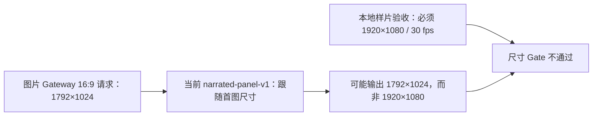
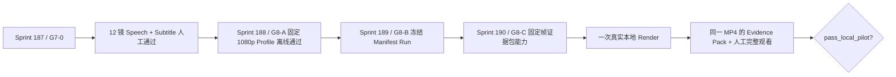

# Native Agent YouTube 1080p 固定渲染 Profile 蓝图

更新时间：2026-08-12

状态：Design ready / not implemented / no render authorization

对应合同：[Sprint 188 / G8-A](../contracts/sprint-188-native-agent-youtube-1080p-render-profile.md)

## 1. 为什么 G8 还不能直接生成成片

当前三组事实不能同时成立：



把交付标准改成 1792×1024 会缩小原目标；把现有模板直接改成固定横屏又会破坏竖屏和 3:4 历史行为。
因此需要一个显式、版本化的新输出 Profile。

## 2. 目标形态

```text
render_story_video(
  scenes=[...],
  bgm_asset_id=null,
  output_preset="youtube_16_9_1080p"
)
```

| preset | 模板 ID | 输出 | 用途 |
| --- | --- | --- | --- |
| `source` | `narrated-panel-v1` | 跟随首图偶数化尺寸 | 保持所有现有行为 |
| `youtube_16_9_1080p` | `narrated-panel-16x9-1080p-v1` | 1920×1080、30 fps | YouTube 横屏本地样片 |

模型只能选择这两个业务枚举，不能提供任意尺寸、模板名、裁切值、fps、codec 或 CSS。

## 3. 调用与校验顺序

```mermaid
sequenceDiagram
  participant A as Agent
  participant T as render_story_video
  participant P as NativeAgentStore
  participant R as Python Remotion bridge
  participant N as Node / Remotion
  participant F as ffprobe
  participant DB as Database

  A->>T: scenes + output_preset
  T->>P: prepare Tool with normalized preset
  T->>R: resolved scenes + preset
  R->>R: validate 16:9, cross-scene ratio and crop budget
  R->>N: versioned manifest (1920×1080)
  N-->>R: temporary MP4 + stdout metadata
  R->>R: verify stdout matches selected profile
  R->>F: inspect the actual temporary MP4
  F-->>R: streams, codecs, dimensions, fps, duration
  R->>R: reject any mismatch; no stdout fallback
  R-->>T: bytes + actual probed metadata
  T->>P: complete Tool with scene snapshots
  P->>DB: save FileAsset + NativeAgentVideo + immutable facts
```

ffprobe 发生在临时文件仍存在、任何视频资产写库之前。失败只产生失败 Tool Step，不产生 Video 或
FileAsset。

## 4. 裁切数学

固定 1920×1080 使用中心 `objectFit: cover`。设源图比例 `r_s=w/h`，目标比例 `r_t=16/9`：

```text
if r_s < r_t:
  axis = vertical
  crop_per_edge = (1 - r_s / r_t) / 2
elif r_s > r_t:
  axis = horizontal
  crop_per_edge = (1 - r_t / r_s) / 2
else:
  axis = none
  crop_per_edge = 0
```

### 已知尺寸示例

| 源图 | 源比例 | 裁切轴 | 每边基准裁切 | 输出 |
| --- | ---: | --- | ---: | --- |
| 1920×1080 | 1.777778 | 无 | 0% | 等比原尺寸 |
| 1792×1024 | 1.750000 | 上下 | 0.78125%（8 px） | 等比放大至 1920×1097.14 后居中取 1080 |
| 16:9 比例下边界（-2%） | 1.742222 | 上下 | 1% | 允许边界 |
| 16:9 比例上边界（+2%） | 1.813333 | 左右 | 约 0.9804% | 允许边界 |

这解释了为什么现有 2% 图片 Gate 能与“每边最多 1% 基准裁切”一致。超过 1% 不继续运行 Node，也不
自动改用 contain、黑边、模糊填充、拉伸或其他模板。

### 与 Motion 的关系

基准 cover 裁切和 Motion 裁切是两件事：

- 基准裁切由输出 Profile 固定并机器计算；
- `zoom_*` 最多约 8%、`pan_*` 另有约 3% 平移，属于既有画面运动；
- Paynes Creek Prompt 已把唯一证据对象放在中央 84%、上方 70%，但仍需用每镜起止帧证据证明安全；
- Sprint 188 不改变 Motion 数值，也不能用“基准裁切只有 1%”替代逐镜动态检查。

## 5. Node 模板边界

Remotion Root 同时注册两条 Composition：

```text
narrated-panel-v1
  width/height = manifest dynamic dimensions

narrated-panel-16x9-1080p-v1
  width/height = exactly 1920/1080
```

`manifest.mjs` 先验证模板—尺寸组合，`render.mjs` 再按已校验 `templateId` 选择 Composition。不能把未知模板
交给 `selectComposition`，也不能让新模板接受其他宽高。

同一 React Scene 组件继续使用：

- `objectFit: cover`
- `transformOrigin: center center`
- 现有 8 帧淡入淡出
- 现有七种 Motion
- 现有中文字幕容器与 BGM 参数

因此本 Sprint 只改变一个主要变量：**输出 Profile**。

## 6. 真实文件探针契约

Node stdout 是执行报告，不是最终文件事实。新 Profile 必须从 ffprobe JSON 读取：

| 维度 | 必须值 |
| --- | --- |
| 视频流数量 | 1 |
| 视频 codec | `h264` |
| pixel format | `yuv420p` |
| 宽高 | 1920×1080 |
| fps | 30/1 |
| 音频流数量 | 1 |
| 音频 codec | `aac` |
| 容器时长 | 正数，且与帧数 / 30 相差不超过一帧 |

以下任一情况都失败：配置的 ffprobe 不存在、退出非 0、JSON 非法、未知 rational、额外 / 缺失流、codec
错误、尺寸错误、fps 错误、时长缺失或 Node / ffprobe 元数据互相矛盾。没有 fallback。

## 7. 持久化映射

| 事实 | 保存位置 |
| --- | --- |
| 用户 / Agent 选择的 `output_preset` | Tool Step `input_summary_json`、Tool Item、Event、trace |
| 行为版本 | `NativeAgentVideo.template_id_snapshot` |
| 真实输出尺寸 | Video / FileAsset `width`、`height` |
| 真实 fps / 帧数 / 时长 | NativeAgentVideo 现有字段 |
| 每镜源图尺寸 | `scenes_json` 新增字段 |
| 每镜基准 crop 轴与比例 | `scenes_json` 新增字段 |
| 图片 / Audio / Subtitle 来源 Run | Sprint 187 的 `scenes_json` lineage 字段 |

无需新增数据库列：输出 Profile 已由 preset 输入、版本化模板 ID、实际视频字段和逐镜 crop 快照共同表达。
历史视频保持原样，不回填未观测值。

## 8. 幂等与失败边界

- `output_preset` 必须加入 `prepare_video_tool()` 的参数 JSON；重试参数比较能发现 preset 漂移。
- idempotency key 仍由 Run + Tool + `tool_call_id` 决定；同一成功调用只保存一个视频。
- 16:9 / crop 失败：Node 0 次，ffprobe 0 次，视频保存 0 次。
- Node 失败或 stdout 不匹配：ffprobe / 保存按实际阶段为 0。
- ffprobe 失败：Node 已运行，但视频保存 0 次；临时文件随现有临时目录清理。
- 持久化失败：保持现有 Tool 失败语义，不伪造成功。

## 9. 测试与本地校准

### 纯函数 / 单元测试

- preset → template / dimensions 映射；
- 16:9 相对偏差与 cross-scene 0.01 规则；
- crop 轴、比例、1% 边界；
- template—dimensions 组合；
- Node stdout 一致性；
- ffprobe stream / codec / rational / duration 解析；
- Tool 参数、快照、幂等和失败零持久化。

### 无网络真实 smoke

1. 本地生成 1792×1024 校准网格，顶部 / 底部 8 px 使用可辨认标记；
2. 本地生成短音频，并使用两行中文字幕；
3. 真实运行 `narrated-panel-16x9-1080p-v1`；
4. ffprobe 确认结构；
5. 在淡入完成后的静态帧抽帧，确认上下等量中心裁切、无非等比变形、无黑边；
6. 检查字幕完整位于 1920×1080 画布内。

该 smoke 证明模板能力，不替代 Paynes Creek 12 镜的事实、对象、Motion、字幕和整片人工审核。

## 10. 生产顺序



Sprint 188 只解除精确交付规格阻塞。通过后仍必须冻结 Manifest，并对一支真实本地成片执行完整验收。

## 控制器决策

- `input_used`：当前图片 Gateway 尺寸映射、比例容差、Python Remotion bridge、Node manifest / Composition、
  本地样片章程与验收模板。
- `artifact`：本蓝图与 Sprint 188 合同。
- `decision`：保留现有 source 模板，新增版本化 1080p preset；禁止降低交付尺寸、任意裁切、拉伸、黑边和
  对 Node stdout 的信任兜底。
- `next_step`：当前仍先执行 Sprint 181；之后按 Sprint 188、189、190 的顺序解除真实 G8 前置阻塞。

本轮完成：发现并设计了解除 1792×1024 源图与 1920×1080 交付要求冲突的最小版本化路径。

下一步建议：按 Sprint 190 蓝图评审固定帧证据包，再设计 G8 → G9 的不可变人工观看记录。
