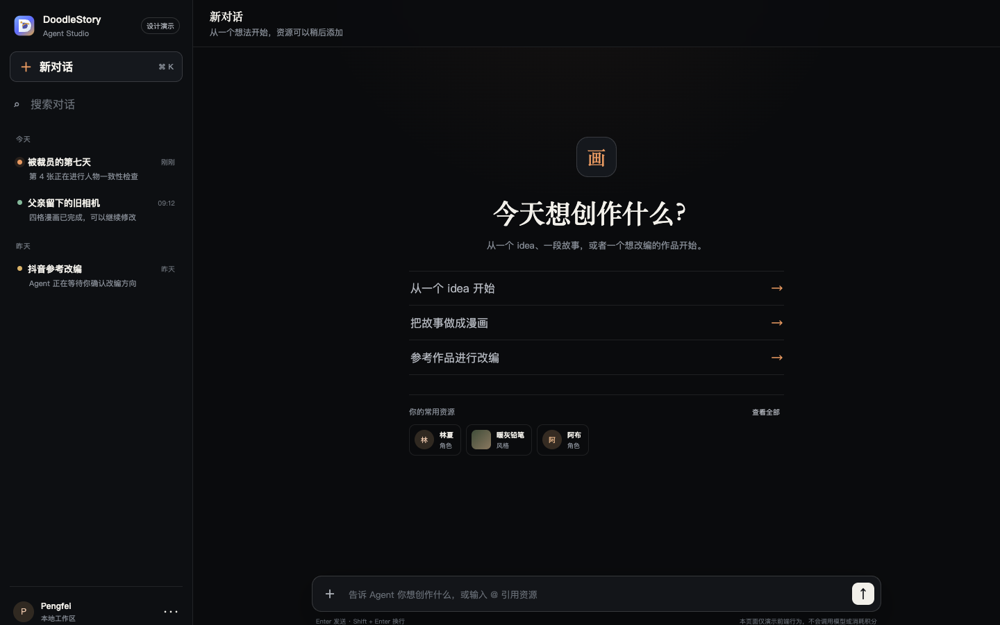

# Agent 会话前端 Demo

这是一个完全独立的本地交互原型，用于验证 DoodleStory Agent 的会话和任务交互，不连接后端，也不会调用模型或消耗积分。



## 查看方式

在仓库根目录启动任意静态文件服务，例如：

```bash
python3 -m http.server 4173 --bind 127.0.0.1
```

然后打开：

```text
http://127.0.0.1:4173/docs/design/agent-conversation-demo/
```

## 建议体验路径

1. 页面默认进入空白对话；可以直接描述创作目标，也可以选择一个示例开场。
2. 点击空白页的常用角色或风格，观察资源如何以可移除的上下文标签进入输入区。
3. 从左侧进入`被裁员的第七天`，查看所属对话中的持续更新任务卡片。
4. 直接点击任务卡中的 Panel 3，打开右侧 Panel 检查器。
5. 查看当前版本和 Agent 检查结论，再点击`引用 Panel 3 并修改`。
6. 验证输入区原有草稿没有被覆盖，并且新增了 `@Panel 3`、`@当前图片 v2`。
7. 切换到其他历史对话再返回，验证当前对话的草稿和资源引用仍然保留。
8. 点击输入框左侧`＋`或输入`@`，体验可搜索的资源入口。

## 边界

- 所有状态均为确定性的前端演示数据。
- 刷新页面后恢复初始状态。
- 默认空白页只展示少量常用资源，完整资源通过输入区选择器按需打开。
- 不修改或复用现有正式任务页面。
- 不包含真正的图片生成、Agent 运行或持久化。
