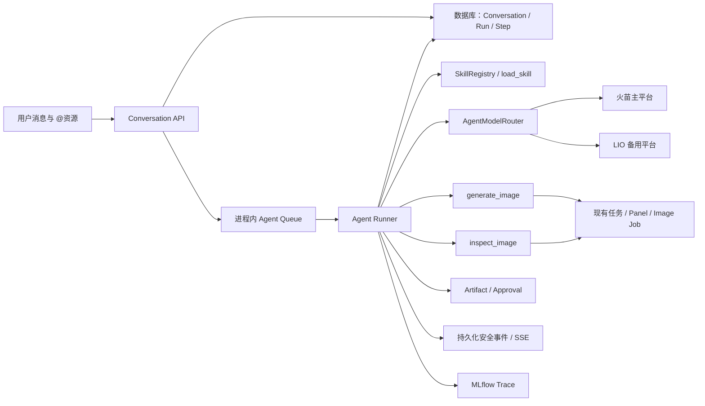
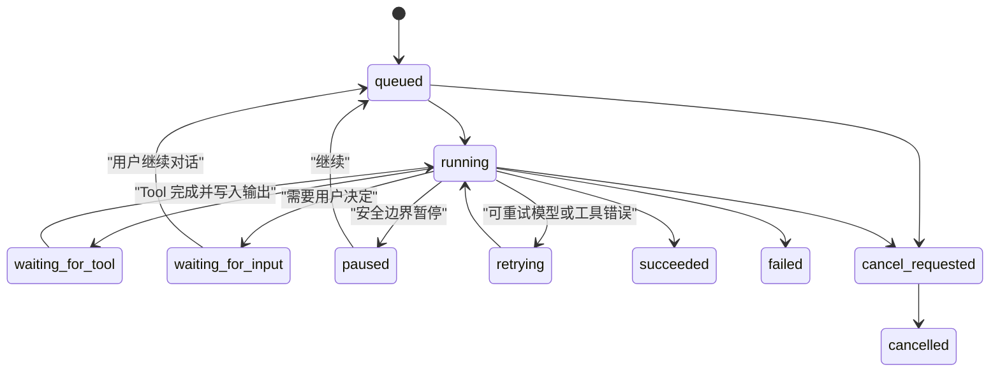

# Agent V1 Runtime、状态与模型路由设计

## 1. 架构结论

Agent V1 使用当前 FastAPI、SQLAlchemy、SQLite/关系型数据库和进程内队列，不引入 LangChain、LangGraph 或外部工作流引擎。

第一版采用一个通用创作 Agent。Agent 负责理解目标、选择并加载 Skill、生成创作方案和选择 Tool；Skill 负责方法、步骤、质量门槛和确认点；Runtime 负责持久化、恢复、权限、预算、幂等、Provider 可靠性、安全事件和观测。不同创作方式通过 Skill 组合原子 Tool，不为每种方式增加硬编码业务 Workflow。

产品运行时 Skill 保存在 `backend/app/agent_skills/<skill-id>/SKILL.md`，与服务 Codex 开发协作的 `.agents/skills/` 分离。基础 Agent 只看到 Skill catalog，调用 `load_skill` 后才加载完整方法；Skill name、version 和内容 hash 必须进入 AgentStep 与 MLflow。

## 2. 为什么不把模型上下文交给 Provider 保存

火苗和 LIO 是两个不同的 OpenAI 兼容平台。任一平台返回的 `response_id`、`conversation_id` 或内部缓存都不能假设可以被另一个平台读取。

因此：

- DoodleStory 数据库保存规范化消息、模型输出项、Tool Call 和 Tool Output。
- 每次模型调用都从应用侧状态构造完整可重放输入。
- Provider response ID 只作为追踪信息保存，不作为恢复的唯一依据。
- 不同时使用“完整本地历史”和 Provider 远程 continuation，避免上下文重复。

## 3. Run 与 checkpoint

一个 Agent Run 对应一次用户 Turn 的处理。Runner 在以下安全边界保存 checkpoint：

1. Run 创建并排队。
2. 一次模型响应完整返回并校验通过。
3. Tool Call 已记录但尚未执行。
4. Tool 执行完成并保存 Tool Output。
5. Run 等待图片 job、用户输入或人工决定。
6. Run 产生最终回答或明确失败。

不保存“半个流式 Token”作为可恢复状态。进程中断后从最后一个完整 Step 恢复；如果外部副作用状态不确定，先按幂等键查询既有结果，再决定是否重放。

## 4. 数据模型

Sprint 104 只完成设计；Sprint 105 已通过 revision `x8f9a0b1c2d3` 创建下列四张表，没有增加通用事件仓库或阶段 2 资源表。Sprint 114 计划在真实 HITL 与 SSE 需求出现时增加最小 `agent_artifacts`、`agent_approval_requests` 和 `agent_events`；MLflow 不作为业务状态表。

### 4.1 `agent_conversations`

| 字段 | 说明 |
| --- | --- |
| `id` | 稳定 Conversation ID |
| `user_id` | 所属用户 |
| `title` | 对话标题 |
| `status` | `active / archived` |
| `last_message_at` | 历史列表排序 |
| `created_at / updated_at` | 时间戳 |

查询路径：当前用户按 `last_message_at` 倒序分页；因此需要 `(user_id, last_message_at)` 索引。

### 4.2 `agent_messages`

| 字段 | 说明 |
| --- | --- |
| `id` | 消息 ID |
| `conversation_id` | 所属对话 |
| `turn_id` | 所属用户 Turn，可为空 |
| `role` | `user / assistant / system_event / task_card` |
| `content` | 用户可见文本 |
| `resource_refs_json` | 当前 Turn 已鉴权资源引用的受控 JSON；阶段 1 可为空 |
| `sequence` | 对话内稳定顺序 |
| `created_at` | 时间戳 |

对话消息按 `(conversation_id, sequence)` 有界分页。大体积 Tool Payload 不写入消息正文。

### 4.3 资源引用的阶段化保存

Sprint 105 只创建四张 Agent 表，资源引用先作为 `agent_messages.resource_refs_json` 的受控结构保存；该阶段不解析具体资源。只有阶段 2 之后出现真实的跨消息查询、独立约束或资源引用生命周期需求时，才评审是否拆分 `agent_message_resource_refs`，不为未来资源预建通用表。

### 4.4 `agent_runs`

| 字段 | 说明 |
| --- | --- |
| `id` | Run ID |
| `conversation_id / turn_id` | 所属上下文 |
| `status` | `queued / running / waiting_for_tool / waiting_for_input / paused / retrying / succeeded / failed / cancel_requested / cancelled` |
| `current_step_sequence` | 当前安全步骤 |
| `model_call_count / image_call_count` | 预算与观测 |
| `error_code / error_message / internal_error_ref` | 分离用户错误和内部错误 |
| `started_at / finished_at / created_at / updated_at` | 恢复与审计 |

恢复查询使用 `(status, updated_at)`；同一个 Turn 默认只允许一个未终态 Run。

### 4.5 `agent_steps`

| 字段 | 说明 |
| --- | --- |
| `id` | Step ID |
| `run_id` | 所属 Run |
| `sequence` | Run 内顺序 |
| `step_type` | `model_call / tool_call / tool_result / wait / final` |
| `status` | `pending / running / succeeded / failed / cancelled` |
| `provider / model` | 模型步骤的实际线路 |
| `attempt` | 当前步骤尝试次数 |
| `idempotency_key` | 外部副作用幂等键 |
| `input_ref / output_ref` | 大 Payload 的引用或受控 JSON |
| `started_at / finished_at` | 时间戳 |
| `error_code / error_message` | 失败原因 |

`(run_id, sequence)` 和非空 `idempotency_key` 唯一。

### 4.6 现有漫画任务关系

- 当前通过 `agent_runs.task_id` 关联现有 `generation_tasks.id`；一个 Conversation 可以通过多个 Run 关联多个任务，不创建 Agent 专用任务表。
- Panel 与 Generated Image 继续使用现有表，不复制到 Agent 表。
- Agent Step 只保存关联任务/Panel/图片版本 ID，不把完整图片结果复制进事件表。

### 4.7 Sprint 114 计划新增的用户可见状态

- `agent_artifacts`：保存通过 schema 校验、用户可查看和版本化的漫画方案。
- `agent_approval_requests`：保存方案 hash、等待用户确认和批准/修改决定。
- `agent_events`：保存用户安全事件并为 SSE 断线补发提供事实来源。

这些表只解决已经明确的 Artifact/HITL/SSE 查询，不扩展成通用事件溯源、Workflow 引擎或任意多态内容平台。

## 5. Agent Runner 状态流

队列消息只包含 `run_id`。Worker 每次领取后重新读取数据库状态；终态、暂停态或取消态不得继续执行。

## 6. 模型调用形态

2026-07-22 使用更新后的 API key 和当时统一模型 `gpt-5.6-terra` 完成兼容性复测；Sprint 110 已把当前 Agent 默认模型统一切换为 `gpt-5.5`。历史报告保留当时真实模型，当前运行配置以 `AGENT_MODEL=gpt-5.5` 为准。

最终决策是：

- 正式 Runtime 锁定 `openai-agents==0.18.3` 与 `openai==2.45.0`。
- 火苗和 LIO 的 Responses SDK Function Call → Tool Output → final response 完整循环和应用侧第二轮重放均已真实通过，因此正式 Runtime 只使用 Responses 模型形态，不在同一 workflow 混用 Chat Completions。
- 每次调用由应用数据库重放规范化上下文，不使用 Provider response ID 作为恢复事实来源。
- 所有模型结构化输出继续做应用层 schema 校验；返回合法 JSON 不代表业务字段正确。

完整证据见 `docs/testing/agent-model-provider-compatibility-report.md`。

## 7. `AgentModelRouter` 契约

`AgentModelRouter` 属于 Runtime 基础设施，Agent 不知道也不决定 Provider。

### 7.1 路由顺序

1. 默认调用火苗主平台。
2. 主平台发生可重试错误时，在配置的短退避后进行有界重试。
3. 主平台仍失败时，使用同一份应用侧上下文调用 LIO。
4. LIO 失败后 Run 明确失败，不返回占位结果。
5. 第一版到此结束，不实现熔断器或动态 Provider 健康评分。只有真实运行数据证明每次请求都等待主平台会造成明显问题时，再评审熔断。

### 7.2 错误分类

| 类型 | 主平台重试 | 切换 LIO | 说明 |
| --- | --- | --- | --- |
| 连接失败、DNS、连接重置 | 是 | 是 | 临时传输错误 |
| 超时 | 是 | 是 | 尚未提交任何模型结果时 |
| HTTP 408、409、429 | 是 | 是 | 有界退避，尊重 `Retry-After` |
| HTTP 500、502、503、504 且错误语义为临时故障 | 是 | 是 | 不能只判断状态码 |
| HTTP 400、401、403、404、422 | 否 | 否 | 请求、密钥、权限或能力配置错误 |
| 任意 HTTP 状态但错误码/语义为 `invalid_request`、`model_not_found`、无渠道、不支持 API/模型 | 否 | 否 | LIO 实测会用 503 表达永久配置/能力错误 |
| 内容拒绝或安全策略拦截 | 否 | 否 | 不通过换 Provider 绕过策略 |
| Tool Schema 或应用校验错误 | 否 | 否 | 修复契约，不隐藏程序错误 |
| 已向用户输出部分流或已经执行副作用 | 否 | 否 | 自动重放不安全 |

### 7.3 重试所有权

- 底层 `AsyncOpenAI` Client 设置 `max_retries=0`。
- Agents SDK Runner 的通用重试关闭或只由 Router 的同一策略驱动。
- 所有次数、退避和切换由一个 Router 统一管理，避免多层重试相乘。

## 8. Tool 执行与幂等

- Runtime 为每个模型 Tool Call 生成稳定 `idempotency_key`，不信任模型自行提供幂等键。
- 图片 Tool 先查询已有 Step/Image Job；存在成功结果时直接返回引用。
- Tool Call 写入数据库后再执行外部副作用。
- Tool 完成后先保存任务/资产结果，再写 Tool Output checkpoint。
- Provider 已返回但 Run 被取消时，按现有图片任务规则丢弃本地结果并释放积分占用。

## 9. 用户可见事件与流式策略

Sprint 114 计划使用数据库持久化的用户安全事件和 SSE：

- `skill.loaded`
- `artifact.created`
- `approval.requested / approval.resolved`
- `tool.started / tool.progress / tool.completed / tool.failed`
- `assistant.message`
- `run.completed / run.failed`

不展示 Chain of Thought、完整系统 Prompt 或原始 Provider 响应。SSE 只传已持久化的安全事件，支持 cursor 断点续传；事件断线不能影响业务 Run 或造成 Tool 重放。完整模型响应仍在校验通过后保存为 assistant 消息，Token 级输出不是漫画 V1 的必要门槛。

## 10. 可观测性字段

每次模型或工具步骤至少记录：

- `conversation_id`、`turn_id`、`run_id`、`step_id`
- `task_id`、`panel_id`、`image_version_id`
- `provider`、`model`、`api_shape`
- `attempt`、`fallback_from`、`fallback_reason`
- `started_at`、`latency_ms`、`status`
- token usage、图片调用数量和积分变化
- Provider request ID
- 错误分类和脱敏错误摘要

Sprint 112 计划接入 MLflow Tracing。MLflow 可以记录 Agent/Skill/Tool/Approval/Provider span 并作为 Evaluation 输入，但 DoodleStory 数据库与结构化日志仍是业务状态、权限、恢复和 Provider fallback 的事实来源。默认不向 MLflow 发送用户全文、完整 Prompt、图片 URL、API key 或 Provider 原始响应。
