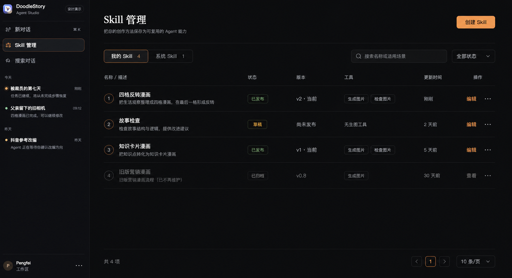
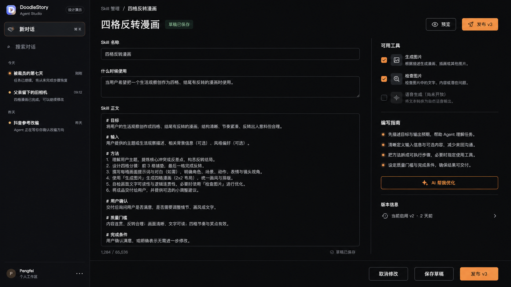
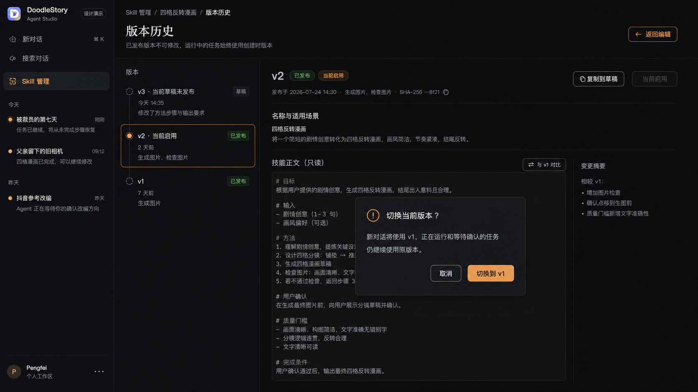
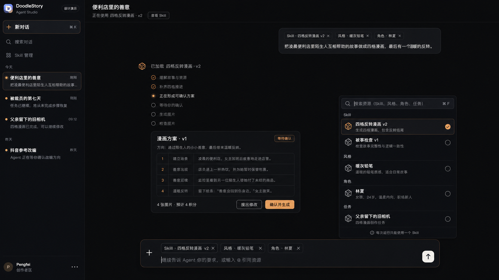

# Sprint 117 Skill 前端视觉与交互基准

## Purpose

本文档用于约束 Sprint 117 的前端呈现，避免实现退化为普通后台表格、简单文本框或与当前
Agent Studio 割裂的独立页面。

四张效果图基于当前 Agent Studio 截图生成，表达页面层级、密度、布局和交互意图。它们是视觉
方向基准，不是逐像素设计稿；图片内文字如果与 Sprint 合同冲突，以合同和本文档为准。

## Visual baseline

### 1. Skill 列表



目标：

- Skill 管理属于独立 Agent Studio，不进入传统工作台 Shell。
- 左侧仍保留新对话、搜索、会话历史、账号等 Agent 上下文。
- “Skill 管理”是清晰但克制的一级入口。
- 主内容使用紧凑行式列表，不做大面积卡片宫格。
- 用户一眼可以比较名称、适用场景、状态、当前版本、Tools 和更新时间。

关键结构：

- 页面标题、解释和“创建 Skill”主按钮。
- “我的 Skill / 系统 Skill”范围切换。
- 搜索和状态筛选。
- 服务端分页的行式列表。
- 状态：草稿、已发布、已归档。
- 行操作：编辑、查看、更多。

禁止：

- 把 Skill 做成与风格资源相同的图片卡片。
- 用统计图、总调用量或虚构数据占据首屏。
- 用大面积橙色、渐变、玻璃拟态或发光效果。

### 2. Skill 编辑器



目标：

- 用户感知是“描述自己的创作方法”，不是编辑配置文件。
- 正文是页面主体，拥有足够宽度和高度。
- Tool 白名单和写作指南在右侧提供辅助，不打断正文。
- 保存草稿和发布版本是两个明确动作。

关键结构：

- 名称。
- “什么时候使用”的简介。
- Skill 正文大文本编辑器。
- 右侧可用 Tools 多选。
- 右侧编写指南。
- “AI 帮我生成/优化”。
- 当前启用版本摘要。
- 保存草稿、发布版本。

AI 辅助行为：

1. 用户点击“AI 帮我生成/优化”。
2. 页面保留当前输入并显示生成中。
3. 建议结果以预览或差异形式出现。
4. 用户选择“应用建议”后才写入表单。
5. 关闭建议不会丢失原正文。
6. AI 建议不自动保存、不自动发布、不扩大 Tool 白名单。

发布行为：

- 发布前确认新版本号和允许的 Tools。
- 发布成功后原位显示新版本，不跳回空白列表。
- 发布失败保留所有输入。
- 有未保存内容时离开页面必须警告。

禁止：

- 要求用户填写 JSON、YAML、frontmatter 或 slug。
- 展示 Provider、模型、API key、数据库 ID 或 hash 输入框。
- 使用拖拽节点、流程图或多步骤配置向导。
- 把正文缩成窄小 textarea，把内部字段放在视觉中心。

### 3. 版本历史



目标：

- 清楚表达“草稿可编辑、发布版本不可变”。
- 左侧版本时间线用于选择，右侧查看准确版本内容。
- 激活历史版本是显式动作，并解释不会改变正在运行的任务。

关键结构：

- 当前未发布草稿。
- v1/v2 等发布版本。
- 当前启用标识。
- 发布时间、Tools 和短 hash。
- 只读正文。
- 复制到草稿。
- 设为当前版本。
- 版本差异摘要。

切换确认文案必须包含：

```text
新对话将使用所选版本；正在运行和等待确认的任务仍继续使用原版本。
```

禁止：

- 允许直接编辑历史发布版本。
- 激活历史版本时偷偷创建新版本。
- 切换 active 后改变已有 Run 的版本。
- 把“删除历史版本”作为普通操作展示。

### 4. 对话 `@Skill` 与执行状态



目标：

- Skill 和风格、角色、任务一样，是可见、可移除的结构化引用。
- 用户可以明确看到本轮使用的 Skill 和版本。
- Agent 展示安全活动事实，不展示推理过程。
- Skill 方案、确认和真实 Tool 执行继续发生在同一个会话上下文。

关键结构：

- Header 显示“正在使用 Skill 名称 · vN”。
- 用户消息保留 Skill、风格、角色等引用标签。
- `@` 菜单增加 Skill 分组。
- 一次只能选择一个 Skill，选择第二个时替换并说明原因。
- 活动流显示加载 Skill、形成方案、等待确认、生成和检查。
- 漫画方案继续使用紧凑 Artifact 卡片。
- 输入框固定在底部，打开资源菜单时不覆盖草稿。

用户安全活动可以显示：

- 已加载“四格反转漫画 · v2”。
- 正在形成可确认方案。
- 等待你的确认。
- 正在生成第 2/4 张图片。
- 正在检查第 2 张图片。

不能显示：

- chain-of-thought。
- Base Instructions。
- 完整 Skill 正文。
- Provider 原始响应。
- API key、内部路径或图片存储 URL。

## Shared visual language

- 延续当前 Agent Studio 近黑背景、低对比边框、暖橙强调色和米白主文字。
- 橙色只用于选中、主操作、当前进度和少量重要提示。
- 内容区域保持宽阔，避免层层嵌套卡片。
- 列表和编辑器强调高信息密度，但行高、段落和分隔必须可扫描。
- 状态不能只依赖颜色，必须同时有文字或图标。
- 使用当前已有图标语言，不单独引入另一套彩色图标。
- 不改变当前品牌 Logo、账号区域、会话历史和底部输入框的基本视觉关系。

## Navigation and state

```text
/agent/skills
  → /agent/skills/new
  → /agent/skills/{skill_id}
  → /agent/skills/{skill_id}/versions/{version_id}

/agent/{conversation_id}
  → 打开 @ 菜单
  → 选择一个 Skill Version
  → 与风格/角色等资源一起发送
  → 查看 Skill 活动与 Artifact
```

返回行为：

- Skill 列表返回对话时恢复原 Conversation、草稿和滚动位置。
- 编辑器返回列表时恢复搜索、筛选和分页。
- 版本详情返回编辑器时恢复未发布草稿。
- 浏览器刷新、前进、后退都由 URL 恢复正确页面。

## Required states

每个相关页面必须提供：

- loading；
- empty；
- no search results；
- API error + retry；
- permission/not found；
- saving；
- saved；
- publishing；
- publish failed；
- stale draft revision conflict；
- archived/read-only；
- unsaved changes。

不能只实现 populated/success 状态。

## Responsive behavior

### 1440×900

- 保留完整左侧 Agent 导航。
- Skill 编辑器保持正文 + 右侧辅助栏。
- 底部操作不遮挡正文。

### 1280×800

- 左侧导航宽度不继续扩大。
- 编辑器右侧辅助栏允许收窄，但正文仍是主区域。
- Tool 说明可以缩短，不能隐藏 Tool 选择。
- 版本列表和详情保持双栏；必要时降低版本栏宽度。

### 更窄宽度

Sprint 117 不要求移动端产品重设计，但布局不能横向溢出：

- 右侧辅助栏可以折叠到正文下方。
- 版本列表可以变成上方水平/下拉选择。
- 主要操作始终可见且可键盘访问。

## Interaction acceptance

实现验收不能只比较静态截图，还必须真实操作：

1. 从会话进入 Skill 管理，再返回原会话。
2. 创建草稿并在 API 失败后保留内容。
3. AI 建议预览、取消和应用。
4. 发布 v1、编辑草稿、发布 v2。
5. 查看 v1/v2 并激活历史版本。
6. 系统 Skill 只读并复制为个人草稿。
7. 归档后从新 `@` 搜索消失，历史消息仍显示原版本。
8. `@Skill + @风格 + @角色` 一起发送。
9. 选择第二个 Skill 时替换第一个。
10. 等待确认期间刷新和重启后仍显示原 Skill Version。

## Relationship to implementation

- 本目录图片控制视觉层级、密度、布局和整体气质。
- Sprint 117 合同控制数据、API、权限、版本和 Runtime 语义。
- `docs/standards/frontend.md` 与 `docs/standards/ui-interaction.md` 控制可访问性、状态和实现质量。
- 图片中的图标、字号和间距允许根据现有组件系统微调，但不能改变上述页面结构和主次关系。
- 如果实现需要明显偏离，先更新本设计说明和 Sprint 合同，再开发。
