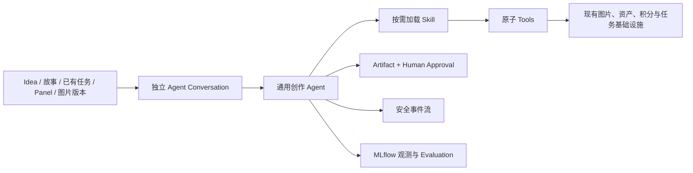

# Agent 漫画 V1 全局实施路线图

## 1. 文档职责

本文档是 Agent 漫画 V1 的全局导航，回答：

- 当前真实基线是什么。
- 为什么要按现在的顺序开发。
- 每个 Sprint 交付什么用户结果。
- 哪些数据库与旧系统共用，哪些能力必须新增。
- 前端什么时候出现，后端什么时候接通。
- 什么时候才可以称为内部可用。

本文档不替代 Sprint 合同。每次实现必须只执行一个 Active 合同；详细字段、接口、边界、验证和新窗口提示以 `docs/contracts/` 中对应文件为准。

## 2. 最新产品决定

### 2.1 最终产品形态

Agent 是独立、会话优先的创作模块，不再是旧任务工作台内容区中的一个模式。

### 2.2 长期边界

- Agent 模型负责理解目标、补齐故事、检查自洽、规划画面、生成简洁 Prompt、选择 Skill 和决定是否调用 Tool。
- Skill 负责创作方法、步骤、质量门槛和何时请求用户确认。
- Tool 只代表原子外部能力，例如 `generate_image`、`inspect_image`；未来可以增加 TTS、Remotion、抠图和媒体提取。
- Runtime 负责权限、状态、预算、幂等、Provider 路由、等待、恢复、暂停、取消、事件和观测。
- `@风格/@角色/@任务/@Panel/@图片版本` 是用户显式选择的结构化上下文，由 Runtime 鉴权和注入，不由模型按名字猜。
- MLflow 只做观测和 Evaluation 输入，数据库仍是业务事实来源。
- Artifact 和 Approval 表达用户可见方案与确认，不把隐藏思维过程暴露给用户。
- 不为每种创作方式写独立硬编码 Workflow；不同方法通过 Skill 组合同一组 Tools。

### 2.3 与旧系统的关系

Agent 和传统构建继续共享：

- 用户与权限；
- 积分账户与流水；
- 风格与角色资源；
- `generation_tasks`；
- `task_panels`；
- `generated_images` 与图片版本；
- `file_assets`；
- 图片 Provider 与 worker。

不创建第二套 Agent Task/Panel/Image 表。Agent 新建或继续的漫画任务仍是同一个 `GenerationTask`。

Agent 不长期复用：

- 旧工作台 Shell；
- 旧 Task 详情抽屉；
- 旧故事拆分/Storyboard/复杂 Prompt 拼接编排；
- 为模型失败而散落在业务代码中的重复重试；
- 旧 Pipeline 的调试字段作为用户创作交互。

## 3. 防止过度设计的硬规则

- 单 Agent，直到真实 Eval 证明必须拆分。
- 小型代码 Registry，不做 Workflow DSL、Skill 市场或 Tool 管理后台。
- Runtime Skill 存在 `backend/app/agent_skills/`，与 Codex 开发 Skill `.agents/skills/` 分离。
- 进程内队列 + 数据库状态，不引入 Redis、Celery、Temporal 或独立工作流服务。
- 一次只新增当前 Sprint 需要的表和 Tool。
- 正式 `/agent` 不允许 Mock、占位成功或看似可用但没有后端语义的按钮。
- 前端不放到最后：信息架构最先修正；每个新后端能力在同一 Sprint 接入真实 UI。
- 不为未来 TTS、Remotion、抠图提前建通用媒体平台；漫画 V1 通过后再加具体 Tool/Skill。
- 每个 Sprint 必须产生可验证结果，不能只写抽象层。

## 4. 当前真实基线

### 已完成

- Sprint 103：会话优先 Agent 前端 Demo。
- Sprint 104：Agent PRD、Runtime/Tool 设计、火苗/LIO 能力探测和 Eval 初稿。
- Sprint 105：可持久化 Conversation/Message/Run/Step、应用侧上下文、主备模型 Router、恢复与幂等。
- Sprint 106：Idea + 一个真实风格 → 固定两格真实漫画。
- Sprint 107：传统/AI 双模式正式工作台整合。
- Sprint 108：正式 Agent 内部界面与 Demo 对齐。
- Sprint 110：Agent 默认模型切换为 `gpt-5.5`。

### 路线制定时的代码限制

- `/agent` 仍嵌在旧工作台 Shell 中。
- Agent 内仍显示 `传统构建 / AI 构建` 切换。
- 任务卡跳转旧 `/tasks/{task_id}` 详情。
- Runtime 只接受恰好一个 Style resource ref。
- `build_agent_input()` 只传消息文本，忽略资源引用。
- `ComicPlan` 固定两格。
- 规划完成后立即创建任务并生图，没有方案确认。
- 当前更新依赖有界轮询，没有用户安全 SSE 事件。
- 没有 Runtime SkillRegistry、通用 Tool Executor、Artifact、Approval、Event、MLflow、VL、版本接受/恢复或 pause/resume。

### 当前 SQL 基线

已有：

- `agent_conversations`
- `agent_messages.resource_refs_json`
- `agent_runs.task_id`
- `agent_steps`
- `generation_tasks`
- `task_panels`
- `generated_images.generation_number/is_current/source_type`

路线中预计新增：

- Sprint 114：`agent_artifacts`
- Sprint 114：`agent_approval_requests`
- Sprint 114：`agent_events`
- Sprint 116：`generated_images.accepted_at/accepted_by_user_id`

Sprint 111–113、115 默认不新增表。

## 5. Sprint 总表

| Sprint | 目标 | 状态 | 数据库变化 | 正式前端 |
| --- | --- | --- | --- | --- |
| 111 | 独立 Agent Shell、紧凑任务卡、只读任务检查器 | Complete | 无 | 有，完整 |
| 112 | MLflow 可观测性基线 | Complete | 无 | 无新功能 |
| 113 | SkillRegistry、ToolRegistry、Generic Tool Executor | Complete | 无 | 无新功能 |
| 114 | `idea-to-comic` Skill、方案确认、SSE 事件流 | Complete | Artifact/Approval/Event | 有，方案卡与活动流 |
| 115 | Style/Character/Task/Panel/Image Version 引用 | Complete | 默认无 | 有，真实 `@` 菜单与引用 |
| 116 | Panel 新版本、接受/恢复、VL、暂停/继续 | Complete | GeneratedImage accepted 字段 | 有，任务检查器写操作 |
| 117 | 可插拔 Skill 管理、版本与通用 Agent Loop | Complete | Skill 与版本表 | 有，Skill 管理和 `@Skill` |

最终 Evaluation 已 Deferred，待功能路线冻结后重新编号，不属于 Sprint 117。

旧 `Sprint 109` Draft 已标记 Superseded，不能再激活。

## 6. Sprint 111：先修正正式前端信息架构

合同：

`docs/contracts/sprint-111-agent-independent-shell-readonly-inspector.md`

### 为什么最先做

- 当前产品层级已经确定不符合目标。
- 越晚拆 Shell，后续 Artifact、Approval、事件流、资源引用和 Panel 操作越会绑在错误页面结构上。
- 这一步只需要最小只读 API，不干扰后端 Agent Runtime 重构。

### 交付

- 独立 `/agent` 模块 Shell。
- 会话主导航。
- 紧凑真实任务卡。
- `/agent/{conversation_id}/tasks/{task_id}` 只读检查器。
- 共享同一 GenerationTask，不新增表。

### 退出门槛

- 正式 `/agent` 没有旧后台导航和模式切换。
- 检查器刷新、后退、关闭和草稿恢复稳定。
- 权限、两个桌面视口和旧工作台回归通过。

### 完成结果

2026-07-24 已通过全部退出门槛。正式 `/agent` 使用独立会话 Shell；任务卡和只读检查器读取同一个真实 GenerationTask；嵌套路由、Conversation→Task→owner 鉴权、Panel/current image 选择、有界版本列表、两个桌面视口、键盘焦点和旧 `/tasks` 回归均已验证。Sprint 112 随后已单独激活并完成。

## 7. Sprint 112：先看得见，再重构 Runtime

合同：

`docs/contracts/sprint-112-agent-mlflow-observability-baseline.md`

### 为什么在 Skill/Tool 前

- 后续 Runtime 重构必须能比较调用次数、fallback、延迟、错误和成本。
- 观测先接当前稳定基线，才能判断重构是否改善或退化。
- MLflow 不参与业务状态，避免把观测和执行耦合。

### 交付

- 官方 MLflow 与当前 Agents SDK/自定义 endpoint 的兼容性结论。
- Agent Run/model/tool/wait/final trace。
- `agent_run_id` 关联、脱敏和真实 fallback 证据。

### 退出门槛

- 火苗成功、火苗→LIO fallback、永久错误三条路径可解释。
- 数据库 AgentStep 与 MLflow trace 一致。
- 不泄露敏感内容，不改变业务状态。

### 完成结果

2026-07-24 已通过全部退出门槛。火苗恢复后的直接成功 Run `c3c1dd54fa0f4d0e807786cc89ee5ac2` 可用 `agent_run_id` 唯一找到 trace `tr-7cc99632fd625cb4abe72b729fcc91be`；真实 provider/model、attempt、延迟、token usage 和 provider request ID 与数据库 AgentStep 一致。火苗临时错误→LIO 成功及永久错误不 fallback 也已验证，默认脱敏扫描无敏感内容或内部路径命中。

## 8. Sprint 113：建立最小 Skill/Tool Runtime

合同：

`docs/contracts/sprint-113-agent-skill-tool-runtime-foundation.md`

### 交付

- Runtime Skill 包约定。
- Skill catalog 和按需 `load_skill`。
- 代码级 ToolRegistry。
- Generic Tool Executor。
- 现有 `generate_image` adapter。
- Skill/Tool Step 与 MLflow trace。

### 退出门槛

- Skill 版本/hash 可追踪。
- Tool 副作用先持久化、可等待、可恢复、可幂等重放。
- 当前真实两格行为无回归。
- 没有引入 Workflow DSL 或新基础设施。

### 完成结果

2026-07-24 已通过全部退出门槛。服务启动扫描受控 Runtime Skill 目录，基础
instructions 只包含有界 catalog；`load_skill` 的版本/hash/加载时间进入 AgentStep
和 MLflow。代码级 Tool Registry 与 Generic Tool Executor 统一执行严格 schema、
权限、预算、call-before-effect、等待、结果 checkpoint、重放和取消门禁。当前固定两格
仍使用旧规划入口，但两个真实图片 job 已通过统一 `generate_image` adapter 创建并复用
既有图片 worker/积分链路。未新增表、Workflow DSL、外部队列或正式 Skill 流程切换。

## 9. Sprint 114：第一条真正 Skill 驱动的创作链路

合同：

`docs/contracts/sprint-114-idea-to-comic-skill-hitl-event-stream.md`

### 交付

- 正式 `idea-to-comic` Skill。
- 2–8 Panel 的方案 schema。
- `agent_artifacts`、`agent_approval_requests`、`agent_events`。
- 漫画方案卡与用户批准/修改。
- 批准后生图门禁。
- 持久化 SSE 活动流。

### 退出门槛

- 方案未批准前绝不生图或占图片积分。
- 请求修改产生方案新版本。
- 批准对象通过 hash 绑定。
- SSE 断线恢复不丢事件、不重复副作用。
- 正式链路不再依赖固定两格硬编码。

### 完成结果

2026-07-24 已通过全部退出门槛。正式 Agent 显式加载 `idea-to-comic`，2–8 Panel ComicPlan 先保存为 hash 绑定 Artifact/Approval 并等待 owner 决策；批准前不创建 GenerationTask、Panel、图片 job 或积分占用，修改会保留旧版本并再次确认。批准后继续复用同一任务、图片 worker 和积分链路，`generate_image` 在 Runtime 内再次校验 approved hash、Panel、Prompt、比例、预算和 Run 状态。持久化安全事件与 SSE cursor 已取代旧轮询，真实 v1→修改→v2→批准→两张图片、服务重启等待恢复、断线错误与手动重连均通过。

## 10. Sprint 115：真实资源上下文

合同：

`docs/contracts/sprint-115-agent-structured-resource-context.md`

### 交付

- 有界 Style、Character、Task、Panel、Image Version 查询。
- Resource Resolver 与所有权/父子关系/组合校验。
- 资源上下文进入模型重放。
- 新任务、已有任务续作和普通讨论路由。
- `@角色` 真实进入任务快照和生图参考。
- 检查器到输入区的引用联动。

### 退出门槛

- 跨用户和错误父子引用全部拒绝。
- 引用已有 Task 不创建新 Task。
- 资源标签不覆盖草稿，刷新和切换可恢复。
- UI 不提前展示 Sprint 116 写操作。

### 完成结果

2026-07-24 已通过全部退出门槛。五类资源有界 API、统一 Resolver、规范引用与安全快照重放、普通讨论/新任务/同任务只读续作路由均已落地；Character 参考真实进入 Task 快照、Panel appearance 关系和图片 Provider 输入。真实浏览器完成 `@风格 + @角色` 两格生成、检查器引用 Task/Panel/Image Version、草稿刷新恢复、同 Task 只读续聊及未开放写操作拒绝；自动化和全量项目检查通过。Sprint 116 保持 Planned，尚未实现 Panel 再生成、接受/恢复版本、VL 或 pause/resume。

## 11. Sprint 116：Panel/VL/版本闭环

合同：

`docs/contracts/sprint-116-agent-panel-version-vl-loop.md`

### 交付

- `inspect_image`。
- 目标 Panel 新图片版本。
- 接受和恢复版本。
- 单 Turn 最多一次自动修订。
- pause/resume。
- 安全活动事件和完整任务检查器操作。

### 退出门槛

- 修改局部性、版本幂等和积分正确。
- 恢复不调用 Provider、不扣积分。
- VL、Agent 决策与版本变化可解释。
- 暂停、继续、取消、晚到和重启行为正确。

2026-07-25 已通过退出门槛。目标 Panel 新版本、接受/恢复、真实 `inspect_image`、严格一次授权自动修订、pause/resume、安全事件与检查器写操作均已落地；长任务继续由现有图片队列处理，Runner 只调用原子 Tool，没有引入通用 Workflow 引擎。全量 240 项后端测试、空库 migration、Python compileall、前端生产构建和真实 Provider/浏览器验收通过。2026-07-26 Sprint 116 正式闭合并整合到后续基线，用户已授权激活新的 Sprint 117。

## 12. Sprint 117：可插拔 Skill 管理、版本与通用 Agent Loop

合同：

`docs/contracts/sprint-117-pluggable-skill-management-agent-loop.md`

### 交付

- 用户 Skill CRUD、草稿、不可变发布版本、激活、归档和系统 Skill clone。
- Skill 编写指南、AI 草稿建议与受控 Tool 白名单。
- `/agent/skills` 管理界面和对话 `@Skill`。
- 每个 Run 固定准确 Skill Version。
- 通用内容创作 Base Instructions 和真正由 Skill 驱动的 OpenAI Agents SDK Tool Loop。
- 移除正式漫画路径按 Skill name 或资源路由硬编码的编排，不保留旧路径 fallback。

### 退出门槛

- UI 新建 Skill 后无需改代码或重启即可在对话中引用并运行。
- 发布 v2、激活 v1 或归档不改变已经开始的 Run。
- 用户创建的无生图 Tool Skill 无法调用 `generate_image`。
- 系统 `idea-to-comic` 继续完成真实方案确认和生图，且方法只维护在 Skill 发布版本。
- Runner 新增其它纯文本 Skill 时不增加按 Skill 名称分支。

2026-07-26 已通过退出门槛。用户 Skill 草稿、不可变 v1/v2、历史激活、归档、系统 clone、AI
建议、真实 `@Skill` 和 Run version pin 均已落地；基础 Instructions 已收敛为通用内容创作规则，
正式执行从数据库准确版本读取完整正文和白名单 Tool schemas，不再使用文件 `load_skill`、
`process_comic_agent_run()`、漫画专用模型入口或 `AgentResourceRoute.create_comic` 业务分支。
252 项后端测试、空库 migration、compileall 和前端构建通过。隔离真实验收中，系统 Skill 和
UI 发布的个人 Skill 各完成 2-Panel 真实生图，共 4 张成功、余额 30→26；无图片 Tool 的故事检查
Skill 只输出文字且未创建任务，Style-only 消息通过 catalog 自动选择系统 Skill 并停在方案确认。
QA 报告：`docs/qa/sprint-117-pluggable-skill-management-agent-loop-report.md`。

## 最终阶段：Evaluation 与内部开放

合同：

`docs/contracts/deferred-agent-evaluation-internal-release-gate.md`

Evaluation 已按用户决定推迟到全部计划功能完成后。当前不分配 Sprint 编号；功能路线冻结后再更新
候选范围、阈值、数据集和启动提示，并输出明确 `GO_INTERNAL` 或 `NO_GO`。

## 13. Mock 与真实实现规则

### 允许 Mock 的地方

- `docs/design/` 下的独立原型。
- 纯组件视觉测试 fixture。
- 自动化测试中的显式 fake Provider。

这些内容必须清楚标注，不进入正式 `/agent`。

### 正式 `/agent` 的规则

- 所有会话、资源、任务、方案、审批、事件、图片和版本都来自真实 API/数据库。
- 后端能力未完成时，不显示对应操作。
- 不使用前端内存假状态冒充持久化结果。
- 不用旧 API 作为未评审语义的隐藏兜底。

## 14. 后续能力如何扩展

Sprint 117 完成后，再按用户优先级讨论：

- 用户维度 Memory：保存创作习惯和规则，不作为 Skill 文件注入。
- 参考优秀漫画与抖音输入：作为受权限资源上下文与专门 Skill。
- TTS：新增 `generate_voice` Tool。
- Remotion：新增 `render_remotion` Tool。
- 视频拼接：新增 `compose_video` Tool。
- 抠图：新增 `remove_background` Tool。
- 漫画转视频、解说视频：新增组合上述 Tools 的 Skill。

新增能力的规则仍是：先定义一个原子 Tool，再用 Skill 组合；不把每个组合写成独立业务 Workflow。

## 15. 新窗口交接规则

每个实施窗口必须依次读取：

1. 根目录 `AGENTS.md`。
2. `README.md`。
3. `docs/spec.md`。
4. `docs/progress.md`。
5. 本路线图。
6. 当前唯一 Active Sprint 合同。
7. 合同直接引用的标准、设计和测试文件。

每个 Sprint 结束时：

- 运行合同全部 Verification。
- 更新合同 Status、`docs/progress.md` 和本路线图。
- 架构/API/数据库变化同步 `docs/spec.md`。
- 记录真实浏览器/Provider/MLflow 证据。
- 不自动开始下一个 Sprint。
- 创建符合仓库规范的中文详细 commit。
