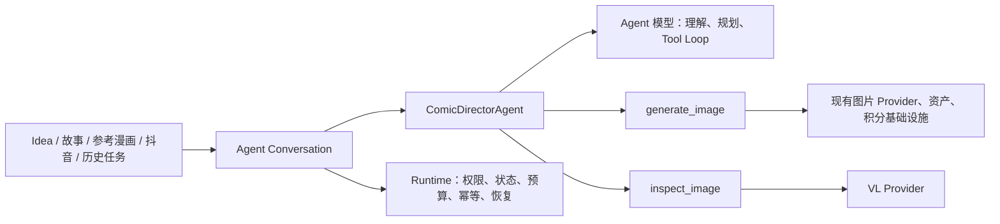

# Agent V1 全局实施路线图

## 1. 文档职责

本文档是 Agent V1 从设计、实现、迁移到发布的全局导航，负责回答：

- 当前处在哪个阶段。
- 各阶段为什么按这个顺序发生。
- 每个阶段交付什么结果，满足什么条件才能进入下一阶段。
- 现有生成 Pipeline 如何逐步退出，而不是长期维护两套创作逻辑。

本文档不替代 Sprint 合同。路线图只规定阶段目标和退出门槛；每次实现仍以 `docs/contracts/` 下唯一激活的 Sprint 合同为边界。

## 2. 最终目标

最终产品只有一套创作决策系统：漫画导演 Agent。

必须长期保持的边界：

- Agent 决定故事、分镜、画面 Prompt、检查方向和是否请求修改。
- Runtime 决定权限、Provider 路由、预算、幂等、状态转换、持久化和错误分类。
- 模型只看到基础生图与 VL 检查 Tool；数据库、队列、积分和 Provider 选择不是 Tool。
- `@风格/@角色/@任务/@Panel/@图片版本` 由 Runtime 鉴权和注入，不让模型按名字猜资源。
- 现有图片 Provider、资产、积分、Panel 和图片版本可以复用；旧故事拆分、复杂 Prompt 拼接和硬编码重试编排不能包装成新 Tool。
- 最终所有旧入口都转成 Conversation 的不同上下文来源，不保留长期并行的创作 Pipeline。

## 3. 阶段状态

| 阶段 | 目标 | 状态 | 对应合同 |
| --- | --- | --- | --- |
| 0 | 产品、架构、交互、平台和 Evaluation 基线 | 已完成 | Sprint 103、104 |
| 1 | 可持久化、可恢复、可切换 Provider 的 Agent Runtime | 已完成 | Sprint 105 |
| 2 | 对话创建两格真实漫画的纵向链路 | 已完成 | Sprint 106 |
| 3 | 指定 Panel 修改、重试、版本恢复和 VL 检查闭环 | 待评审 | Sprint 107 Draft |
| 4 | 角色、任务、图片、参考漫画和抖音等资源入口 | 未开始 | 阶段 3 后创建合同 |
| 5 | 旧入口迁移到 Agent 并移除重复编排 | 未开始 | 阶段 4 后创建合同 |
| 6 | 完整 Evaluation、稳定性、成本和发布门槛 | 未开始 | 阶段 5 后创建合同 |

阶段不能仅凭“代码大致完成”前进。必须运行该阶段合同的 Verification、更新 `docs/progress.md`，并在本表更新状态。

## 4. 阶段 0：设计与能力验证

### 已完成

- Agent V1 PRD 和会话优先前端 Demo。
- 单 Agent Runtime、应用侧上下文、checkpoint 和 Tool 边界。
- 火苗和 LIO 使用 `gpt-5.6-terra` 的真实兼容性探测。
- 20 个版本化 Evaluation 场景。

### 已知验证边界

阶段 1 已进一步确认两个平台均能通过 `openai-agents==0.18.3` 执行 Responses Function Calling、Tool Output、final response 和应用侧完整输入重放；正式 Runtime 已锁定 Responses，不使用 Provider continuation ID。

## 5. 阶段 1：Agent Runtime 基础

### 完成结论

Sprint 105 已完成并通过全部退出门槛。四张 Agent 表、最小 API、进程内队列、应用侧上下文、主备 Router、完整 Step checkpoint 与启动恢复均已落地；双平台 SDK 报告和两轮真实 Runtime smoke 报告保存在 `docs/testing/`。全量检查覆盖 190 个后端测试、空库 migration 和前端生产构建，现有生成 Pipeline 未修改。

### 用户可感知结果

后端可以创建会话、发送消息、异步完成一个真实 Agent 文本 Turn，并在关闭页面或服务重启后读取和继续同一会话。火苗发生合同允许的临时错误时，Runtime 使用完整应用侧上下文切换到 LIO。

### 实现范围

- 精确验证 OpenAI Agents SDK 在两个平台上的 Responses Tool Loop。
- 锁定 SDK、OpenAI client 和 API 形态。
- 新增 `agent_conversations`、`agent_messages`、`agent_runs`、`agent_steps` 四张最小表。
- 使用进程内队列调度 `run_id`，数据库作为状态事实来源。
- 实现 Conversation、Message 和 Run 最小 API。
- 实现一个 ComicDirectorAgent 的文本 Turn，不接漫画 Tool。
- 实现火苗主平台、LIO 备用平台的最小 Router。
- 记录模型步骤、Provider、模型、attempt、延迟、usage、fallback 和脱敏错误。

### 退出门槛

- 两个平台的实际 SDK Tool Loop 结论已保存。
- 两轮对话能从应用数据库重放上下文，不依赖 Provider continuation ID。
- 服务重启后未完成 Run 能按安全 step 恢复，已完成模型 step 不重复调用。
- 临时错误可以切 LIO；401、schema、`model_not_found` 和能力不支持等永久错误不切换。
- 普通用户不能读取或继续其他用户的 Conversation。
- `./scripts/check.sh` 通过。

## 6. 阶段 2：对话式真实漫画生成

### 完成结论

Sprint 106 已完成并通过全部退出门槛。真实 `/agent` 页面支持 Idea + 一个 active 全局风格，Agent 结构化输出固定两格 ComicPlan，Runtime 原子保存任务与两个 Panel，并通过两个有幂等键的真实 `generate_image` job 生成资产；图片完成后写 Tool Output、恢复最终回答，并在对话任务卡片中展示。真实 HTTP、浏览器和中断恢复 smoke 均通过，证据保存在 `docs/testing/agent-comic-vertical-slice-smoke-report.json`；全量检查覆盖 196 个后端测试、空库 migration 和前端生产构建。现有旧 Pipeline 未迁移，VL、Panel 迭代、角色和抖音均未实现。

### 用户可感知结果

用户在真实 Agent 页面新建或继续对话，输入漫画 Idea 并选择一个 `@风格`，Agent 自主生成两格 `ComicPlan`、调用真实生图 Tool，并在对话中展示任务卡片和两张图片。

### 实现范围

- 将 Sprint 103 Demo 的会话行为接入真实 API，不照搬 Demo 数据。
- 增加 `@风格` 的前端选择、后端鉴权和快照。
- 定义并校验最小 `ComicPlan`。
- 复用现有 GenerationTask、Panel、GeneratedImage、图片 Provider、资产和积分基础设施。
- 新增真实 `generate_image` Tool；不复用旧故事拆分和 Prompt 编排。
- Agent Run 在等待图片 job 时 checkpoint，图片完成后恢复 Tool Loop。
- 对话中展示应用级进度和真实任务卡片，不做 Token 级流式输出。

### 退出门槛

- 本地 UI 可以从 Idea 和一个已授权风格生成两格真实漫画。
- Agent 生成的最终单图 Prompt 不经过旧 Pipeline 的多层创作 Prompt 拼接。
- 同一 Tool Call 重放不会产生第二个图片 job 或第二次扣费。
- 图片失败、积分不足、取消和 Provider 错误均有明确状态，不返回占位图。
- 页面刷新或后端重启后仍能恢复任务卡片和图片状态。
- 阶段 2 的针对性测试和 `./scripts/check.sh` 通过。

## 7. 阶段 3：Panel 迭代与 VL 闭环

阶段 3 已建立 `docs/contracts/sprint-107-agent-panel-iteration-vl-draft.md`，当前仅待评审，不代表授权实施。

### 用户可感知结果

用户可以在对话中说“把第 3 张表情改掉”“恢复上一版”或“检查人物是否一致”。Agent 只作用于目标 Panel，并能调用 VL 获取证据后决定接受、修改或询问用户。

### 核心能力

- 指定 Panel 修改和重试。
- 图片版本切换和恢复，不重新生图。
- `inspect_image` Tool。
- Tool 预算、最大自动修改次数和 `waiting_for_input`。
- 取消、晚到结果丢弃和积分正确释放。

### 退出门槛

- 修改一个 Panel 不改变其他 Panel。
- 恢复旧版本不调用图片 Provider、不扣费。
- VL 结果、Agent 决策和新图片版本可以从 Step trace 完整追踪。
- 重启、重复投递和取消不会造成重复副作用。

## 8. 阶段 4：资源与参考改编

按真实用户价值逐项加入，不为所有资源预建通用框架：

1. `@固定角色`。
2. `@任务/@Panel/@图片版本`。
3. 最后一张真人图片。
4. 参考优秀漫画的结构改编。
5. 抖音内容提取结果作为 Agent 上下文。

每增加一种资源都必须覆盖归属校验、快照、对话恢复和目标局部性。阶段 4 完成时，不同入口只是向同一 Agent Turn 注入不同资源，而不是启动不同 Pipeline。

## 9. 阶段 5：旧 Pipeline 迁移与删除

迁移采用“入口逐个切换、能力验收后删除旧编排”，不在一个 Sprint 全量重写：

1. 统计现有完整故事、故事方案、提取分镜、知识方案和 DY 入口的真实能力清单。
2. 为每个入口增加 Agent 等价 Eval case。
3. 将入口改为创建或继续 Conversation，并注入原始文本/资源。
4. 达到功能和质量门槛后，停止该入口调用旧编排。
5. 删除已经没有调用方的 Prompt 拼接、单次 LLM 步骤和重复重试代码。

阶段 5 的完成定义是“创作决策只有 Agent 一套”，不是“旧文件暂时没人点”。

## 10. 阶段 6：Evaluation 与发布

- 跑完 `evals/agent_v1/cases.jsonl` 的关键确定性断言。
- 固定模型、Judge、风格快照和数据集版本，建立可比较基线。
- 覆盖 Provider 故障注入、长对话、重启、取消、重复 Tool Call 和并发。
- 统计完成率、fallback、调用次数、token、图片成本和延迟分位数。
- 先本地开发，再内部使用，再小范围用户开放。

以下任一情况阻止发布：跨用户资源访问、错误 Panel 修改、重复生图/扣费、取消后保存结果、永久错误被无限重试、无法从 Run/Step 解释失败。

## 11. 防止过度设计的硬规则

- 单 Agent，直到真实 Eval 证明必须拆分。
- 四张 Agent 表起步；资源引用先作为受控 JSON 保存，只有出现真实查询或约束需求才拆表。
- 进程内队列起步，不引入 Redis、Celery、Temporal 或独立 worker 服务。
- 不实现熔断器、动态 Provider 评分或多区域路由；阶段 1 只有有界重试和一次备用切换。
- 不做 Token 流；先轮询/应用级状态事件。
- 不建立通用 Tool 注册平台；只实现当前阶段需要的 Tool。
- 不为阶段 4 的资源提前写抽象。
- 每个阶段都必须产生一条真实可体验链路，不能只交付基础设施。

## 12. 文档和新窗口交接规则

每个实现窗口开始时按顺序读取：

1. 根目录 `AGENTS.md`。
2. `README.md`、`docs/spec.md`、`docs/progress.md`。
3. 本路线图。
4. 当前唯一激活的 Sprint 合同。
5. 合同直接引用的设计、标准和 Evaluation 文件。

每个 Sprint 结束时：

- 运行合同 Verification。
- 更新本路线图阶段状态和 `docs/progress.md`。
- 架构/API/数据契约变化时同步 `docs/spec.md` 和合同。
- 记录未验证内容和下一阶段输入。
- 创建符合仓库规范的中文 commit。
