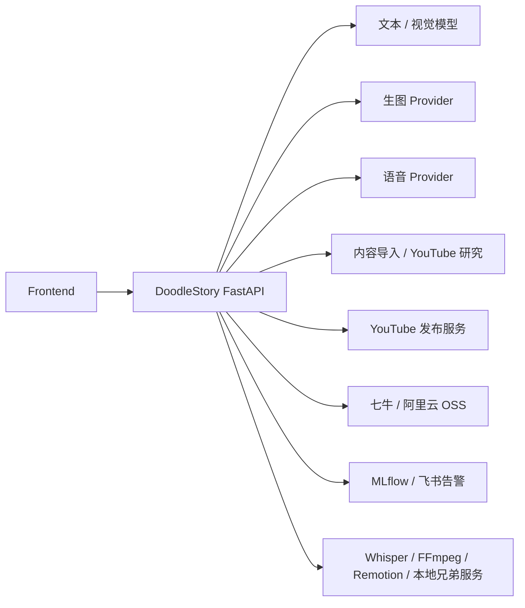

# DoodleStory 全部出站调用清单

本文以当前仓库代码为准，整理 DoodleStory 的外部 HTTP 调用、SDK 调用、兄弟服务调用和本地进程调用。重点回答：

- SiliconFlow 是否由 DoodleStory 直接调用；
- Native Agent 实际使用哪个地址、哪个 API 形状；
- 每个业务能力最终连接到哪个地址、哪个路径；
- 哪些配置只是遗留项或模型归类，并没有被 DoodleStory 直接请求。

本文不记录 API Key、Secret、Token 或完整 webhook URL，只记录公开地址、配置项、路径、调用方式和代码位置。每次重试仍然属于同一个调用入口，本文按入口归并，不重复列出重试循环。

## 1. 总览



当前本地 .env 中能确认的主要地址如下：

| 配置项 | 当前值或规范化结果 | 直接用途 |
| --- | --- | --- |
| SILICONFLOW_BASE_URL | https://api.siliconflow.cn/v1 | SiliconFlow 文本、视觉、语音 |
| TEXT_FALLBACK_BASE_URL | https://api.huomiao.art，代码规范化为 https://api.huomiao.art/v1 | 普通文本/视觉兼容接口、Native Agent 主地址 |
| LIO_BASE_URL | https://api.apilio.ai，代码规范化为 https://api.apilio.ai/v1 | LIO 文本/视觉兼容接口、旧 Agent Router 备用地址 |
| IMAGE_GATEWAY_BASE_URL | http://192.129.209.36:3001/v1 | IMAGE_PROVIDER=qy 的统一生图网关 |
| XG_BASE_URL | https://api.xgapi.top，请求时补 /v1 | IMAGE_PROVIDER=xgapi |
| DOUYIN_IMPORT_SERVICE_BASE_URL | http://127.0.0.1:8010 | 抖音下载、多平台素材导入、YouTube 频道研究 |
| YTB_PUBLISH_URL | https://video.inboxlinks.top/ | YouTube 频道/视频同步和上传任务 |
| MLFLOW_TRACKING_URI | http://127.0.0.1:5000 | Agent 观测数据 |
| ALIYUN_OSS_ENDPOINT | https://oss-cn-beijing.aliyuncs.com | 阿里云 OSS SDK |
| VITE_API_BASE_URL | http://127.0.0.1:8000 | 前端调用本项目自己的 FastAPI，不是外部供应商 |

## 2. 模型 API：SiliconFlow、普通兼容接口、Native Agent

### 2.1 SiliconFlow：DoodleStory 后端直接调用

SiliconFlow 是独立的后端直连链路，不是 Native Agent 的固定地址。

| HTTP 调用 | 代码入口 | 配置和用途 |
| --- | --- | --- |
| POST {SILICONFLOW_BASE_URL}/chat/completions | backend/app/services/llm.py 的 call_siliconflow_json | 结构化文本 JSON；模型来自 SILICONFLOW_MODEL |
| POST {SILICONFLOW_BASE_URL}/chat/completions | backend/app/services/media_text_extraction.py 的 _chat_multimodal | 视觉、图文内容提取、角色参考图描述；模型来自 SILICONFLOW_VISION_MODEL |
| POST {SILICONFLOW_BASE_URL}/uploads/audio/voice | backend/app/services/siliconflow_voice.py 的 upload_reference_voice | 上传参考音频并注册声音；multipart/form-data |
| POST {SILICONFLOW_BASE_URL}/audio/speech | backend/app/services/siliconflow_voice.py 的 generate_speech | 使用已注册声音生成音频；JSON 请求，返回音频二进制 |

普通文本/视觉请求使用 OpenAI-compatible chat.completions，逻辑地址是：

```text
https://api.siliconflow.cn/v1/chat/completions
```

### 2.2 普通 OpenAI-compatible 文本/视觉链路

这条链路使用 TEXT_FALLBACK_BASE_URL 和 LIO_BASE_URL，但它本身不是 Native Agent 的 Responses 调用。

| HTTP 调用 | 代码入口 | 业务用途 |
| --- | --- | --- |
| POST {TEXT_FALLBACK_OPENAI_BASE_URL}/chat/completions | backend/app/services/llm.py 的 call_text_fallback_json | 文本结构化请求；模型为 TEXT_FALLBACK_MODEL |
| POST {TEXT_FALLBACK_OPENAI_BASE_URL}/chat/completions | backend/app/services/media_text_extraction.py、agent_vision.py | 风格提示词、单图内容、Agent 图片检查等多模态请求 |
| POST {LIO_OPENAI_BASE_URL}/chat/completions | backend/app/services/llm.py 的 call_lio_json | LIO 结构化文本请求 |
| POST {LIO_OPENAI_BASE_URL}/chat/completions | backend/app/services/media_text_extraction.py | 单图内容提取在主平台失败后的 LIO 路径 |

已有代码中的实际路由行为：

1. extract_single_image_content 先调用 TEXT_FALLBACK_BASE_URL，失败后切换到 LIO 并按代码配置重试。
2. call_lio_json 的调用链在 LIO 失败时会回到 call_text_fallback_json。
3. call_siliconflow_json 和 call_lio_json 是 llm.py 中的结构化请求封装；具体业务使用点以同文件的调用者为准。

### 2.3 Native Agent：Responses API

Native Agent 的主循环在 backend/app/services/native_agent_loop.py 创建：

```python
client = AsyncOpenAI(
    api_key=resolved_settings.text_fallback_api_key,
    base_url=resolved_settings.text_fallback_openai_base_url,
)
provider = OpenAIProvider(openai_client=client, use_responses=True)
```

因此 Native Agent 的逻辑请求地址是：

```text
https://api.huomiao.art/v1/responses
```

| 项目 | 当前配置 |
| --- | --- |
| 客户端 | AsyncOpenAI + OpenAI Agents SDK OpenAIProvider |
| API 形状 | Responses API，不是 chat.completions |
| 主地址 | TEXT_FALLBACK_BASE_URL → https://api.huomiao.art/v1 |
| 模型 | AGENT_MODEL；当前 .env 未覆盖，代码默认 gpt-5.5 |
| 工具 | Native Agent Function Tool，工具执行后再把结果返回给模型 |

Native Agent 的 generate_image、generate_speech、generate_subtitles、render_story_video、capture_wechat_article、inspect_youtube_channel、publish_youtube_video 等是本地工具，不是模型供应商地址；工具内部会继续调用本文后面的各个 Provider。

### 2.4 旧 AgentModelRouter

backend/app/services/agent_model_router.py 仍被 Skill 编写等旧流程使用：

| 顺序 | Provider 名称 | 地址 | API 形状 |
| --- | --- | --- | --- |
| 1 | huomiao | TEXT_FALLBACK_BASE_URL → https://api.huomiao.art/v1 | POST /responses |
| 2 | lio | LIO_BASE_URL → https://api.apilio.ai/v1 | POST /responses |

旧 Router 的 LIO 备用逻辑地址是 `https://api.apilio.ai/v1/responses`。

该 Router 只在主请求满足代码定义的可重试失败条件时切换到 LIO。它和 Native Agent 主循环是两条代码路径：Native Agent 主循环当前直接创建主地址客户端，旧 Router 显式实现 Huomiao → LIO 的路由。

## 3. 图片生成

统一入口为 backend/app/services/image_generation.py 的 request_xg_image，由 IMAGE_PROVIDER 选择 Provider。

### 3.1 QY / 统一生图网关

当前 .env 为 IMAGE_PROVIDER=qy，实际由 DoodleStory 直接请求：

| HTTP 调用 | 请求形状 | 结果处理 |
| --- | --- | --- |
| POST {IMAGE_GATEWAY_BASE_URL}/images/generations | Bearer 鉴权；JSON 包含 model、prompt、n、可选 size 和参考图字段 | 接受 b64_json、data URL 或远程 url；远程 URL 再 GET 下载 |

当前逻辑地址：

```text
http://192.129.209.36:3001/v1/images/generations
```

统一网关的模型名包含 gpt-image-2、Tongyi-MAI/Z-Image、Qwen/Qwen-Image、baidu/ERNIE-Image-Turbo、Gemini/Nano Banana 等。IMAGE_GATEWAY_SILICONFLOW_MODELS 和 IMAGE_GATEWAY_APEXER_MODELS 只参与代码中的模型归类、参考图限制或 extra_body 组织；DoodleStory 的 HTTP 目标仍然只有 IMAGE_GATEWAY_BASE_URL。

### 3.2 XG API

IMAGE_PROVIDER=xgapi 时，代码会为不带 /v1 的 XG_BASE_URL 自动补 /v1：

| 场景 | HTTP 调用 | 请求形状 |
| --- | --- | --- |
| 无参考图 | POST {XG_BASE_URL}/v1/images/generations | JSON，包含 prompt、model、aspect_ratio、quality、response_format=url |
| 有参考图 | POST {XG_BASE_URL}/v1/images/edits | multipart/form-data，参考图先通过 GET 下载后再上传 |
| 结果图 | GET Provider 返回的 url | 下载并保存到项目配置的存储后端 |

当前 XG 生成地址为：

```text
https://api.xgapi.top/v1/images/generations
https://api.xgapi.top/v1/images/edits
```

### 3.3 Grok

IMAGE_PROVIDER=grok 时，DoodleStory 不直接构造 HTTP 请求，而是启动本地 grokcli：

```text
grokcli image <prompt> --model <GROKCLI_IMAGE_MODEL> ...
grokcli image-edit <prompt> --model <GROKCLI_IMAGE_EDIT_MODEL> --image <public-url> ...
```

代码位置是 backend/app/services/image_generation.py 的 request_grokcli_image。grokcli 自己如何访问其 Provider、如何认证，不由 DoodleStory 的 HTTP 客户端控制；DoodleStory 只读取 CLI 返回的 JSON 和输出目录中的图片文件。

### 3.4 APEXERAPI 配置的实际状态

APEXERAPI_BASE、APEXERAPI_API_KEY、APEXERAPI_PROXY_URL 在 backend/app/core/config.py 中存在，但当前业务代码没有使用它们直接创建 HTTP 请求。APEXERAPI_BASE 目前不能视为 DoodleStory 的直接调用地址；相关 Gemini 模型通过统一生图网关的模型名和 extra_body 处理。

## 4. 语音、字幕和视频

### 4.1 SiliconFlow 语音

见第 2.1 节。参考音频注册和视频任务旁白使用：

- POST {SILICONFLOW_BASE_URL}/uploads/audio/voice
- POST {SILICONFLOW_BASE_URL}/audio/speech

调用者包括 backend/app/api/audio_references.py 和 backend/app/services/video_task_worker.py。Native Agent 的 generate_speech 不走这条链路，而走下一节的火山语音。

### 4.2 火山引擎 / 豆包语音

Native Agent 的 generate_speech 使用 backend/app/services/volcengine_speech.py，直接请求：

```text
POST {DOUBAO_VOICE_GEN_BASE_URL}
```

默认地址：

```text
https://openspeech.bytedance.com/api/v3/tts/unidirectional
```

请求使用 X-Api-App-Id、X-Api-Access-Key、X-Api-Resource-Id、X-Api-Request-Id 请求头，JSON 主体为 user + req_params，响应以流式 JSON frame 返回 Base64 音频。音频时长缺失时，代码使用本地 ffprobe 探测。

### 4.3 本地 Whisper 和 FFmpeg

| 能力 | 实现 | 是否外部 API |
| --- | --- | --- |
| 音频参考转写 | faster_whisper.WhisperModel，backend/app/services/local_whisper.py | 否；代码没有显式 HTTP endpoint |
| 语音字幕时间轴 | backend/app/services/whisper_subtitles.py 调用本地 Whisper | 否 |
| 从视频分离音频 | 本地 ffmpeg 子进程 | 否 |
| 获取语音时长 | 本地 ffprobe 子进程 | 否 |

agent_observability.py 的 _runtime_git_commit 还会运行 git rev-parse HEAD 读取当前提交号，用于观测标签；这是本地诊断命令，不产生网络调用。

### 4.4 视频渲染

Native Agent 的 render_story_video 默认使用 backend/app/services/remotion_video.py，通过本地 Node 进程执行 Remotion 渲染脚本：

```text
node remotion/render.mjs --input <manifest.json> --output <output.mp4>
```

传统视频任务链路使用可配置的本地 comic-video-studio 兄弟服务：

| HTTP 调用 | 用途 |
| --- | --- |
| POST {COMIC_VIDEO_SERVICE_BASE_URL}/api/v1/jobs | 创建视频渲染任务 |
| GET {COMIC_VIDEO_SERVICE_BASE_URL}/api/v1/jobs/{job_id} | 轮询任务状态 |
| GET {output_url} | 下载成功后的 MP4 |

默认兄弟服务地址是 http://127.0.0.1:51103。如果配置了 COMIC_VIDEO_SERVICE_API_KEY，请求会带 X-API-Key。

## 5. 内容采集、YouTube 研究和发布

### 5.1 抖音下载与多平台素材导入服务

DOUYIN_IMPORT_SERVICE_BASE_URL 的变量名历史上只写了抖音，但当前代码把它作为多平台导入服务基地址使用。

| HTTP 调用 | 代码入口 | 用途 |
| --- | --- | --- |
| GET {base}/health | douyin_import_service.py:check_douyin_import_health | 抖音下载服务健康检查 |
| POST {base}/api/v1/download | douyin_import_service.py:download_douyin_content | 抖音内容下载，JSON 为 {"url": ...} |
| POST {base}/api/v1/import | social_content_import.py:import_social_content | 微信文章等多平台链接导入，JSON 为 url 和 include_comments |
| POST {base}/api/v1/youtube/channel-insights | youtube_channel_insights.py:fetch_youtube_channel_insights | YouTube 频道、视频、评论和缩略图研究数据 |

YouTube 频道研究的底层公共数据采集由兄弟导入服务负责；DoodleStory 当前没有发现直接使用 googleapiclient 或直接请求 YouTube Data API v3 的代码。DoodleStory 只请求上述兄弟服务并校验其返回的输出目录和文件。

### 5.2 YouTube 发布服务

backend/app/services/youtube_publisher.py 使用 YTB_PUBLISH_URL 和 x-api-key 请求头。当前基地址为 https://video.inboxlinks.top/，代码会去掉末尾 / 后拼接以下路径：

| 方法 | 路径 | 用途 |
| --- | --- | --- |
| POST | /api/youtube/channel/v1/list | 同步频道列表 |
| GET | /api/youtube/channel/v1/analytics/latest?channel_id=... | 查询频道最新分析 |
| POST | /api/youtube/video/v1/list | 分页同步已发布视频 |
| POST | /api/youtube/upload-video/v1/create | 创建远程上传任务 |
| GET | /api/youtube/upload-video/v1/one?id=... | 查询远程上传任务 |

youtube_publishing.py 负责本地发布任务状态、幂等和结果回写；实际 HTTP 都由 YoutubePublisherClient 发出。Native Agent 的 inspect_youtube_channel 走第 5.1 节的研究接口，publish_youtube_video 走本节的发布服务。

## 6. 文件存储和远程资产下载

存储后端由 STORAGE_BACKEND 选择；local 不产生外部调用。

### 6.1 七牛云

backend/app/services/storage.py 使用七牛 SDK：

- qiniu.Auth 生成上传凭证；
- qiniu.put_file_v2 上传本地文件；
- 公开地址由 QINIU_BUCKET_DOMAIN、QNY_PUBLIC_BASE_URL 或 QNY_DOMAIN 组合。

上传的 HTTP endpoint 由七牛 SDK、区域和 Bucket 配置决定，DoodleStory 代码没有写死单一上传 URL。对于已上传的远程资产，materialize_asset_to_local 会对生成的公开 URL 执行 GET 并缓存到本地。

### 6.2 阿里云 OSS

backend/app/services/storage.py 使用 oss2.Auth、oss2.Bucket 和 put_object_from_file 上传。Endpoint 来自 ALIYUN_OSS_ENDPOINT，当前配置为：

```text
https://oss-cn-beijing.aliyuncs.com
```

公开 URL 来自 ALIYUN_OSS_PUBLIC_BASE_URL，未配置时由 Bucket 名和 Endpoint 主机名推导。远程资产需要本地化时，同样通过公开 URL 执行 GET。

## 7. 观测和告警

### 7.1 MLflow

当 MLFLOW_TRACING_ENABLED=true 时，backend/app/services/agent_observability.py：

1. 通过 mlflow.set_tracking_uri(MLFLOW_TRACKING_URI) 设置 HTTP Tracking Server；
2. 设置 MLFLOW_EXPERIMENT_NAME；
3. 启用 mlflow.openai.autolog 和 Agent span；
4. 将 Agent/模型调用的 trace、usage 和状态写入 MLflow。

这是由 MLflow SDK 发出的观测调用，不是业务模型调用。DoodleStory 没有在代码中硬编码 MLflow REST 路径，实际 HTTP 路径由 SDK 版本决定。scripts/agent-mlflow-smoke.py 还提供主动查询 trace 的诊断脚本，不属于正常业务链路。

### 7.2 飞书失败告警 Webhook

当配置 TASK_FAILURE_ALERT_WEBHOOK_URL 且任务失败时，backend/app/services/task_failure_alerts.py 直接发送：

```text
POST {TASK_FAILURE_ALERT_WEBHOOK_URL}
Content-Type: application/json
```

JSON 形状：

```json
{
  "msg_type": "text",
  "content": {
    "text": "DoodleStory 图文任务失败告警 ..."
  }
}
```

任务链接由 TASK_FAILURE_ALERT_TASK_BASE_URL 或前端 Origin 拼接，不是另一个出站接口。

## 8. 仅诊断脚本的调用

以下脚本不是正常业务 Worker，但会主动触发外部调用，使用时也应按本文的地址清单理解：

| 脚本 | 调用 | 说明 |
| --- | --- | --- |
| scripts/check_agent_model_compatibility.py | POST {provider_base}/chat/completions；POST {provider_base}/responses | 逐项探测 chat、结构化输出、工具、多模态和 Responses 能力；provider 地址由参数或配置传入 |
| scripts/check_agent_sdk_compatibility.py | Agents SDK Responses API，分别探测 Huomiao 和 LIO | 独立探测各 Provider，不做跨 Provider fallback |
| scripts/check_agent_runtime_smoke.py | 调用应用内部 Agent Runtime | 使用临时 SQLite，实际模型调用沿 Native Agent 主链路执行 |
| scripts/agent-mlflow-smoke.py | MLflow SDK 查询实验和 trace | 只用于观测链路 smoke，不属于业务请求 |

诊断脚本不会新增业务 Provider 地址；它们复用 TEXT_FALLBACK_BASE_URL、LIO_BASE_URL 和 MLFLOW_TRACKING_URI 等既有配置。

## 9. 项目内部 API：前端到 DoodleStory FastAPI

这部分不是外部 Provider，但属于项目内的 API 调用边界。前端统一通过：

```text
{VITE_API_BASE_URL}/api/v1/*
```

frontend/src/api/client.ts 使用 fetch 发出普通请求，另外使用以下 SSE 事件流：

```text
GET {VITE_API_BASE_URL}/api/v1/agent/conversations/{conversation_id}/events
GET {VITE_API_BASE_URL}/api/v1/agent-loop/runs/{run_id}/events
```

后端在 backend/app/main.py 注册的路由前缀为：

```text
/auth
/styles
/style-tests
/characters
/tasks
/video-tasks
/audio-references
/content-extractions
/assets
/credits
/agent/skills
/agent
/agent-loop
/youtube
```

因此，前端调用项目 API 时，真正的外部 Provider 调用发生在 FastAPI 后端服务内部，按照本文第 2 至第 7 节的路由执行。

## 10. 配置项与实际调用的注意事项

| 项目 | 结论 |
| --- | --- |
| SiliconFlow 与 Native Agent | SiliconFlow 使用 chat.completions 和语音接口；Native Agent 主模型使用 TEXT_FALLBACK_BASE_URL/v1/responses，两者不是同一条固定地址 |
| TEXT_FALLBACK_MODEL 与 AGENT_MODEL | 前者是普通文本/视觉模型；后者是 Native Agent/旧 Agent Router 模型，不能混看 |
| SILICONFLOW_API_BASE | 根目录 .env 中存在历史变量，但 Settings 使用的是 SILICONFLOW_BASE_URL；当前代码以后一项为准 |
| APEXERAPI_BASE | 当前只有配置字段和统一生图模型归类，没有 DoodleStory 直连请求 |
| DOUYIN_IMPORT_SERVICE_BASE_URL | 变量名较旧，实际同时承载抖音、微信/多平台导入和 YouTube 频道研究 |
| YTB_PUBLISH_URL | 指向视频发布平台服务；DoodleStory 调用的是其 /api/youtube/... 服务 API，不是直接调用 Google YouTube SDK |
| 本地 Whisper、FFmpeg、Remotion、grokcli | 都是本地依赖或子进程，不应在 Provider 地址表中当作 HTTP API |

## 11. 维护规则

修改供应商、Endpoint 或模型时，至少同步检查：

1. backend/app/core/config.py 的字段和 URL 规范化逻辑；
2. 对应 backend/app/services/* 的 HTTP/SDK/子进程调用；
3. 本文表格中的地址、路径、模型和“是否直接调用”结论；
4. .env.example 中的配置名。

不要把 API Key、Secret、Token 或完整 webhook URL 写入本文档。
