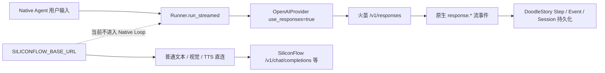
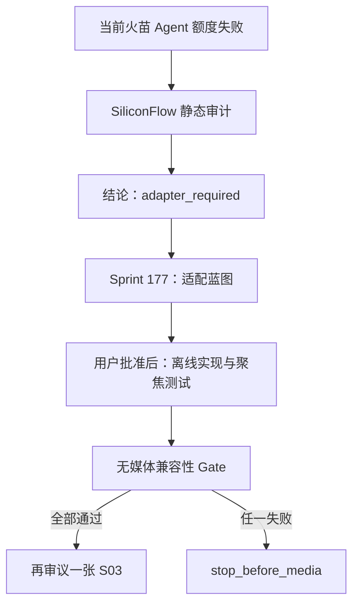

# SiliconFlow Native Agent 兼容性决策

日期：2026-08-12

结论：`adapter_required`

验证状态：静态代码与官方文档审计完成；真实模型调用未授权、未执行

## 一句话结论

SiliconFlow 可以作为 DoodleStory Native Agent 的**候选模型供应商**，但不能通过修改地址和模型名
直接接管当前流程。当前 Agent 固定请求 Responses API；SiliconFlow 官方公开的是 Chat Completions
Function Calling。已安装的 Agents SDK 内置了部分事件转换能力，但其 Chat 路线会复用固定伪 Response /
Item ID，且不发当前持久化代码等待的参数 done 事件，因此还必须增加应用侧事件身份适配。多轮消息上限、
流式工具参数、工具结果回传和持久化重放仍需一次独立的真实兼容性 Gate。

因此当前制作决策是：**不切路由，不重跑 S03；先开发并验证显式 Chat Completions 适配路径。**

## 1. 三种“支持”必须分开

| 层级 | 当前结论 | 证据边界 |
| --- | --- | --- |
| SiliconFlow 官方 API 支持 | 支持 Chat Completions 与 Function Calling | 官方公开端点为 `/v1/chat/completions`，工具类型为 function |
| 当前 DoodleStory 已接入 | Native Agent 未接入 SiliconFlow | Native Loop 使用 `TEXT_FALLBACK_*`、`use_responses=True`，请求火苗 `/v1/responses` |
| 真实 Agent 兼容 | 未验证 | SDK 有适配代码，但还没有用 SiliconFlow 做工具流、重放和消息上限实测 |

`adapter_required` 只代表“已有清晰适配路径”，不代表“已经可用于生产”。

## 2. 当前真实调用链



当前关键事实：

- `backend/app/core/config.py` 的 `agent_model` 默认值为 `gpt-5.5`；本地 `.env` 没有覆盖该字段。
- `backend/app/services/native_agent_loop.py` 使用 `text_fallback_api_key`、
  `text_fallback_openai_base_url` 和 `OpenAIProvider(..., use_responses=True)`。
- 当前逻辑请求是 `https://api.huomiao.art/v1/responses`，不是 SiliconFlow。
- `SILICONFLOW_MODEL=deepseek-ai/DeepSeek-V3.2` 当前只进入既有 SiliconFlow 直连 Chat Completions
  业务，不会自动成为 Native Agent 模型。
- 旧 `AgentModelRouter` 的火苗 → LIO Responses 路由也不是 Native Agent 主循环；不能借旧 Router
  推断 SiliconFlow 已经接入。

## 3. SiliconFlow 官方公开能力

官方证据按 2026-08-12 读取：

1. [SiliconFlow 文档总索引](https://docs.siliconflow.cn/llms.txt)列出 OpenAI Chat Completions、
   Anthropic Messages、Embedding、Rerank、图片、音频、视频、Batch 和模型列表；索引没有列出
   Responses API。这里能证明的是“官方公开目录中未提供”，不是证明服务端绝对不存在未公开实现。
2. [OpenAI Chat Completions API](https://docs.siliconflow.cn/cn/api-reference/chat-completions/chat-completions)
   给出的端点是 `POST https://api.siliconflow.cn/v1/chat/completions`，流式返回使用 SSE 并以
   `[DONE]` 结束；响应对象为 `chat.completion`。
3. 同一 API 文档把 `messages` 数组记录为 **1–10 条**，把 `tools` 定义为 function 工具。这个 10 条
   边界是否由所有模型和服务版本硬执行，必须实测，不能只靠文档猜测。
4. [Function Calling 指南](https://api-docs.siliconflow.cn/docs/userguide/guides/function-calling)
   使用 `client.chat.completions.create(..., tools=...)`，并展示模型工具调用、应用执行工具、追加
   `role=tool` 结果后再次请求的完整两轮模式。
5. [SiliconFlow 模型中心](https://www.siliconflow.cn/models)当前将
   `deepseek-ai/DeepSeek-V3.2` 标为支持工具调用；Chat Completions 文档也把该精确 ID 列入
   `enable_thinking` 支持清单。

这些证据足以排除“直接替换 Responses 地址”，也足以把 Chat Completions 适配列为可验证主路径。

## 4. 已安装 Agents SDK 能做什么

仓库当前锁定并实际安装 `openai-agents==0.18.3`、`openai==2.45.0`。本轮直接检查安装目录，而不是
依据最新网络文档推断：

| SDK 代码 | 已确认行为 | 对 DoodleStory 的意义 |
| --- | --- | --- |
| `agents/models/openai_provider.py` | `use_responses=False` 返回 `OpenAIChatCompletionsModel` | 可以显式切换 API 形状，不必伪装 `/responses` |
| `openai_chatcompletions.py` | 流式请求交给 `ChatCmplStreamHandler` | 仍可使用 `Runner.run_streamed` |
| `chatcmpl_converter.py` | Response Item / Function Call / Function Output 转成 assistant tool call 与 `role=tool` message | 能把现有 Session Item 重放到 Chat Completions |
| `chatcmpl_stream_handler.py` | 生成 `response.output_item.added`、`response.function_call_arguments.delta`、`response.output_item.done`、`response.completed` 等事件 | 只提供事件外形；固定伪 ID 与缺失 arguments done 仍要求应用适配 |
| `buffer_streamed_tool_calls` | 可在 Provider 工具分片不可靠时缓冲到流结束再发出 | 是待验证开关，不应在没有实测时默认开启 |

这说明不需要重写 Agents SDK 或整个 Runner，但适配面已经不只是 Provider 选择：必须在 SDK 事件与
DoodleStory 持久化之间加入身份和完成语义适配。“代码路径存在”仍不能替代真实 Provider 兼容性测试。

## 5. 当前阻塞点

### 5.1 不能直接改配置

如果只把 `TEXT_FALLBACK_BASE_URL` 改为 `https://api.siliconflow.cn/v1`，当前代码仍会请求：

```text
POST https://api.siliconflow.cn/v1/responses
```

这个端点不在 SiliconFlow 官方公开 API 目录中。模型 ID 即使正确，也不能修复 API 形状不匹配。

### 5.2 完整重放可能超过 10 条消息

`NativeAgentDatabaseSession.get_items()` 默认读取并返回该 Run 的全部持久化 Item，没有出站条数限制。
当前 Runner 允许最多 12 个模型回合。一次工具循环通常会增加 assistant tool call 与 tool output，多轮执行
可能让转换后的 Chat Completions `messages` 超过官方文档记录的 10 条。

这不是立即要求截断上下文。Sprint 105 已锁定应用侧持久化和完整输入重放契约；若 10 条是硬限制，
迁移应停止并单独讨论请求上下文契约，不能静默丢弃、摘要或压缩历史。

### 5.3 流式 Tool Calling 仍需实测

项目当前依赖以下事件完成可观测性和持久化：

- `response.created` 建立模型 Step；
- `response.output_item.added` 建立 Function Call；
- `response.function_call_arguments.delta/done` 保存完整工具参数；
- `response.completed` 写入 usage 并结束模型 Step。

SDK 会合成这些事件，但 SiliconFlow 的工具参数 chunk、call ID、finish reason、usage 和思考内容是否都能
被当前 OpenAI 客户端与 SDK 正确解析，尚无真实证据。

### 5.4 免费额度不是公开零价保证

用户给出的允许模型清单继续作为本项目的账号额度 / 运营白名单；但
[SiliconFlow 当前公开价格页](https://siliconflow.cn/pricing)对 `deepseek-ai/DeepSeek-V3.2` 列出了
非零输入、输出单价，仅缓存命中栏显示免费。因此不能把允许清单写成“所有账号永久零价”。真实 Gate 前
还需由账号控制台确认余额、赠送额度或优惠券适用性；本轮没有读取私有账单。

### 5.5 Chat 事件身份与参数完成语义不兼容

后续对当前安装版本源码的逐行审计确认：

- Chat 模型创建的 Response ID 固定为 `__fake_id__`；
- Function Call Item ID 与 arguments delta 的 Item ID 也固定为 `__fake_id__`；
- 真实 Chat completion ID 只在流后段写入 Output Item 的 `provider_data.response_id`；
- Stream Handler 不发 `response.function_call_arguments.done`，而是在 `response.output_item.done` 的
  Function Item 中给出最终 arguments。

当前 Native Agent 把 Response ID 写进模型 Step 唯一幂等键，并按 Item ID 保存 Function metadata 和
参数 buffer。直接切 Chat 后，第二个模型回合会与第一步冲突，多 Tool 参数会相互覆盖，参数完成事件也
不会持久化。详细修正和实施矩阵见
[SiliconFlow Native Agent 适配实施蓝图](../architecture/siliconflow-native-agent-adapter-blueprint.md)。

### 5.6 非文本 Tool Output 不能按原语义重放

`generate_image` 当前返回文本 JSON 和图片，`inspect_youtube_channel` 返回文本 JSON、头像与封面。
Chat Converter 默认只保留 Function Tool Output 的文本部分；V3.2 又是文本模型。因此首版 Chat 路由
不能声称模型直接看到了图片。S03 只能通过文本 `image_id` 再调用 `inspect_image` 获取文本 verdict；
YouTube 频道看图和所有依赖直接图片 Tool Output 的 Skill 保持禁止。

## 6. 候选模型决策

| 候选 | 是否在用户允许清单 | 官方静态证据 | 本轮结论 |
| --- | --- | --- | --- |
| `deepseek-ai/DeepSeek-V3.2` | 是；当前 `SILICONFLOW_MODEL` 也使用它 | 模型中心标注工具调用；Chat API 列入思考开关支持 | 第一且唯一真实 Gate 候选 |
| `Qwen/Qwen3.5-35B-A3B` | 是 | Chat API 列入思考开关支持；本轮未验证完整 Agent Tool Loop | 不进入首轮，避免同时比较模型 |
| `deepseek-ai/DeepSeek-V3.1-Terminus` | 是 | 模型中心标注工具调用；本轮未验证完整 Agent Tool Loop | 不作为自动备用 |

选择 V3.2 的理由是“精确 ID 已配置、官方标注工具调用、用户明确允许”，不是因为已证明它比其他模型
更好。首轮只允许一个变量，任何失败都不能自动改成 Qwen 或 Terminus。

## 7. 未来实现边界

Sprint 177 已把建议收敛为原子 Run 级 route ID，而不是两个可以组成非法组合的独立开关：

```text
NATIVE_AGENT_DEFAULT_ROUTE=huomiao_responses
NATIVE_AGENT_HUOMIAO_MODEL=gpt-5.5
NATIVE_AGENT_SILICONFLOW_MODEL=deepseek-ai/DeepSeek-V3.2
```

离线实现现已拆成串行 G2-A / G2-B。当前只允许先评审
[Sprint 181 / G2-A 路由快照基础](../contracts/sprint-181-native-agent-run-route-snapshot-foundation.md)：它只把
现有火苗 Responses 变成真实 Run 快照并消除模型漂移，不创建 SiliconFlow Chat 路径。Chat Event Adapter、
Admin 显式选择、能力 Profile 和消息 wrapper 留给 G2-B；两者都通过后才算 G2 `pass_offline`。

实现时应满足：

- `huomiao_responses` 继续保持当前行为；
- `siliconflow_chat_v1` 复用现有 `SILICONFLOW_API_KEY` 与 `SILICONFLOW_BASE_URL`，构建
  `OpenAIProvider(use_responses=False)`；
- Run 创建时固化 route、provider、api shape 和 model，Follow-up 原样继承，执行不再读当前环境模型；
- 现有 `AGENT_MODEL` 继续服务旧 Router，Native Agent 不隐式回退到该字段；
- 非法 route、缺凭据或未开放能力在 Run 创建前失败，不自动改用另一个供应商；
- 加入应用侧模型调用 ID、output index / call ID 参数映射与 arguments done 合成；
- Chat Route 的 `generate_image` 只返回文本 `image_id`，并要求随后执行 `inspect_image`；
- `buffer_streamed_tool_calls` 只在真实流测试证明必要后显式配置；
- 不改变 Session 的本地完整持久化，不在本 Sprint 预设截断或摘要方案；
- 代码、`.env.example`、`docs/spec.md`、聚焦测试和兼容性检查脚本必须在同一实现 Sprint 更新。

完整字段、迁移、事件、能力 Profile 与测试矩阵见
[适配实施蓝图](../architecture/siliconflow-native-agent-adapter-blueprint.md)。当前仍没有修改任何配置或代码。

## 8. 下一次真实兼容性 Gate

前提：用户先批准并完成实施蓝图中的离线 Phase A，再明确批准一次小额模型调用，并确认该账号的 V3.2
可用额度。

固定条件：

| 项目 | Gate 固定值 |
| --- | --- |
| Provider / API | SiliconFlow / Chat Completions |
| 模型 | `deepseek-ai/DeepSeek-V3.2` |
| 工具 | 一个本地、确定性、无外部副作用的 `echo_probe` |
| 媒体 Tool | 0；不注册生图、TTS、字幕、视频或发布工具 |
| 重试 / fallback | 0 / 无 |
| 数据 | 临时本地数据库；日志和报告不得记录 API Key |

未来执行的完整细则已冻结在 [G3 零媒体 Gate 协议](../testing/siliconflow-native-agent-zero-media-gate-protocol.md)
和 [空白证据模板](../testing/siliconflow-native-agent-zero-media-gate-evidence-template.json)。总请求预算最多 5 次；
协议和模板存在只代表准备完成，不代表 G2 已实施、G3 已授权或 SiliconFlow 已通过。

按顺序验证：

1. **普通流式文本**：必须得到文本 delta、terminal event 和 usage；空响应或解析警告即停。
2. **单次 Function Call**：模型必须返回唯一 `echo_probe`、合法 JSON 参数和稳定 call ID；应用执行后把
   tool output 回传，第二轮必须得到最终文本。
3. **应用事件契约**：必须证明两个 SDK `__fake_id__` 回合不会冲突、Tool 参数按 call ID 隔离、
   `output_item.done` 被转换为唯一 arguments done，并持久化真实 Provider response ID；数据库中模型
   Step、工具 Step 与 Session Item 可对应。
4. **恢复重放**：单 Tool 第一次请求及 Tool Output 持久化后结束子进程 A，由独立子进程 B 从同一临时
   数据库恢复并发出第二次模型请求；已完成工具不得重复执行，最终输出可继续。
5. **消息边界**：分别构造转换后 10 条和 11 条消息的无副作用请求。10 条必须经过生产 wrapper 并成功；
   11 条必须先证明生产 wrapper fail-closed，再由测试脚本唯一的 boundary client 绕过本地上限做一次
   Provider 探针。接受或结构化拒绝都记录真实行为；即使接受，在官方文档更新或另行评审前仍保留生产
   10 条预检上限。
6. **流分片模式**：默认不缓冲；若参数 delta 结构不兼容，只记录失败。是否另开一次缓冲模式验证必须
   作为显式单变量后续动作，不能在同一 Run 自动切换。

Gate 只允许两个最终结论：

- `pass_for_s03_single_image_review`：普通流、Tool Loop、事件、恢复与 10 条消息均通过，11 条行为已记录，
  再由用户决定是否把有界 route 用于一张 S03；
- `stop_before_media`：任一项失败，保持现有路由与媒体停止，并记录精确协议差异。

即使通过，也只证明模型路由兼容，不证明 S03 图片、整片生产或 YouTube 赛道表现。

## 9. 对 Paynes Creek 制作的影响

Sprint 175 的 `stop_before_batch` 保持有效。当前可以确认的问题顺序是：



在 F 通过前，不应调整 S03 Prompt 或 Style，也不应调用 Qwen-Image；目前没有图片质量证据。
