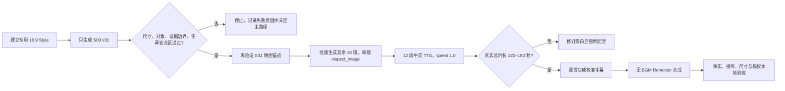

# Paynes Creek 中文旁白与逐镜图片 Prompt 包

更新时间：2026-08-12

状态：**脚本与 Prompt Gate 已通过；本地 16:9 Style 配置已存在但未做 Style Test、未产出图片；G2-A 尚待批准**

配套阅读：

- [逐镜证据板](paynes-creek-shot-evidence-board.md)
- [事实来源账本](ancient-salt-access-source-ledger.md)
- [视觉来源与授权清单](paynes-creek-visual-source-rights-ledger.md)
- [Sprint 174 契约](../../contracts/sprint-174-youtube-paynes-creek-chinese-script-prompt-pack.md)
- [机器可读生产草案](paynes-creek-production-draft.json)
- [16:9 Style 状态审计](paynes-creek-style-state-audit.md)

## 一、制作决定

第一条实际制作继续使用已经通过研究 Gate 的赛道：

> **考古证据驱动的古代技术与日常生活机制可视化**

首个题目是：

> 公元六百到九百年，伯利兹南部海岸的盐工，怎样把含盐水变成可以离开海岸的盐？

这不是发布实验，而是一条中文本地生产验证片。它先验证事实映射、12 张原创图的一致性、中文语音、
时间轴字幕和 Remotion 合成。成片质量不能证明赛道、语言或频道会获得市场表现。

## 二、当前工具约束

| 环节 | 本片固定值 | 代码边界 |
| --- | --- | --- |
| 图片 | `Qwen/Qwen-Image`、Style 比例 `16:9`、Provider 参数 `default` | `generate_image` 只有完整 `prompt` 与 `provider`；没有独立 `negative_prompt` 或像素参数 |
| 语音 | 中文、`speed=1.0`、一镜一段 | 六档倍速可用，但首版不混用语速；真实时长由 Provider / ffprobe 返回 |
| 字幕 | 每段音频调用 `generate_subtitles(audio_id)` | Whisper 使用中文识别，并用保存的 TTS 原文校准时间轴 |
| 合成 | `narrated-panel-v1`、30 fps、12 Scene、无 BGM | Scene 时长严格等于对应音频时长；每镜只能有一图、一音频和一份字幕 |
| 运动 | `static`、`zoom_in`、`zoom_out`、`pan_right`、`pan_down` | 不使用未实现的转场、图层、动态地图或对象动画 |
| 输出尺寸 | 交付目标 1920×1080 | Native Remotion 实际跟随首图宽高；统一 Gateway 对 `16:9` 当前请求 `1792×1024`，不能预先声称输出一定是 1920×1080 |

图片模型选择遵守项目的 SiliconFlow 免费模型约束：当前已接入图片模型中，只选用户明确允许的
`Qwen/Qwen-Image`。若默认 Provider 失败，本包不授权自动切换到 Grok、xgapi 或其他模型。

## 三、中文语音规范

### 1. 读法

| 原名 / 术语 | 旁白读法 | 决定 |
| --- | --- | --- |
| Paynes Creek | 佩恩斯克里克 | 中文音译只用于 TTS；描述区未来仍保留英文原名 |
| Ek Way Nal | 不朗读 | 只留在来源账本，避免未验收专名发音打断主线 |
| Ta'ab Nuk Na | 不朗读 | 同上 |
| briquetage | 制盐粗陶 | 使用功能性中文，不在本片教授术语 |
| 600–900 CE | 公元六百到九百年 | 不把连字符和字母交给中文 TTS |
| 1.43 m | 约一米四三 | 实际试听后检查是否自然；不写“一点四三米” |

### 2. 时长预算

计划阶段按每秒约 4 个汉字估算，536 个汉字约 134 秒；这只是节奏预算，不是成片时长。12 段真实
音频生成后，以 `duration_ms` 求和，必须落在 120–150 秒；若超出，停止并改旁白，不静默拉伸音频、
删除限定词或给不同 Scene 混用倍速。

| Scene | 目标秒数 | 汉字数 | 计划估算 | 证据 | 运动 |
| --- | ---: | ---: | ---: | --- | --- |
| S01 | 8 | 34 | 8.5 秒 | F8；B 解释 | `zoom_in` |
| S02 | 10 | 42 | 10.5 秒 | F1；A 直接证据 | `static` |
| S03 | 11 | 44 | 11.0 秒 | F3；A+B 重建 | `pan_right` |
| S04 | 12 | 43 | 10.8 秒 | F3；A+B 证据链 | `zoom_in` |
| S05 | 13 | 48 | 12.0 秒 | F5；A+B 证据链 | `pan_down` |
| S06 | 14 | 51 | 12.8 秒 | F4；A+B 证据链 | `zoom_out` |
| S07 | 11 | 44 | 11.0 秒 | F6；B 解释 | `static` |
| S08 | 11 | 44 | 11.0 秒 | F7；A 直接证据 | `zoom_out` |
| S09 | 12 | 46 | 11.5 秒 | F7、F8；A+B 解释 | `pan_right` |
| S10 | 11 | 43 | 10.8 秒 | F8；B 解释 | `static` |
| S11 | 12 | 46 | 11.5 秒 | F2；A 直接证据 | `pan_down` |
| S12 | 13 | 51 | 12.8 秒 | F3、F6、F7、F8；A+B 证据链 | `zoom_out` |
| **合计** | **138** | **536** | **约 134 秒** |  |  |

## 四、Style 与完整 Prompt 规则

### 1. 当前本地专用 Style 快照

| 字段 | 只读观测值 |
| --- | --- |
| 本地 Style ID | `4443d2412c994ec298b635e6c63806e7`；只用于当前验证库 lineage，执行时重新解析 |
| 名称 | `Paynes Creek Evidence Desk 16:9` |
| 状态 / 模式 | `active / prompt`；启用只证明 Prompt 非空，不证明视觉质量 |
| 画面比例 | `16:9` |
| 图片模型 | `Qwen/Qwen-Image` |
| Style Prompt | 883 字符；SHA-256 `5b8b5a7d144b13d6cdecc2ba2949205090df0958d8563b69968e8940a23b0d1b` |
| 参考图 / Style Test | `0 / 0` |
| 图片 / 频道绑定 | `0 / 0`；视觉输出和生产账号均未验证 |
| 用途 | 仅限 Paynes Creek 中文本地生产验证片；不得据此创建发布关系 |

完整只读证据与 G4 重新解析规则见 [Style 状态审计](paynes-creek-style-state-audit.md)。现有记录不应重复
创建；但未来 G4 也不能直接沿用这里的本地 ID，必须重新核对状态、模型、比例、Prompt 哈希和参考图数量。

Style 提示与每镜 Prompt 都必须表达同一视觉系统。当前 Native Runtime 不会替模型补写 Prompt，因此
下面每个代码块已经是自包含文本，可直接作为 `generate_image` 的 `prompt`；不要只复制“Scene”段落。

### 2. 共享视觉语言

- 横向、克制、平面化的考古机制图，不做电影海报或历史写实复原。
- 主色固定为深海墨蓝 `#102A33`、泻湖青绿 `#2B7A78`、矿物琥珀 `#C98234`、沉积蓝灰
  `#D8E4E5` 与盐白 `#F4F6F1`。
- 直接证据用青绿与实线，重建 / 解释用琥珀与断线；颜色是内部一致性约定，不在画面内生成图例文字。
- 关键对象位于中央 84% 和上方 70%；底部 30% 只保留低对比背景，给中文字幕、8% 缩放和 3% 平移留余量。
- 不生成任何文字、字母、数字、标题、标签、Logo、水印或伪造的文物说明牌。
- 低细节人物只用于尺度和动作，不给出身份、服饰、性别分工、阶层或情绪叙事。

## 五、S01–S12 最终旁白与完整 Prompt

### S01｜海岸的盐怎样到达内陆

- **旁白**：海岸生产的盐，怎样到达内陆？佩恩斯克里克留下了一条不完整、却能追踪的证据链。
- **映射**：F8；事实 S1、S4、S5；视觉 R1、R2、R3。
- **资产名**：`PC-S01-prompt.md` → `PC-S01-v01.png`。

```text
Create one exact 16:9 horizontal historical mechanism illustration for an evidence-led archaeology documentary. Use a non-photoreal editorial map diagram with matte flat shapes and a restrained palette of deep marine ink #102A33, lagoon teal #2B7A78, mineral amber #C98234, sediment blue-gray #D8E4E5, and salt white #F4F6F1. Keep one clear focal question, all essential evidence inside the central 84% and upper 70%, and the bottom 30% quiet for Chinese subtitles. Show a simplified southern Belize coastline and lagoon occupying the left 45%, one approximate coastal production node, several small unnamed inland nodes in the upper right, and a large unresolved water-and-land gap between them. Do not draw a completed route; use only spatial separation and one interrupted directional trace. No people are needed. Do not include words, letters, numerals, labels, logos, or watermarks. Do not show a single confirmed trade route, named buyers, named inland cities, modern political borders presented as ancient borders, an exact ancient shoreline, or the claim that this site supplied the entire Maya world. No parchment, satellite imagery, Google-style map, cinematic lighting, palace, pyramid, or decorative ethnic pattern.
```

### S02｜时间与地点

- **旁白**：它位于今天伯利兹南部海岸。考古年代显示，这套盐业系统的核心活动，大约发生在公元六百到九百年。
- **映射**：F1；事实 S1、S3、S4；视觉 R1、R2、R3。
- **资产名**：`PC-S02-prompt.md` → `PC-S02-v01.png`。

```text
Create one exact 16:9 horizontal historical mechanism illustration for an evidence-led archaeology documentary. Use a non-photoreal editorial map diagram with matte flat shapes and a restrained palette of deep marine ink #102A33, lagoon teal #2B7A78, mineral amber #C98234, sediment blue-gray #D8E4E5, and salt white #F4F6F1. Keep one focal relationship between place and broad period, all essential evidence inside the central 84% and upper 70%, and the bottom 30% quiet for Chinese subtitles. Show a closer simplified view of the southern Belize coast, with an approximate lagoon location in the upper half. Add a clean horizontal time band near the top using geometry only: a broad highlighted interval with soft end boundaries, no dates or text. Use teal for the observed location and period evidence. Do not include words, letters, numerals, labels, logos, or watermarks. Do not imply every building began and ended together, do not draw a precise ancient shoreline, and do not present modern borders as Classic Maya political boundaries. No exact village map, named buyer, trade route, palace, pyramid, photoreal satellite view, parchment, or cinematic scene.
```

### S03｜依据遗迹与类比重建浓缩步骤

- **旁白**：下面这一步，是依据遗迹和类比做的重建：盐工可能让盐水经过含盐土，提高浓度，再把更浓的卤水收进陶罐。
- **映射**：F3；事实 S3、S4；视觉 R2、R3。
- **资产名**：`PC-S03-prompt.md` → `PC-S03-v01.png`。

```text
Create one exact 16:9 horizontal historical mechanism illustration for an evidence-led archaeology documentary. Use a non-photoreal editorial cutaway with matte flat shapes and a restrained palette of deep marine ink #102A33, lagoon teal #2B7A78, mineral amber #C98234, sediment blue-gray #D8E4E5, and salt white #F4F6F1. Keep one clear focal mechanism, all essential evidence inside the central 84% and upper 70%, and the bottom 30% quiet for Chinese subtitles. Show a cautious horizontal reconstruction of brine concentration: a simple elevated wooden container holding low-detail saline earth, liquid passing downward through the earth into a funnel-like outlet, then collecting in one rough unglazed ceramic jar below. Use a single teal liquid path from upper left to lower right and amber dashed contours around reconstructed components. No human figure is required. Do not include words, letters, numerals, arrows with text, labels, logos, or watermarks. Do not copy a modern Sacapulas installation as an ancient scene. Do not show a modern water filter, metal pipe, valve, precision machinery, fixed standard workstation, exact dimensions, stone factory, palace, or photoreal archaeological artifact display.
```

### S04｜陶器与黏土支座加热卤水

- **旁白**：接着，陶碗、陶罐或陶盆被黏土支座托在火上。器物与支座的组合，支持人们在这里加热卤水，让盐逐渐结晶。
- **映射**：F3；事实 S1、S3、S4；视觉 R2 Figure 12、R3 Figure 9。
- **资产名**：`PC-S04-prompt.md` → `PC-S04-v01.png`。

```text
Create one exact 16:9 horizontal historical mechanism illustration for an evidence-led archaeology documentary. Use a non-photoreal editorial hearth cutaway with matte flat shapes and a restrained palette of deep marine ink #102A33, lagoon teal #2B7A78, mineral amber #C98234, sediment blue-gray #D8E4E5, and salt white #F4F6F1. Keep one clear focal relationship between pottery, clay supports, and heat, all essential evidence inside the central 84% and upper 70%, and the bottom 30% quiet for Chinese subtitles. Center a shallow hearth in the upper half. Show rough unglazed bowl, jar, and basin forms resting on simple cylindrical clay supports above a restrained amber fire, with a small amount of diagrammatic steam and salt residue. Make the load-bearing contact between vessel bases and supports visually legible. Treat the scene as a mechanism reconstruction, not an intact excavated stove. Do not include words, letters, numerals, labels, logos, or watermarks. Do not show metal pots, a chimney, a stone factory, modern stove racks, glazed or painted ceremonial pottery, industrial equipment, a palace, or dramatic photoreal fire.
```

### S05｜居住空间与盐厨房相邻

- **旁白**：木柱布局还显示，盐厨房与居住空间彼此相邻。这支持家庭或亲属群体参与剩余生产，但我们不知道具体家谱和分工。
- **映射**：F5；事实 S3、S4；视觉 R2、R3。
- **资产名**：`PC-S05-prompt.md` → `PC-S05-v01.png`。

```text
Create one exact 16:9 horizontal historical mechanism illustration for an evidence-led archaeology documentary. Use a non-photoreal editorial plan-and-cutaway hybrid with matte flat shapes and a restrained palette of deep marine ink #102A33, lagoon teal #2B7A78, mineral amber #C98234, sediment blue-gray #D8E4E5, and salt white #F4F6F1. Keep one focal idea of spatial adjacency, all essential evidence inside the central 84% and upper 70%, and the bottom 30% quiet for Chinese subtitles. Show two neighboring low-detail pole-and-thatch structures. One contains a few ordinary domestic vessel silhouettes; the other contains a small hearth, rough salt-making pottery, and clay supports. Use post positions and a short shared ground plane to show that the spaces are adjacent, not a family tree. At most two tiny neutral labor silhouettes may appear for scale. Do not include words, letters, numerals, labels, logos, or watermarks. Do not invent a known family genealogy, fixed gender roles, a royal overseer, social rank, simultaneous use of every building, stone walls, chimney, palace, ceremonial costume, expressive faces, or a crowded village scene.
```

### S06｜证据支持超过日常自用的生产

- **旁白**：这里也不像偶尔为一户人家煮一锅盐。大量制盐粗陶和专门作业空间，共同支持超过日常自用的生产；确切年产量仍不知道。
- **映射**：F4；事实 S1、S3、S4；视觉 R2、R3。
- **资产名**：`PC-S06-prompt.md` → `PC-S06-v01.png`。

```text
Create one exact 16:9 horizontal historical mechanism illustration for an evidence-led archaeology documentary. Use a non-photoreal editorial archaeological distribution diagram with matte flat shapes and a restrained palette of deep marine ink #102A33, lagoon teal #2B7A78, mineral amber #C98234, sediment blue-gray #D8E4E5, and salt white #F4F6F1. Keep one focal idea of repeated production evidence, all essential evidence inside the central 84% and upper 70%, and the bottom 30% quiet for Chinese subtitles. Begin visually from one clear pottery-and-clay-support set near the center, then reveal several repeated rough pottery fragment groups and multiple post-layout traces spread across a wider work area. Use repetition and spacing, never a numerical chart, to express production beyond one household batch. Do not include words, letters, numerals, labels, logos, or watermarks. Do not show one hundred and ten factories operating at once, an industrial assembly line, tonnage, annual output, warehouses, identical modern pots, every site in simultaneous operation, smokestacks, palace administration, or a photoreal mass-production scene.
```

### S07｜散盐与可能的盐饼

- **旁白**：成品可以是散盐。相近的器形还支持制作尺寸相近盐饼的可能，但这不等于玛雅人已经把盐当成通用货币。
- **映射**：F6；事实 S4、S5；视觉 R3、R6。
- **资产名**：`PC-S07-prompt.md` → `PC-S07-v01.png`。

```text
Create one exact 16:9 horizontal historical mechanism illustration for an evidence-led archaeology documentary. Use a non-photoreal editorial object comparison with matte flat shapes and a restrained palette of deep marine ink #102A33, lagoon teal #2B7A78, mineral amber #C98234, sediment blue-gray #D8E4E5, and salt white #F4F6F1. Keep one focal comparison, all essential evidence inside the central 84% and upper 70%, and the bottom 30% quiet for Chinese subtitles. Make loose white salt crystals and a simple storage vessel the certain subject on the left two-thirds. On the right third, show one plain compact salt block as a cautious possibility, with a soft incomplete amber dashed contour rather than a museum artifact display. Keep both forms modest and functional. Do not include words, letters, numerals, labels, logos, or watermarks. Do not show coin symbols, stamped designs, brands, denomination, price, market stalls, universal currency, piles of countable money-like salt cakes, or a pristine excavated finished salt block. No dramatic treasure lighting or commercial product photography.
```

### S08｜全尺寸木桨是直接证据

- **旁白**：运输链里最直接的证据，是盐业遗址出土的一支全尺寸木桨，长约一米四三。它证明这里具备水上交通能力。
- **映射**：F7；事实 S1；视觉 R4，仅作事实参考。
- **资产名**：`PC-S08-prompt.md` → `PC-S08-v01.png`。

```text
Create one exact 16:9 horizontal historical mechanism illustration for an evidence-led archaeology documentary. Use a non-photoreal editorial object plate with matte flat shapes and a restrained palette of deep marine ink #102A33, lagoon teal #2B7A78, mineral amber #C98234, sediment blue-gray #D8E4E5, and salt white #F4F6F1. Keep one clear focal object, all essential evidence inside the central 84% and upper 70%, and the bottom 30% quiet for Chinese subtitles. Place a simplified complete wooden canoe paddle horizontally across the upper half, showing a plain blade, shaft, and grip. Under it, add one clean unlabeled dimension line spanning the full length and a tiny unlabeled circular shaft cross-section inset. Make this an original geometric reconstruction, not a copy of any published photograph. Do not include words, letters, numerals, labels, logos, or watermarks. Do not copy the breakage, lighting, texture, camera angle, or arrangement of the PNAS figure. Do not substitute a short stirring paddle, add carved ornament, show the paddle carrying salt, or imply that this specific artifact records one shipment. No museum case, photoreal wood scan, canoe crew, or destination.
```

### S09｜独木舟运输合理，但没有货单

- **旁白**：船桨与当地舟船技术，让独木舟运输成为合理解释；但考古没有留下某一条船的货单，我们不知道它装了多少盐。
- **映射**：F7、F8；事实 S1、S4；视觉 R2、R4。
- **资产名**：`PC-S09-prompt.md` → `PC-S09-v01.png`。

```text
Create one exact 16:9 horizontal historical mechanism illustration for an evidence-led archaeology documentary. Use a non-photoreal editorial lagoon scene with matte flat shapes and a restrained palette of deep marine ink #102A33, lagoon teal #2B7A78, mineral amber #C98234, sediment blue-gray #D8E4E5, and salt white #F4F6F1. Keep one focal relationship between paddle, canoe, and water movement, all essential evidence inside the central 84% and upper 70%, and the bottom 30% quiet for Chinese subtitles. Show a distant low-detail dugout canoe silhouette moving horizontally across calm lagoon water in the upper half. Make the paddle and water direction clearer than the occupants. Inside the canoe, include only a few low, indistinct, uncountable shapes so no cargo quantity can be inferred. Use an amber dashed wake to signal interpretation. Do not include words, letters, numerals, labels, logos, or watermarks. Do not specify canoe length, carrying capacity, crew count, loading action, cargo list, exact destination, named route, or a boat filled with visible countable salt cakes. No heroic voyage, trade harbor, palace, market, photoreal people, or dramatic storm.
```

### S10｜内陆方向网络不是确定路线

- **旁白**：生产规模、船桨和沿海与内陆的物质联系，共同支持盐进入内陆交换网络；具体路线、城市和买家仍然未知。
- **映射**：F8；事实 S1、S4、S5；视觉 R1、R3、R4、R6。
- **资产名**：`PC-S10-prompt.md` → `PC-S10-v01.png`。

```text
Create one exact 16:9 horizontal historical mechanism illustration for an evidence-led archaeology documentary. Use a non-photoreal abstract network diagram with matte flat shapes and a restrained palette of deep marine ink #102A33, lagoon teal #2B7A78, mineral amber #C98234, sediment blue-gray #D8E4E5, and salt white #F4F6F1. Keep one focal idea of directional exchange with an explicit evidence gap, all essential evidence inside the central 84% and upper 70%, and the bottom 30% quiet for Chinese subtitles. Place one teal coastal production node on the left and several small unnamed inland nodes toward the upper right. Connect them with three amber dashed directional traces that do not follow precise rivers. Interrupt the traces at a prominent open gap near the center and leave the final destinations unresolved. Do not include words, letters, numerals, labels, logos, or watermarks. Do not show a market building, buyer, seller, price, tax, named city, named river, single confirmed route, fully connected network, exact political boundary, cargo count, palace, or photoreal landscape.
```

### S11｜遗址是后来被淹没的

- **旁白**：今天这些遗址在浅水下，不代表古人在水里煮盐。它们废弃后被海水淹没，缺氧泥炭反而保存了木柱和作业布局。
- **映射**：F2；事实 S3、S4、S6；视觉 R2、R3、R7。
- **资产名**：`PC-S11-prompt.md` → `PC-S11-v01.png`。

```text
Create one exact 16:9 horizontal historical mechanism illustration for an evidence-led archaeology documentary. Use a non-photoreal editorial environmental cutaway with matte flat shapes and a restrained palette of deep marine ink #102A33, lagoon teal #2B7A78, mineral amber #C98234, sediment blue-gray #D8E4E5, and salt white #F4F6F1. Keep one focal relationship between later inundation and preservation, all essential evidence inside the central 84% and upper 70%, and the bottom 30% quiet for Chinese subtitles. Divide the scene with a calm horizontal present-day shallow-water line. Above and just below the water, show one small modern survey flag and a neutral low-detail researcher silhouette. Beneath, show sediment and dark peat layers preserving several wooden posts and a simple work-layout trace. Make the old ground surface visible as a buried layer, so the ancient activity clearly predates the water. Do not include words, letters, numerals, labels, logos, or watermarks. Do not show ancient salt workers boiling brine underwater, deep sea, scuba divers, submarine, treasure hunt, intact underwater factory, or the claim that sea-level rise was the only cause of abandonment. No cinematic ruins or photoreal expedition scene.
```

### S12｜机制可以重建，单次旅程不能

- **旁白**：所以，证据能拼出浓缩、煮卤、成盐、水运和内陆交换的机制；它不能复原某一船盐的完整旅程。这正是我们知道与不知道的边界。
- **映射**：F3、F6、F7、F8；事实 S1、S3、S4、S5；视觉锚点继承 R2、R3、R4、R6。
- **资产名**：`PC-S12-prompt.md` → `PC-S12-v01.png`。

```text
Create one exact 16:9 horizontal historical mechanism illustration for an evidence-led archaeology documentary. Use a non-photoreal editorial evidence-chain diagram with matte flat shapes and a restrained palette of deep marine ink #102A33, lagoon teal #2B7A78, mineral amber #C98234, sediment blue-gray #D8E4E5, and salt white #F4F6F1. Keep one focal chain, all essential evidence inside the central 84% and upper 70%, and the bottom 30% quiet for Chinese subtitles. Arrange five original simplified objects from left to right across the upper half: a saline-earth funnel and collection jar, rough pottery on clay supports above a small fire, loose salt beside one softly outlined possible salt block, a complete plain canoe paddle, and several branching inland nodes. Connect directly observed evidence with teal solid segments and reconstructed links with amber dashed segments. Leave the final segment open and visibly incomplete. Do not include words, letters, numerals, labels, logos, or watermarks. Do not close the route, identify a buyer or destination, show a complete shipment record, turn salt into coins, remove the uncertainty gap, add a triumphant conclusion, or claim market validation. No palace, battle, treasure, photoreal artifacts, parchment, or cinematic montage.
```

## 六、真实制作顺序



S03 被选为第一张，不是因为它是成片开头，而是它同时测试最难的四件事：横向机制切面、对象锚点、
琥珀重建语言与底部字幕安全区。S03 不通过时，批量制作另外 11 张只会扩大返工。

## 七、单镜与整片 Gate

### S03 单镜必须全部通过

- 真实图片宽高已记录；宽高比足以用于后续统一合成，且最终交付如何达到 1920×1080 已明确。
- 画面只有木质高位容器、含盐土、漏斗、液体路径和下方粗陶罐；没有现代滤芯、金属管或阀门。
- 琥珀断线只表达重建，不生成 `reconstruction` 等画内文字。
- 关键装置不进入底部 30%，在 `pan_right` 的 8% 缩放和 3% 平移下仍不被裁掉。
- 无标题、说明、乱码、数字、Logo、水印或论文图件复制痕迹。
- `inspect_image` 返回 `accept`；人工事实审核与视觉审核也同时通过，才改名为 `PC-S03-approved.png`。

### 整片开始前仍需通过

- S01 地图锚点通过后，确认地图与机制图确实属于同一视觉系统。
- 12 张图真实宽高比例一致；Remotion 对任意两张图的宽高比差异要求不超过 `0.01`。
- 每段 TTS 使用本页原文和 `speed=1.0`；真实音频总时长在 120–150 秒。
- S03、S07、S09、S10 的限定词进入校准字幕，不依赖画内文字。
- 不使用第三方图片和 BGM，不生成伪署名，不创建发布任务。

## 八、当前结论

脚本与 Prompt 已足以进入第一张真实媒体验证，但还不足以直接生成整片。2026-08-12 的首次受控 Gate
已建立专用 16:9 Style 和最小 Skill；唯一一次 Native Run 在 Agent 文本规划阶段因当前火苗
`gpt-5.5` 额度返回 HTTP 429，`image_call_count=0`，没有图片可供尺寸或视觉审核。结果固定为
`stop_before_batch`，详见 [S03 单镜真实媒体 Gate 记录](paynes-creek-s03-media-gate.md)。恢复同一
主路径额度或另行批准 Agent 模型路由后，仍从一张 S03 重做；通过后才继续 S01 和剩余镜头。
