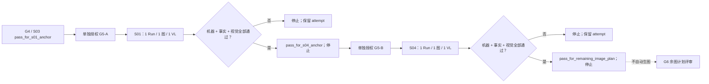

# Paynes Creek G5 串行视觉锚点协议

更新时间：2026-08-12<br>
状态：`protocol_ready / G5_not_authorized / no_media`<br>
用途：在 S03 单镜完整通过后，逐张验证 S01 地图锚点和 S04 陶器 / 火候锚点

配套文件：

- [Gate Profile](paynes-creek-g5-anchor-profiles.json)
- [空白 attempt 模板](paynes-creek-g5-anchor-attempt-template.json)
- [S03 单镜重试协议](paynes-creek-s03-retry-protocol.md)
- [16:9 Style 状态审计](paynes-creek-style-state-audit.md)
- [逐镜证据板](paynes-creek-shot-evidence-board.md)
- [中文旁白与完整 Prompt 包](paynes-creek-chinese-script-prompt-pack.md)

## 1. 为什么 G5 必须拆成两步

S03 只能验证一种“机制切面”画面。首片还有两种必须在余图前暴露的问题：

1. S01 的抽象地图是否能提出海岸—内陆距离问题，同时不伪造确定路线、买家或古代政治边界；
2. S04 的陶器、黏土支座和热源是否形成可读的受力关系，同时不漂移成完整炉灶、现代设备或礼仪器物。

因此 G5 是一个 umbrella，但执行上固定为：



G5-A 和 G5-B 不能共用一次授权、一次 Run 或一个终态。G5-A 通过后必须停；G5-B 通过后也必须停。

## 2. 当前代码事实

- `inspect_image` 只接受当前 Run 的 `image_id`、1–10 个不重复 `checks` 和
  `story_beat / characters / required_text`；返回 `accept / revise / ask_user / blocked`、逐项分数、
  issues、Provider、模型和耗时。
- `accept` 是进入视频渲染的运行前置，但不能替代事实审核、视觉审核、来源判断或版权判断。
- `zoom_in` 当前只做 `scale(1.00 → 1.08)`，`transformOrigin` 固定为 `center center`，没有可配置焦点。
- Remotion 以第一张图的真实宽高建立 Composition；后续图片宽高比与首图绝对差超过 `0.01` 就拒绝。
- 图片实际尺寸必须从文件读取。Gateway 的 1792×1024 只是当前 16:9 请求目标，1920×1080 只是交付目标。

这意味着 S01 旧描述中的“缩放收向泻湖点位”不是当前运行能力。G5-A 不改 motion，而是用中心 8% 缩放
探针判断海岸节点是否仍完整、地图问题是否仍可读。若需要自定义焦点，必须另立开发 / production revision。

## 3. 两个锁定 Profile

| 子 Gate | Scene | 唯一验证问题 | 前置通过状态 | 本次通过状态 |
| --- | --- | --- | --- | --- |
| G5-A | S01 | 抽象地图是否提出未闭合的海岸—内陆问题，而不画成确定贸易路线 | G4 `pass_for_s01_anchor` | `pass_for_s04_anchor` |
| G5-B | S04 | 粗陶、黏土支座和热源是否构成可信机制关系，而不画成完整炉灶 | G5-A `pass_for_s04_anchor` | `pass_for_remaining_image_plan` |

S01 Prompt SHA-256：`4c1c0198a549149ff0196356fab9fe2ee497f138b26549825b550dc1a8b245c3`。<br>
S04 Prompt SHA-256：`39bac237ebeba2e78d019358d67feae07909bca03fbfc2fcae8f3608bc2d5381`。

规范输入均为 Prompt 包对应 Scene 的完整 `text` 代码块，UTF-8、换行统一 LF、末尾无换行。完整 Profile
和检查 ID 见 [机器可读 Profile](paynes-creek-g5-anchor-profiles.json)。

## 4. 每个 attempt 的硬前置

执行 G5-A 或 G5-B 前必须全部满足：

1. 选中的 Profile ID、Profile Catalog 规范 SHA-256、Prompt SHA-256 与将提交文本一致。
2. 所有前序 Gate 有不可覆盖记录，且终态与 Profile 要求完全一致；“协议已准备”不能代替通过。
3. 用户对当前子 Gate 做单独媒体授权，写明授权人、时间、一个 Run、一次图片 Tool、一次 VL Tool 和成本上限。
4. 指定事实审核人和视觉审核人；可以是同一人，但必须分别给出 verdict。
5. 重新解析 Style ID、状态、模型、比例、Prompt 哈希、参考图数量和 Skill Version；不得直接沿用旧 ID。
6. 路由、Agent 模型、图片 Provider、图片模型和 Style 必须与已批准前序锚点一致。
7. 记录已批准前序图片的 asset ID、SHA-256、真实宽高和比例，作为当前尺寸与连续性基线。
8. 工作树、输入 Git commit、Profile、完整 Prompt 和 Scene 字段已冻结。

任一条件缺失时，终态写 `blocked_precondition`；不得创建 Run 或调用外部服务。

## 5. 单次授权边界

每个子 Gate 只覆盖：

```text
1 个新 Native Run
→ 最多 1 次 generate_image
→ 最多得到 1 张当前 Scene 候选
→ 最多 1 次 inspect_image
→ 文件与中心 8% zoom_in 探针
→ 事实人工复核 1 次
→ 视觉人工复核 1 次
→ 写入一个终态并停止
```

它不授权第二张候选、第二次 Run、自动重试、Prompt 改写、模型 / Provider 切换、下一个子 Gate、余图、
语音、字幕、视频或发布。失败候选可保留审计，但不能使用 `approved` 文件名。

## 6. G5-A / S01 地图锚点

### 机器检查

`inspect_image` 固定请求六项：

```text
map_abstraction_and_layout
unresolved_route_boundary
modern_cartography_exclusion
composition_and_subtitle_safety
center_zoom_crop_safety
visual_style_and_text_exclusion
```

机器 `accept` 只是进入人工复核的必要条件。它不能判断考古来源强度，也不能确认地图轮廓是否来自许可合适
的转绘过程。

### 事实人工复核

审核人逐项写 `pass / fail`：

1. 画面只提出海岸生产点与内陆方向之间的距离问题，不给出已证实路线或交易结论。
2. 左侧约 45% 是简化海岸 / 泻湖和一个近似生产节点，右上是多个未命名内陆节点，中间保留明显断口。
3. 只有中断的方向痕迹；不出现唯一航线、精确买家、命名内陆城市、价格或全玛雅供盐结论。
4. 不把现代国界冒充古典期政治边界，不声称精确古代岸线。
5. 不复刻 Google / 卫星 / 羊皮纸地图、论文图版或带署名要求的第三方地图画面。

### 视觉人工复核

1. 真实像素尺寸与已批准 S03 完全相同，并分别记录请求目标、真实文件和交付目标。
2. 关键地图对象位于中央 84% / 上方 70%，底部 30% 保持低信息、低对比。
3. 应用当前中心 `scale(1.08)` 末帧探针后，海岸节点、内陆节点和路线断口仍完整可辨。
4. 平面编辑地图、锁定色板和形状语言与 S03 属于同一视觉系统，但不伪装成写实地理底图。
5. 缩小到视频观看尺寸后，仍能读懂“海岸节点—距离断口—内陆方向”的问题结构。
6. 无文字、字母、数字、标签、现代边界、Logo、水印、乱码或明显生成伪影。

机器 `accept`、事实 `pass`、视觉 `pass` 三者齐全，才可命名 `PC-S01-approved.png`，写
`pass_for_s04_anchor` 并停止。

## 7. G5-B / S04 陶器与火候锚点

### 机器检查

`inspect_image` 固定请求七项：

```text
pottery_support_load_bearing_relationship
hearth_and_brine_heating_mechanism
reconstruction_not_intact_stove_claim
modern_and_ceremonial_object_exclusion
composition_and_subtitle_safety
center_zoom_crop_safety
visual_style_and_text_exclusion
```

### 事实人工复核

1. 画面表达的是器物与支座组合支持的加热机制，不把它写成原封不动出土的完整炉灶。
2. 粗糙无釉的碗、罐、盆形体和简单圆柱黏土支座可区分，器底与支座接触关系可见。
3. 火、少量蒸汽和盐残留只服务“加热卤水逐渐结晶”，不增加工业产量或标准工位断言。
4. 不出现金属锅、烟囱、石砌工厂、现代炉架、工业设备、釉面 / 彩绘礼仪器或宫殿场景。
5. 不复制论文 Figure 排版、文物陈列照片或来源未支持的人物身份、服饰与分工。

### 视觉人工复核

1. 真实像素尺寸与已批准 S03、S01 完全相同，宽高比也满足当前 Remotion 一致性要求。
2. 火塘和器物关系位于中央 84% / 上方 70%，底部 30% 保持字幕安全。
3. 应用中心 `scale(1.08)` 末帧探针后，器底、支座接触点和受控火源仍未被裁切。
4. 主焦点是“器物由支座托在热源上”，不是火焰奇观、人物戏剧或文物陈列。
5. 粗陶轮廓、矿物琥珀火源、沉积蓝灰背景与 S03 的插画语言保持连续。
6. 无文字、字母、数字、图号、标签、Logo、水印、乱码或明显生成伪影。
7. 缩小到视频观看尺寸后，仍能读懂器物—支座—火源三层关系。

三类 verdict 全部通过，才可命名 `PC-S04-approved.png`，写 `pass_for_remaining_image_plan` 并停止。

## 8. 尺寸、运动与连续性硬规则

- G5-A 的尺寸基线是已批准 S03；G5-B 的尺寸基线同时包括已批准 S03 和 S01。
- 首支本地样片要求锚点实际宽高完全相同。若只满足 Remotion `0.01` 比例容差但像素尺寸不同，仍写
  `needs_revision`，不在当前 attempt 内缩放或重采样。
- `zoom_in` 无平移、无可配置变换原点；探针必须记录原图和 `scale(1.08)` 末帧预览。
- S01 若因中心缩放不能实现创作意图，记录 `motion_capability_mismatch`；不能把探针失败解释为 Prompt 失败。
- S04 必须与 S03 比较色板、粗陶轮廓和编辑插画语言；S01 只比较共享色板与平面形状语言，不要求对象相同。

## 9. 终态

| 条件 | 终态 | 下一动作 |
| --- | --- | --- |
| 前序 Gate、授权、成本、审核人、Profile 或 Style 任一缺失 | `blocked_precondition` | 补证据；不创建 Run |
| Run 在图片 Tool 前失败 | `failed_before_image` | 保留 Run；新 attempt 另行授权 |
| 图片调用或资产失败 | `failed_during_image` | 保留调用证据；不补第二张 |
| VL 技术失败 | `failed_during_inspection` | 保留候选和错误；不跳过机器检查 |
| 机器非 `accept`、尺寸漂移或任一人工非 `pass` | `needs_revision` | 记录首个失败项；当前停止 |
| G5-A 三类 verdict 全部通过 | `pass_for_s04_anchor` | 可评审 G5-B 单独授权；不得直接生成 S04 |
| G5-B 三类 verdict 全部通过 | `pass_for_remaining_image_plan` | 可评审 G6 余图顺序；不得直接批量生图 |

`ask_user` 不等于通过。任何通过状态都必须与选中 Profile 的 `pass_status` 完全一致。

## 10. 证据记录

执行时先复制[空白 attempt 模板](paynes-creek-g5-anchor-attempt-template.json)，按日期、子 Gate 和 attempt
命名，例如 `paynes-creek-g5a-s01-2026-08-12-attempt-01.json`。每个子 Gate 使用独立文件，旧记录不覆盖。

未运行写 `not_run`，未审核写 `not_reviewed`，未知写 `null`。真实尺寸、哈希、调用计数和 verdict 必须来自
持久化记录或真实文件；不得记录 API Key、Authorization、签名 URL、账号密码或本地绝对数据库路径。

## 控制器决策

- `input_used`：S01 / S04 证据板和完整 Prompt，S03 Gate，Style 审计，Native `inspect_image` 与 Remotion
  当前实现。
- `artifact`：本协议、机器可读 Profile 和空白 attempt 模板。
- `decision`：G5 拆成两个串行单图 Gate；禁止共享授权、自动连跑或把模板写成通过结果。
- `next_step`：维持 G5 关闭；G2 已离线完成，当前先单独评审 G3，再按序执行 G4。

本轮完成：把两个视觉锚点拆成可分别失败、分别停止、分别追溯的 G5-A / G5-B。<br>
下一步建议：停在 G3 授权前；G3 / G4 通过前不创建 G5 Run 或媒体。
