# Paynes Creek 本地样片生产验证章程

更新时间：2026-08-13

状态：`ready_as_acceptance_design / media_not_started / publication_not_authorized`

实验 ID：`yt-pc-local-pilot-01`

## 一句话结论

赛道和首片已经选定。下一轮不是继续比较赛道，也不是验证 YouTube 会不会推荐，而是验证：

> 当前 DoodleStory 的静态原创插画、中文语音、字幕和 Remotion 链路，能否把一条来源可审计的历史机制
> 解释做成 120–150 秒、1920×1080、30 fps、可人工复核的本地视频。

本章程只定义未来真实媒体的验收方法。当前图片、语音、字幕和视频仍为 0；G2 已离线通过，G3 已以
5 次零媒体真实请求通过，但 G4 尚未执行。当前只允许创建唯一一张 S03，不允许批量媒体。

## 1. 为什么现在应该做样片

前序研究已经回答了首片开始前的三个问题：

| 问题 | 现有证据 | 当前结论 |
| --- | --- | --- |
| 题目是否有可靠来源 | 10 条主张、同行评议来源和未知项已有账本 | G0 通过 |
| 是否能用原创画面表达 | 地图、装置、陶器、木构、船桨和方向网络均有原创视觉边界 | 有条件通过 |
| 当前产品是否能承载 | 12 个单图 Scene、中文旁白、字幕和有限运动符合现有积木 | G1 通过 |

继续扩充同类频道不会验证生产链。下一条新增证据必须来自真实单镜、真实音频或真实成片，而不是更多选题
描述。首片适配度高不等于赛道市场成立；后者必须在确定频道、语言和发布实验后另行验证。

## 2. 实验身份与单一变量

| 字段 | 锁定值 |
| --- | --- |
| `purpose` | `local_production_validation` |
| `topic` | 公元 600–900 年 Paynes Creek 玛雅海岸盐业生产—运输机制 |
| `single_validation_question` | 当前静态插画视频链路能否形成一条可审核的历史机制解释片 |
| `single_changed_variable` | 从纸面生产包进入真实端到端媒体执行；内容输入保持不变 |
| `market_inference_allowed` | `false` |
| `publication_authorized` | `false` |

这里的“单一变量”不是标题 A/B 或画风 A/B。第一轮只把同一套锁定输入从文档推进到真实媒体，观察链路
是否可用。若一边改题目、脚本、画风、时长和模型，一边评价成片，就无法判断失败发生在哪一层。

### 固定变量

- 赛道、地点、时期、事实来源和版权边界。
- S01–S12 的顺序、每镜唯一主张、536 字中文旁白和四处不确定性限定词。
- 16:9 普通视频、计划 138 秒、真实音频允许 120–150 秒、30 fps、无 BGM。
- `Qwen/Qwen-Image`、Paynes Creek Evidence Desk 视觉规则、单镜单图与当前合法运动预设。
- S03 → S01 / S04 → 余图 → TTS / 字幕 → Remotion 的 Gate 顺序。
- 逐镜 TTS / 字幕与 Remotion 使用独立 Run；G7-0 必须先让 G8 安全读取同一 Conversation 的已审核
  Audio / Subtitle 对，不能用单 Run 连跑绕过人工试听。
- G8 必须显式使用版本化 `youtube_16_9_1080p / narrated-panel-16x9-1080p-v1`；G8-A 先离线证明
  1792×1024 等合格 16:9 源图能以每边最多 1% 的确定性中心裁切交付 1920×1080，不能改写旧 source 模板。
- G8-B 必须把认证用户确认的 S01–S12 资产、审核引用、Motion、BGM 与 output preset 编译成 Run 级
  canonical Manifest 和 SHA-256；专用 Skill 只允许零参数渲染，不能让模型在 Tool Call 时重新拼 Scene。
- G8-C 必须先离线证明固定 Evidence Pack 能力：真实 Render 成功后，对同一 Video SHA-256 独立重做完整
  解码和逐镜固定抽帧；Pack 成功只开放人工完整观看，不触发第二次 Render 或自动判定通过。
- G8 最终验收必须绑定同一个 Video、Render Manifest、Evidence Manifest 和 Archive SHA-256，经零写入
  preview 后由认证 owner 签署 exact canonical hash；终态只能是不可变的
  `pass_local_pilot | needs_revision`，且始终保存 `publication_authorized=false`。
- 不自动重试、不换 Provider、不截断、不摘要、不用占位媒体、不公开发布。

### 本轮不验证

- 中文或英语哪个市场更大。
- 标题、缩略图、开头钩子、发布时间或频道包装哪个更有效。
- 点击率、平均观看时长、留存曲线、评论、涨粉、获利与稳定播放。
- 是否应该批量做第二条、建立矩阵账号或全自动发布。

## 3. 临时内容人格

本地样片使用候选人格 `candidate_evidence_guide`，只写入本章程，不升级全局人格库：

| 字段 | 定义 |
| --- | --- |
| 人群欲望 | 想看懂一种普通物资如何被生产和移动，而不是只看古代奇观 |
| 道德站位 | 证据边界优先；尊重当地劳动者，不把玛雅生活异域化或原始化 |
| 情绪曲线 | 日常限制 → 可见机制 → 运输证据 → 明说未知项 |
| 风险边界 | 不伪造精确产量、路线、买家、货单、家谱或“盐就是通用货币” |
| 评论触发 | 本地样片禁用；未来发布实验另行设计，不能让评论替代事实审核 |
| 账号包装 | 未指定；不倒推频道名、头像、地区或语言 |

## 4. 四个成片验收维度

四项必须全部通过。任何一项失败都把当前 attempt 置为 `needs_revision` 并停止；修改输入后必须新建
attempt，不能覆盖失败证据。

### A. 视觉证据连续性

**要证明：** 12 张独立生成图能保持同一视觉语法和核心对象，同时区分直接证据、解释与未知项。

通过条件：

- S01–S12 各有一张经过机器检查、事实人工审核和视觉人工审核的 `approved` 图片。
- 12 张图片真实比例一致；关键对象均位于中央 84%、上方 70%，底部 30% 可安全放两行中文字幕。
- 卤水装置、粗陶与支座、木构、盐、船桨、独木舟和研究现场不发生对象锚点漂移。
- S03、S07、S09、S10 的重建或未知边界没有被画成已证实事实。
- 无现代设备、确定路线、可数载重、虚构市场、文字、Logo、水印或不可解释伪影。

失败动作：保留首个失败镜的候选与 verdict，停止后续生成；不在同一授权内生成替代图。

### B. 脚本、证据与节奏

**要证明：** 536 字能在目标时长内讲清“浓缩—煮卤—成盐—水运—内陆交换”，且不靠删除限制词提速。

通过条件：

- 12 镜顺序与旁白逐字来源可回查，事实 ID、来源 ID 和权利 ID 映射完整。
- 真实音频总长在 120–150 秒；每镜音频时长能被对应 Scene 承载，不静默拉伸或截断。
- S03 的“重建 / 可能”、S07 的“可能 / 不等于通用货币”、S09 的“没有货单”和 S10 的“路线、城市、
  买家未知”同时保留在语音与字幕中。
- 事实审核人确认没有新增未在来源账本中的产量、路线、人物身份、交易或因果主张。

失败动作：当前 attempt 停止在脚本 / 节奏层；修订需要更新源文件、哈希和新 attempt，不进入渲染。

### C. 中文语音与字幕

**要证明：** 当前中文链路能让专名、年代和限定词听得清、看得懂，字幕与语音保持同义。

通过条件：

- 12 段真实音频和 12 段 WebVTT 均存在，字幕时间落在各自音频范围内。
- “佩恩斯克里克”“伯利兹南部”“公元六百到九百年”“一米四三”等词完成人工试听。
- 字幕使用 TTS 原文校准，不因 ASR 结果删除或替换事实限定词。
- 两行字幕在 1920×1080 输出中可读，不遮挡每镜唯一证据对象，不越出安全区。
- 没有未授权 BGM、背景音或声音素材。

失败动作：只回到失败的音频或字幕步骤；不能通过隐藏字幕、加快播放或删减事实边界继续。

### D. 渲染交付与可追溯性

**要证明：** 当前单图 Remotion 模板足以交付一份技术上可播放、内容上可审核的本地母版。

通过条件：

- 最终文件探针确认 H.264 / yuv420p、AAC、1920×1080、30 fps、真实时长 120–150 秒，并且恰好存在
  一个视频流与一个音频流。
- 所有图片比例一致，无拉伸、未批准裁切、黑边、混合画幅、冻结空帧或字幕越界；固定 Profile 的基准
  中心裁切逐镜不超过每边 1%，Motion 产生的额外裁切仍需起止帧人工通过。
- `static / pan_* / zoom_*` 与锁定 Scene 一致，运动后关键对象仍在安全区。
- Run、Step、Tool、模型路由快照、调用计数、资产 ID、文件哈希、审核 verdict 和错误均能回查。
- Evidence Pack 对同一 Video hash 每镜提供淡入端点、安全起点、中点、安全终点、淡出端点，并覆盖 S03、
  S07、S09、S10 四组限定词 cue；Archive 只含 manifest、离线 HTML 和真实 PNG。
- 文件能从头播放到尾；机器检查和至少一次完整人工观看均为 `pass`，并形成绑定上述 exact hashes 的
  immutable Acceptance，而不是只在前端登记时提交 `review_status="approved"`。

失败动作：保持本地、不登记为可发布视频；根据首个确定失败点进入新 attempt，不自动换模板或 Provider。

## 5. Gate 与验收不是一回事

```mermaid
flowchart LR
  G0["G0 来源与事实"] --> G1["G1 分镜与脚本"]
  G1 --> G2A["G2-A 路由快照"]
  G2A --> G2B["G2-B Chat 适配"]
  G2B --> G3["G3 零媒体真实 Gate"]
  G3 --> G4["G4 S03 单镜"]
  G4 --> G5A["G5-A S01 地图锚点"]
  G5A --> G5B["G5-B S04 陶器 / 火候锚点"]
  G5B --> G601["G6-01 S02"]
  G601 --> G60209["G6-02→09<br/>S08→S11→S05→S09→S07→S06→S10→S12"]
  G60209 --> G70["G7-0 跨 Run 媒体 lineage"]
  G70 --> G7["G7 逐镜语音与字幕"]
  G7 --> G8A["G8-A 固定 1080p Profile"]
  G8A --> G8B["G8-B 冻结 Manifest Run"]
  G8B --> G8C["G8-C 固定帧证据包能力"]
  G8C --> G8["G8 单次本地成片"]
  G8 --> E["同一 MP4 的 Evidence Pack"]
  E --> W["人工完整观看"]
  W --> H["Acceptance preview<br/>复验 exact hashes"]
  H --> P{"签署四维不可变终态"}
  P -->|否| R["needs_revision / 保留证据并停止"]
  P -->|是| L["pass_local_pilot"]
  L -. "不自动开放" .-> G9["G9 发布准备"]
```



Gate 决定“是否允许做下一步”，四维验收决定“做出来的本地样片是否合格”。G8 技术渲染成功也可能因
事实限定词缺失、对象漂移或字幕遮挡而在最终验收失败。

## 6. 证据包与命名

每个完整样片 attempt 使用独立目录或等价的不可覆盖记录，至少包含：

```text
yt-pc-local-pilot-01/
  acceptance.json
  scene-assets/
    PC-S01-approved.png
    ...
    PC-S12-approved.png
  narration/
    PC-S01-zh.mp3
    ...
  subtitles/
    PC-S01-zh.vtt
    ...
  PC-render-manifest-request.json
  PC-render-manifest-canonical.json
  PC-g8-render-attempt.json
  PC-local-pilot.mp4
  PC-g8-frame-evidence-request.json
  PC-g8-frame-evidence.zip
  PC-g8-human-acceptance-request.json
  PC-g8-acceptance-canonical.json
  reviews/
    fact-review.md
    visual-review.md
    language-review.md
    full-watch-review.md
```

记录规则：

- 未运行写 `not_run`，未审核写 `not_reviewed`，未知值写 `null`；不以 `0` 或空字符串假装已检查。
- 真实尺寸、时长、帧率、流、哈希和字节数必须来自文件探针，不从请求参数推断。
- 不记录 API Key、Authorization、邮箱密码、签名 URL、完整 Prompt 响应或本地绝对数据库路径。
- 新 attempt 通过 `previous_attempt` 串联；旧记录不可原地改成成功。

机器可读空白结构见
[本地样片验收模板](paynes-creek-local-pilot-acceptance-template.json)。G8 的冻结输入与执行记录分别使用
[Render Manifest 模板](paynes-creek-g8-render-manifest-template.json)和
[G8 空白 attempt](paynes-creek-g8-render-attempt-template.json)，操作顺序见
[G8 Render Manifest 协议](paynes-creek-g8-render-manifest-protocol.md)。逐镜抽帧请求使用
[G8-C 空白请求模板](paynes-creek-g8-frame-evidence-request-template.json)，抽取与人工观看交接遵循
[G8-C 帧证据协议](paynes-creek-g8-frame-evidence-protocol.md)。完整观看后的不可变签署使用
[G8 人工验收请求模板](paynes-creek-g8-human-acceptance-request-template.json)并遵循
[G8 人工完整观看与不可变验收协议](paynes-creek-g8-human-acceptance-protocol.md)。

## 7. 终态决策

| 终态 | 条件 | 允许的下一动作 |
| --- | --- | --- |
| `not_run` | 尚未进入真实媒体 | 等待当前 Gate，不填写结果 |
| `blocked_precondition` | 授权、成本、审核人或上游 Gate 缺失 | 补齐缺口；不创建下一步副作用 |
| `needs_revision` | 任一四维检查失败或证据不完整 | 保留证据；评审新 attempt |
| `invalid_evidence` | 记录被覆盖、伪造、缺哈希或无法回查 | 当前结果作废，不能据此继续 |
| `pass_local_pilot` | G0–G8 与四维验收全部通过，且 exact hash 的不可变人工 Acceptance 已保存 | 可评审 G9 发布包；`publication_authorized=false`，仍不登记发布任务 |

## 8. 通过后能说什么

可以说：

- 当前系统完成过一条 12 镜中文历史机制本地样片。
- 哪些镜头、语音、字幕或渲染步骤稳定，哪些需要开发。
- 这类来源审计 + 原创解释图结构在生产上是否可行。

不能说：

- 考古历史赛道已验证、会爆、能涨粉或能获利。
- 中文、英语、某标题、某缩略图或某频道包装已经有效。
- 一条样片足以支持批量生产、自动发布或策略 Skill 升级。

## 9. 当前控制器决策

- `input_used`：来源账本、视觉权利清单、12 镜证据板、旁白 Prompt 包、生产草案、S03 Gate、G2-A 合同。
- `artifact`：本章程、空白总验收 JSON、G8 不可变人工验收协议与空白请求。
- `decision`：允许把 Paynes Creek 固定为首个本地样片；禁止把验收设计写成已执行结果。
- `next_step`：G3 已按独立协议真实通过；只开放 G4 的一张 S03，不把零媒体结果解释为媒体验收。

本轮完成：把“开始做第一条视频”定义成一轮有终态、有证据且不会误判市场的本地生产实验。

下一步建议：只有 G3 获得独立小额调用授权后才执行真实兼容性验证；当前不调用模型或媒体。
