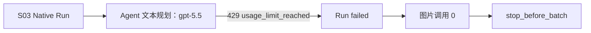

# Paynes Creek S03 单镜真实媒体 Gate 记录

日期：2026-08-12

结论：`stop_before_batch`

## 结论先行

本轮没有得到 S03 候选图，不能继续 S01，也不能批量生成其余 11 镜。失败发生在 Native Agent 的
第一轮文本规划请求：Run 快照模型为 `gpt-5.5`，请求当前 `TEXT_FALLBACK_BASE_URL` 配置的火苗
OpenAI 兼容服务时返回 HTTP 429 `usage_limit_reached`。Agent 因此没有发出 Tool Call，图片 Provider
`qy` 与 `Qwen/Qwen-Image` 均未被调用。

这是前置 Agent 模型额度 Gate 失败，不是 S03 Prompt、Qwen-Image、图片尺寸或视觉质量测试失败。
在恢复同一主路径额度，或另行批准并验证新的 Agent 模型路由之前，所有媒体制作保持停止。

## 运行环境

- 平台：Windows 本地，Python 3.11，隔离环境 `backend/.venv`；没有使用 WSL。
- 数据：仓库本地 `.env` 指向的 SQLite 与本地 Storage；没有连接远端数据库。
- 观测：按仓库既有配置启动 `docker-compose.mlflow.yml`，MLflow `/health` 返回 `OK`。
- 后端：`http://127.0.0.1:8000/health` 返回 `ok`；启动恢复扫描为 0 个待恢复 Native Run。
- 启动修复：原单实例锁无条件导入 Unix-only `fcntl`，Windows 无法导入后端。本轮改为 Windows
  `msvcrt` 文件区间锁、POSIX 继续 `flock`，保持第二进程非阻塞失败和释放后可重获语义。

## 本地 Style 与 Skill 快照

| 对象 | 事实 |
| --- | --- |
| Style | `Paynes Creek Evidence Desk 16:9` |
| Style ID | `4443d2412c994ec298b635e6c63806e7` |
| 状态 / 模式 | `active` / `prompt` |
| 图片模型 / 比例 | `Qwen/Qwen-Image` / `16:9` |
| 参考图 | 0 |
| Skill | `Paynes Creek S03 单镜生产验证` |
| Skill Version ID | `ba3a4875771248c4870b1ab6cf6afabd` |
| 发布状态 / 版本 | `published` / `1` |
| 唯一授权 Tool | `generate_image`、`inspect_image` |

Style 与 Skill 只存在本地验证库。测试用户凭据没有写入仓库、文档或持久化脚本。

## Run 证据

Run ID：`de8b148d122343fd984a9d646801c12b`

Conversation ID：`ec4859ef4ea540ba88416106fe7959d1`

| 字段 | 持久化事实 |
| --- | --- |
| 终态 | `failed` |
| Agent 模型快照 | `gpt-5.5` |
| 图片模型快照 | `Qwen/Qwen-Image` |
| 比例快照 | `16:9` |
| `model_call_count` | 1 |
| `image_call_count` | 0 |
| speech / subtitle / video call | 0 / 0 / 0 |
| Step 数 | 0 |
| Event 序列 | `run.created` → `run.started` → `model.request.started` → `run.failed` |
| 错误 | `RateLimitError`，HTTP 429，`usage_limit_reached` |

服务日志把失败请求定位到 `POST https://api.huomiao.art/v1/responses`。数据库同时确认：

- `native_agent_images`、`native_agent_audios`、`native_agent_subtitles`、`native_agent_videos` 均为 0；
- `file_assets` 为 0；
- 没有 `generate_image` 或 `inspect_image` Step；
- 仅有注册本地用户时的初始积分流水，没有生图扣费事实。

## 未执行项

因为图片调用从未发生，下列字段和检查均为“不适用”，不能填入估算值或请求目标：

- 图片 Provider request ID、asset ID、文件类型、真实宽度、高度与宽高比；
- 卤水浓缩装置对象、液体路径、重建色彩与现代器件禁区人工审核；
- 中央 84%、上方 70% 和底部字幕安全区检查；
- `inspect_image` verdict；
- `PC-S03-approved.png`。

## Gate 决策

本轮严格执行“一次 Run、失败即停”：没有重新提交 Run，没有切换 Agent 模型、图片 Provider 或图片
模型，也没有创建第二张候选。下一次动作必须先解决一个主路径决策：

1. 恢复当前火苗 `gpt-5.5` 的可用额度，然后在新的单镜 Gate 中重做 S03；或
2. 用户明确批准独立的 Agent 模型路由变更，再先验证该路由与 Agents SDK Responses / Tool Calling
   契约兼容。不能直接把 SiliconFlow 模型名写进配置并假定 Native Agent 可用。

无论选择哪条路径，下一次仍只允许一张 S03；S03 自动与人工审核通过前，S01、TTS、字幕、Remotion
和发布继续禁止。

## 后续路由审计（Sprint 176）

后续静态审计已把 SiliconFlow 路径判定为 `adapter_required`：官方公开工具调用入口是 Chat
Completions，而当前 Native Agent 固定使用 Responses，不能直接替换 Base URL。更完整的 SDK 源码审计
又确认 Chat 兼容层会复用固定 `__fake_id__`，并缺少当前持久化代码等待的 arguments done；因此必须先
增加 Run 路由快照、应用侧模型调用身份和 Function 参数完成适配，不能只切 Provider。官方文档记录的
10 条 `messages` 边界、真实流式工具参数和完整 Session 重放仍未经过真实调用。完整决策与实现设计见
[兼容性决策](../../integrations/siliconflow-native-agent-compatibility-decision.md)和
[适配实施蓝图](../../architecture/siliconflow-native-agent-adapter-blueprint.md)。

因此本 Gate 的 `stop_before_batch` 不变。下一步应先由用户批准蓝图 Phase A 的离线实现与聚焦测试，
之后再单独批准零媒体、单模型、单确定性工具的真实 Gate；通过后才重新审议一张 S03，不把设计文档
当作模型路由已可用。

## 验证记录

- 单实例锁聚焦测试：6/6 通过，包含同进程互斥、释放后重获、不同数据库、PID 可读、startup 失败
  释放和真实子进程竞争。
- 真实双后端：首实例监听 8000 时，第二个 Uvicorn 使用 8001 启动，在监听前因同数据库锁退出，
  exit code 为 3；没有执行恢复副作用。
- Python：`backend/app` 与 `backend/tests` compileall 通过。
- 数据库：Alembic 当前 revision 为 `u2v3w4x5y6z7 (head)`。
- 内容迭代控制器：`ok=true`、0 error、0 warning。
- 全量后端：380 项已运行，结果为 1 failure、8 errors。8 个 error 都是 Windows 无法删除仍被 SQLite
  或 MLflow 句柄占用的临时数据库；1 个 failure 是 Whisper 测试预期 POSIX `/tmp/reference.mp3`，Windows
  实际传入 `\\tmp\\reference.mp3`。这些跨模块 Windows 测试问题未在本内容 Gate 中扩修。
- `scripts/check.sh` 使用 POSIX `backend/.venv/bin/python`，Windows 本轮以等价原生命令完成上述检查；
  前端与 Remotion 没有改动。
